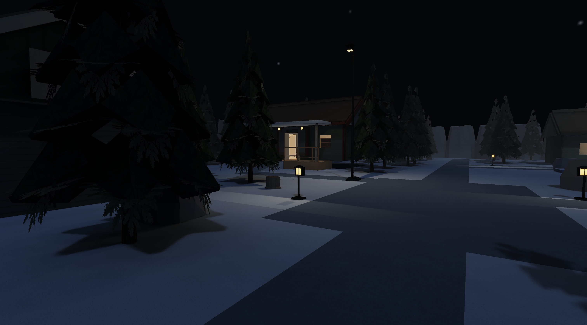
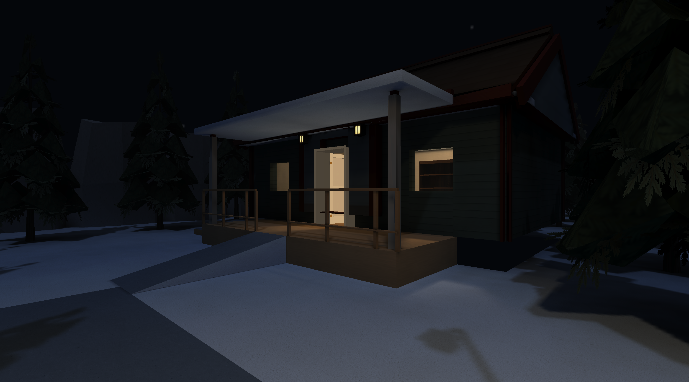
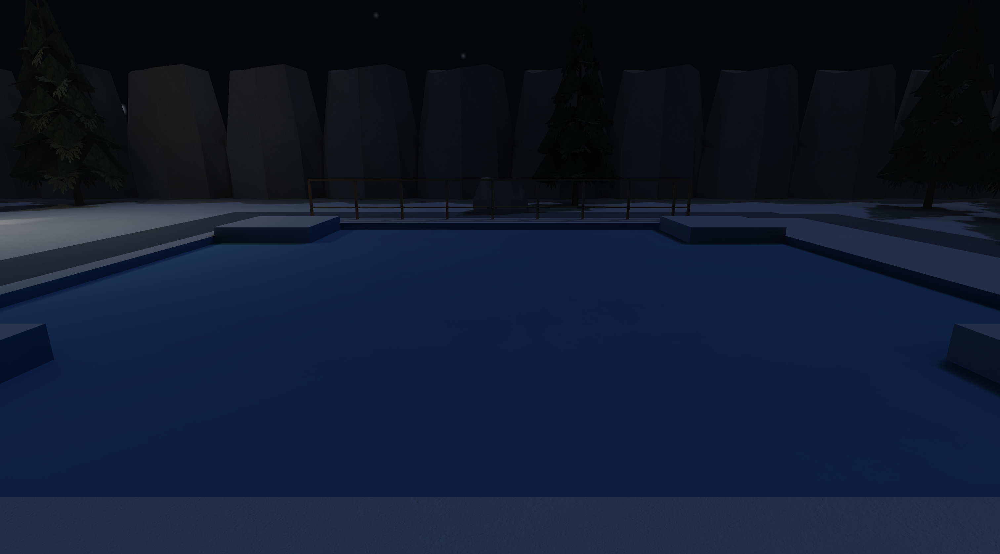
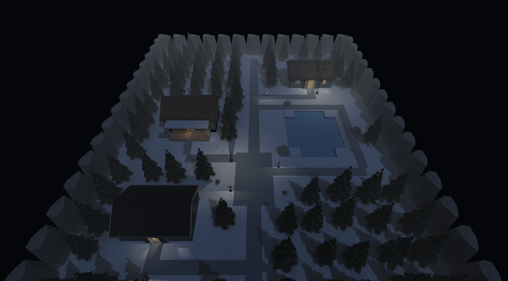

# Winter Place foundation

Winter is a bundled playable settlement (`winter`) built against the existing
Places authoring/compiler/renderer pipeline. The provided Winter Expansion
concept sheet guides the cold-blue ground, dark conifers, compact buildings and
warm entrances. This is the first pass; advanced winter art and systems remain
explicit follow-up work.

## Environment

The 48 × 60 m world contains three furnished, enterable cottages, a central
square with seating, a conifer forest, a 52 m forest sightline, packed-snow paths,
boulders, a shallow frozen pond, a pond railing and a raised lodge terrace.
The lodge has a three-step side flight, a front ramp, two rail sections and a
supported awning with 2.73 m clearance above its dry wooden deck. Cottages use
sealed gable ceilings, the existing exterior roof/gable kit, real solid glazing
and doors that start open and toggle with E. Separate eaves and the awning offer
attachment locations for later icicles. The square and terrace reserve space
for string lights. Open snow ground, sheltered deck and enclosed warm interiors
provide distinct weather-testing locations.

44 non-overlapping rooms partition the whole world. The pond's −0.16 m floor
and raised snow corners live inside one dedicated shore room. There is no liquid
volume or ice-friction change. Visible five-metre rock escarpments contain the
world; conifers collide on their trunks and leave the canopy transparent to
coarse lighting occlusion. There are no invisible perimeter blockers.

Night lighting uses the shared stars, restrained cool directional moonlight,
ambient fill, two streetlights, four path lamps, six entrance lamps and three
warm interior fixtures. Static lightmaps are prepared for off/medium/full
quality with the normal compiler. No engine, movement, renderer, dependency,
shared texture or existing map changes are needed.

## Reuse and placeholders

The canonical evergreen is `outdoor:tree_03` (3.2 × 6.8 × 3.2 m), authored by
`tools/props/parts/outdoor_kit.py::build_tree_03`. Its original GLB, PNG, foliage
and dimensions are untouched. The winter namespace reserves a separate future
`winter:tree_snow_01` using that builder and visual foundation; no duplicate or
fake alias is registered now.

Winter adds three material definitions referencing existing **real PNGs**:

| Placeholder | Shared texture | Next pass |
| --- | --- | --- |
| `winter:snow_01` | Home plaster | Proper tileable snow; snow caps, drifts and accumulation |
| `winter:snow_packed_01` | Outdoor concrete | Packed-snow paths and stair treads |
| `winter:ice_01` | Core clear-glass image, drawn opaque | Stylized ice and surface-specific friction |

Trees, boulders, cottage families 01/02/04, rails, posts, lamps, furnishings and
stars reuse existing assets. Roofs currently retain shared shingles with pale
snow eaves/awning; proper accumulated roof snow, tree/rock/rail snow, modular
drifts, icicles, string lights, aurora, snowfall and blizzard are deferred.
The current rectangular paths, clipped pond outline and escarpment repetition
are deliberately simple foundation geometry, ready for later environment-art
passes. [Namespace and dimensional contracts](../assets/environment/winter/README.md)
describe canonical future directories, references and integration anchors.

## Defects found and corrected

- A coplanar lodge awning/eave overlap: separated the underside planes by 3 cm.
- Open-looking exterior roofs: added correctly spaced existing slope, ridge
  and gable modules above the sealed interior ceiling.
- Raised-lodge prop height ownership: kept inside-room roof offsets relative
  to the lodge floor and outside entrance lamps relative to the ground.
- Dark internal pond skirts: used one ice region entirely inside a dedicated
  shore room, instead of crossing room boundaries.
- Probe-less narrow ground strips: split only at active building bounds.
- Existing fixed theme/bundled-level test lists: added Winter while preserving
  Places Demo as the default.

## Validation

The following commands are run from the repository root. Logs and full native
captures are retained under `target/winter-*` and `target/winter-evidence/`.
The committed images below and `docs/winter-foundation/validation.json`
preserve selected evidence beyond build cleanup.

| Command | Result |
| --- | --- |
| `cargo fmt --all --check` | Passed |
| `cargo check --locked --workspace --all-targets --all-features` | Passed |
| `cargo clippy --workspace --all-targets --all-features -- -D warnings -D clippy::all -D clippy::pedantic -D clippy::nursery -D clippy::cargo` | Passed |
| `cargo clippy --release --workspace --all-targets --all-features -- -D warnings` | Passed |
| `cargo build --release --bins` | Passed |
| `cargo test --workspace --all-features` | Passed: 1,995 library + 6 integration tests; 23 existing tests ignored |
| `cargo test --lib game::tests::winter -- --nocapture` | 6 controller tests passed |
| `python3 -m unittest tests.test_package tests.test_winter tests.test_packaging` | 56 tests passed |
| `python3 tools/levels/build_winter.py --check` | Current, repeatable source |
| `python3 tools/assets/validate.py` | Passed, no warnings |
| `python3 tools/textures/build.py --check` | Passed; existing manifest/native-source warnings |
| `python3 tools/props/build.py --check` | Passed; existing high-detail model review notices |
| `python3 tools/assets/audit.py --workers 12 --out target/winter-asset-inventory.json` | Zero errors |
| `./target/release/places --check-geometry --level winter --json target/winter-geometry.json --strict` | Zero errors/warnings; narrow intentional outdoor perimeter annotations |
| `./target/release/places-compile build assets/levels/winter.json --workers 12 --json` | All three variants built; zero package warnings |
| `./target/release/places-compile validate assets/levels/winter.placesmap --json` | Passed |
| `./target/release/places-compile verify assets/levels/winter.json --package assets/levels/winter.placesmap --require-current --json` | Current; no differences |
| Repeat compiler build | `rebuilt: false`; bytes reused |
| `sh tools/package.sh target/winter-distribution` | Flat distribution and macOS bundle include Winter |
| `git diff --check` | Passed |

The compiler retains 45 sub-texel sliver quads on vertex lighting, a supported
fallback rather than an asset error. The package is about 40.3 MiB. No new models
or textures were added; the global art checks still cover the original pack.

Native capture commands:

```sh
python3 tools/bench/capture_winter.py --root "$PWD" \
  --views square,lodge,pond,forest,interior,overview,walk-lodge,walk-stairs,walk-pond,walk-forest
python3 tools/bench/capture_winter.py --root "$PWD" --quality medium --views square,pond,interior
python3 tools/bench/capture_winter.py --root "$PWD" --quality low --views square,pond,interior
python3 tools/bench/capture_winter.py --root "$PWD" --low-lighting --views square,lodge
```

The harness requires a current compiled package, fresh screenshot/player/trace
files, successful native exit, and `scene_presented: winter`. It checks applied
renderer quality and verifies scripted movement bounds/return positions for
walk views. It records package/binary hashes, frame samples and player traces.
Screenshots are native 3024 × 1676 captures on this desktop (the requested
1920 × 1080 window is constrained by the display). This is practical foundation
acceptance, not certification of later winter systems or exhaustive GPU profiling.

The four native traversal traces return to their starting snow floor after
entering the lodge, climbing the stairs, and jumping on the pond. The forest
walk covers over 46 m without changing the standing eye height. All 18 captures
exit successfully with the requested quality applied. The isolated flat
package launches from `/tmp` with no asset-root override; its Winter payload
and the macOS bundle payload match the repository package hash. Loading reports
**zero runtime surface construction or light baking**. High with alternate low
lighting correctly selects the prepared `off` variant.

The 1,767-frame forest observation recorded an 8.29 ms median loop and 8.98 ms
95th percentile on this desktop, with VSync and background Rust validation.
These are local observations, not a regression baseline or a general GPU
performance guarantee.

## Files

Added:

- `assets/levels/winter.json` and `assets/levels/winter.placesmap`
- `assets/environment/winter/README.md`
- `tools/levels/build_winter.py`
- `tools/bench/capture_winter.py` and `tools/bench/winter_views.json`
- `src/game/tests/winter.rs` and `tests/test_winter.py`
- `docs/WINTER_FOUNDATION.md`
- `docs/winter-foundation/{square,lodge,pond,overview}.png` and `validation.json`

Modified:

- `assets/catalog.json`: Winter theme and three shared-image material definitions
- `assets/levels/README.md`: bundled map/launch documentation
- `src/game/tests.rs`: test module registration
- `src/assets/tests.rs` and `src/loader/tests.rs`: theme/bundled content expectations
- `tests/test_package.py`: shipped source/package expectations

Other user-added reference files remain untouched and outside this commit.

## Native screenshots





