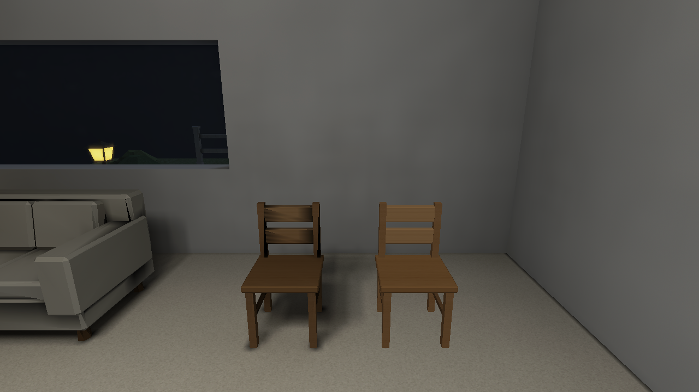

# Art-style baseline and diagnostic foundation — 2026-10-08

Stage 1 established a repeatable native room, hall and garden benchmark. It was an audit and instrumentation milestone, with no claimed renderer or lighting improvement. Source geometry, lights, camera settings and artwork were held for the following stages.

The original room and static/runtime-chair views below are genuine native Metal captures. Repeat controls restored the same settled camera/settings state; small animation differences were qualified rather than treated as static lighting errors.

| Original room | Original static and runtime chairs |
| --- | --- |
|  |  |

## What the baseline established

Albedo and normal diagnostics separated visible cushion diagonals from artwork and geometric normals: stored illumination also carried the discrepancy. The spawned chair already had Prepared probe data, so absence of a probe field was not the explanation for its flat response. Static self-occlusion, spatial sampling and contact remained distinct questions. The nearly dark hall table lay beyond one source's authored 5 m range; this was underillumination, not proof of an all-zero or missing model. Disabling the atlas while keeping overall High isolated an exterior lighting-route contribution without proving a sky leak or gamma defect.

Independent filtering, lighting and atlas controls returned settled endpoint images to their direct-launch equivalents. Loading transients were outside that ready-gated evidence. The original rejected/partial timing attempts were not promoted to gameplay FPS or bake-speed measurements.

The compiler dump inspection corrected an indirect export that had carried combined rather than stored indirect values. It changed the diagnostic label/export, not the physical bake. Native diagnostic selectors and offline direct/indirect/filter/fill/chart/caster analysis are described in [the diagnostic guide](diagnostics.md). Measurements and hard-bound distinctions are retained in [baseline costs](performance.md).

## Reproduce and continue

The maintained native camera definition is [the hero manifest](../../tests/fixtures/native/hero-manifest.json). Use the normal compiler/player with compatible source, package and asset catalogue; a historical image alone does not supply a compatible runnable build. [Verification](../VERIFICATION.md) defines current build/package order, diagnostics and acceptance.

[Seven-stage history](../style-upgrade-20261007/art-style-history.md) explains the completed progression. [Stage 2](stage2/README.md) establishes linear colour/HDR; [Stage 3](stage3/README.md) covers real surface/transport continuity; [Stage 4](stage4/README.md) covers live entities; [Stage 5](stage5/README.md) covers presentation/weather; [Stage 6](stage6/README.md) covers content/cache currency; [Stage 7](stage7/README.md) records completed inventory integration. The separate [model-lighting correction](../model-lighting-root-cause-and-fix.md) addresses later production kitchen, corridor and close-skeleton reports.

## Historical implementation and checks

The baseline implementation [d24d278](https://github.com/csd113/Places/commit/d24d278c8b5a248c5ee66efd8aaca063f0e16d13) passes its [CI run](https://github.com/csd113/Places/actions/runs/37723638291). Diagnostic implementation [2050fb2](https://github.com/csd113/Places/commit/2050fb23f1c6be75b0ee1b248b1a2623b36e37f7) passes [exact-head CI](https://github.com/csd113/Places/actions/runs/37728914254). Local strict Clippy passes; the local workspace command passes 2,022 library tests with 23 ignored, then exits 101 at three inherited stale-package discovery cases. Five diagnostic runtime/shader checks and seven hero/dump analysis checks pass. The dated local command is not relabeled a full pass; supported package closure follows in Stage 7.
