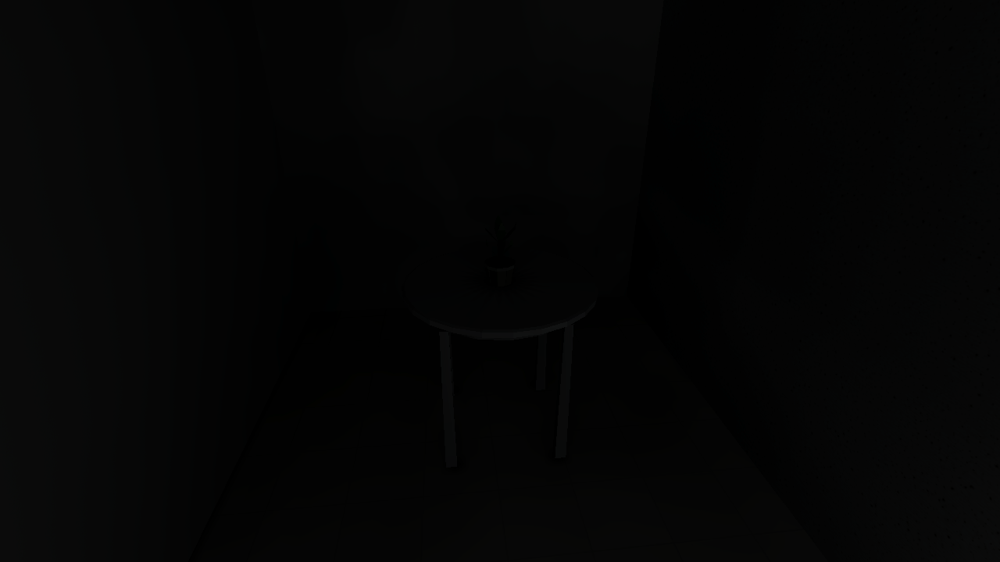
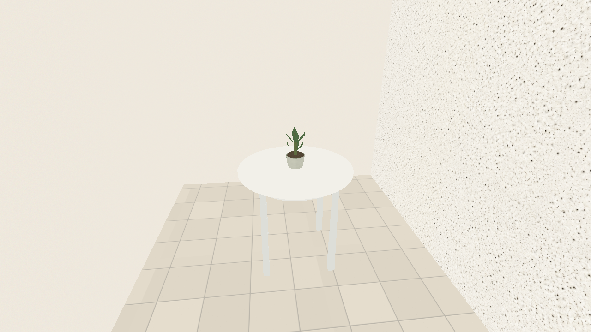
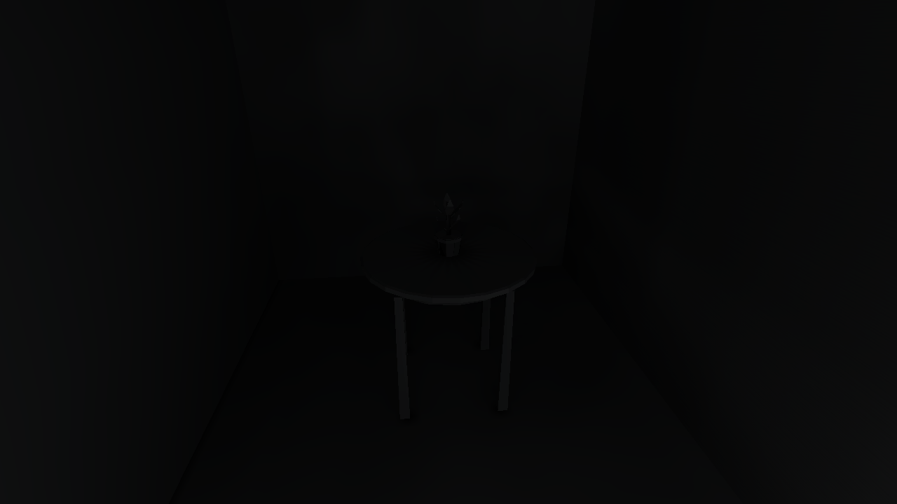
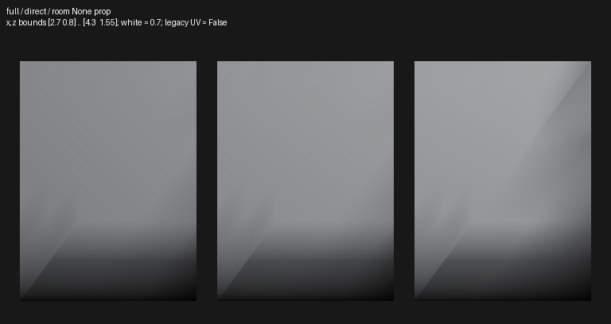
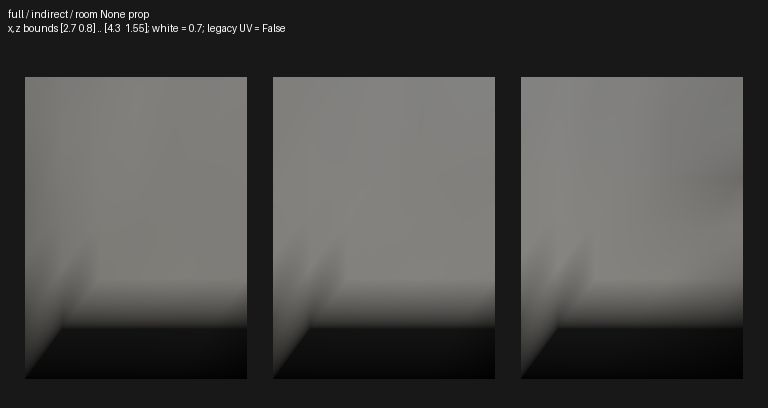
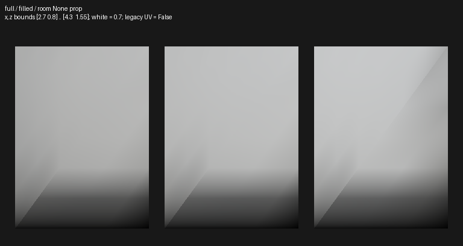
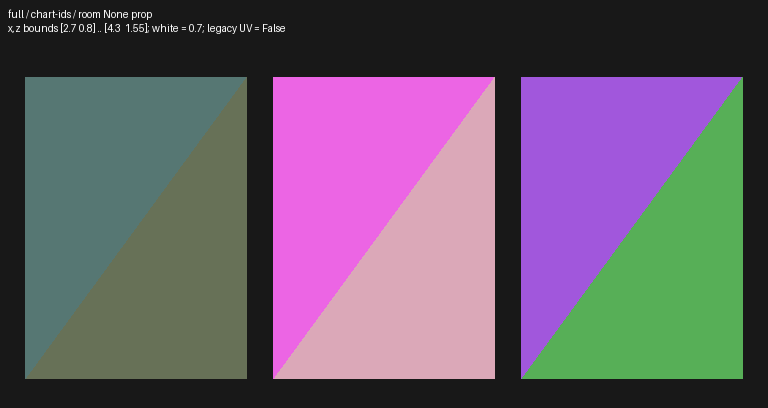

# Stage 1 diagnostic contract

This is inspection infrastructure, not a lighting correction. It extends the
existing native capture, entity trace, graphics-cycle, atlas dump and chart
projection facilities. The original hero, concept PNGs and baseline are retained.
Stages 1–6 compile/bake and visually accept only this hero.

## Native selection

Build with `RUSTC_WRAPPER= cargo build --release --features visual-diagnostics`.
Set `PLACES_VISUAL_DIAGNOSTIC=<name>` or press **F8** to cycle the stable order
while playing. Selection changes the existing camera uniform's reserved word;
it does not edit the level, reload geometry or rebake. The ordinary build omits
the selector/shader extension. The production `world.wgsl` stays unchanged.

The capture wrapper accepts `--diagnostic <name>` and requires a real
capture-time feature receipt, so an ignored environment variable cannot be
mistaken for a successful diagnostic. Use `--binary` to name the opt-in executable.
`--lightmaps`, `--filtering`, `--low-lighting`, `--quality-cycle`,
`--graphics-cycle`, `--capture-frame` and `--entity-light-trace` reuse existing
settings and native controls. Original camera/settings live in
[hero-manifest.json](hero-manifest.json); the additional close resin-table view is
in [hero-diagnostics-manifest.json](hero-diagnostics-manifest.json).

| Mode | Actual data and presentation |
| --- | --- |
| `final` | Ordinary composition: sky, fog, emission, response, reflections and post. |
| `albedo` | Sampled authored PNG RGB, without vertex/material tint or lighting. Tint cannot be recovered separately from baked static vertex colors on the fallback route. This is texture albedo, not the complete tinted base color. |
| `vertex-normal` | Uploaded interpolated world-space vertex normal, normalized; RGB=(N+1)/2. An actor import may carry a placeholder normal. |
| `world-normal` | Actual oriented shading normal, including normal maps and posed-actor geometric derivatives; RGB=(N+1)/2. |
| `baked-light` | Combined baked diffuse at the actual shading normal, before surface soft clipping/material/dynamic light. HDR maps as max(x,0)/(1+max(x,0)). Entity fallback supplies a display factor, not comparable HDR; static vertex-light coefficients are unavailable. |
| `lightmap-values` | Combined saved atlas mean irradiance, including enabled switchable groups, before normal reconstruction; same HDR mapping. Actors/fallback do not have these atlas coefficients. |
| `chart-uv` | Atlas UV in red/green, page identity in blue, white 16×16 atlas grid. It is **not** actual chart IDs, chart boundaries or seam truth; use offline mappings alongside it. |
| `roughness` | Actual shader roughness scalar, including the plain-prop default. This is not metallic or a claim of imported glTF roughness. |
| `depth` | Actual perspective device depth z in [0,1]; nonlinear, grayscale. |
| `distance` | Radial eye-to-fragment metres /100, clamped; explicitly not linear view depth. |
| `lighting-state` | Cyan=resident atlas, green=prepared entity field, red=entity fallback, amber=static vertex fallback. These colors label routes, not energy. |

Nonfinal views use identity post without bloom/grade/fog/emission/reflections,
and suppress sky/decals/effects. Existing world/prop/actor draw routes, cutout and
fade coverage remain; blended pixels still composite and are not an unambiguous
per-fragment numeric readback. **Magenta means unavailable representation**,
not invalid or corrupt lighting. Keep final images beside debug images.

`[visual-diagnostic]` JSON records mode/meaning, requested and applied graphics,
resident atlas/probes/uniforms/meshes, actual dimensions and uploaded selector.
`capture_submission` counts the actual offscreen base-scene encoding submitted
to the GPU; its vertices are frustum-visible distinct vertices, not triangles or
pixel-visible vertices. It excludes uncounted sky/reflections and post/UI/emission
duplicates. `surface_submission` is separate and may be zero/stale when the
native window cannot acquire a surface. Neither is GPU time or steady FPS.

The runtime rejects `direct`, `indirect`, `shadow`, `ao`, `metallic`,
`chart-boundaries`, `seams` and `probe-field` with specific missing-data reasons.
There is no separate direct/indirect/shadow GPU payload, metallic shader input,
or resident chart identity. Stage 4 extends this selector/provider seam for real
probe placement/validity/interpolation visualization; Stage 1 adds no probe system.

## Offline stages and provenance

`places-compile export-lighting HERO.placesmap --out NEW_DIRECTORY --json`
exports existing saved records without a bake/GPU. The directory must be new.
Saved coefficients are combined final transport; absent original source/solver/
material information is null with an explanation. Actual existing probe data
may be inspected, but no new field or runtime probe overlay is invented.

A single opt-in forced hero compile with `PLACES_LIGHTING_DUMP_DIR=NEW_ROOT`
records actual solver stages in `off/medium/full`, with source/catalog/dependency/
solver/settings identities, logical materials, chart offsets, receiver positions,
ray origins, normals, albedo, attenuation, area and caster triangle ownership.
Existing directories are refused. Sidecars publish after successful output;
`result.json` means variant encoded, not package published. Diagnostic write
errors remain visible warnings and do not invalidate a physical lighting solve.

- `direct`: actual integrated direct transport.
- `bounced`: direct plus diffuse indirect before filtering/fill.
- `indirect`: the saved diffuse component, reconstructed independently.
- `filtered`: combined filtered diffuse plus unchanged direct.
- `filled`: combined result including the supported authored recovery policy.
- `global-direct`/`local-N`: explicitly recomputed point-sample component queries.
- `caster-rays`: exact nearest opaque triangle/owner for requested rays, not a
  shadow-map or AO coefficient layer.

The existing `inspect_lighting_dump.py` can select those stages, true chart IDs
or density after this one dump. Its indirect view now reads the actual saved
component: subtracting nonlinear reconstructed combined/direct values was an
incorrect diagnostic. This correction changes no physical bake or package.
Offline projections are clearly labeled analysis images, not native game frames.
Saved-package RGB reconstructs at geometric chart normals; it cannot reproduce
the renderer's imported/material shading normals without that data.

[Campaign requests](diagnostic-campaign.json) record each purposeful view/control.
[Campaign execution](diagnostics/campaign-execution.json) completed **25 cases / 37 raw
native PNGs**. Two close-table albedo/light views were added only after the first
final exposed a nearly black region. [Resident-state checks](diagnostics/native-state-summary.json)
verify all uploaded selectors, requested/applied/resident graphics, nonzero capture
encoding and the preserved comparison entity. PNGs are untouched native outputs.

## What the expanded evidence establishes

| Evidence | Interpretation / next owner |
| --- | --- |
| [Contact albedo](diagnostics/native/view-albedo/contact.png), [vertex normal](diagnostics/native/view-vertex-normal/contact.png), [shading normal](diagnostics/native/view-world-normal/contact.png), [combined light](diagnostics/native/view-baked-light/contact.png), [atlas mean](diagnostics/native/view-lightmap-values/contact.png) | Cream PNGs and planar normals do not carry the visible diagonal cushion tones. Combined illumination and stored mean do. Direct transport already has a triangle-aligned discrepancy in the labeled offline seat projection. Stage 3 owns receiver/grid/visibility evidence; do not blame post or normal maps alone. |
| [Entity albedo](diagnostics/native/view-albedo/entities.png), [combined light](diagnostics/native/view-baked-light/entities.png), [route state](diagnostics/native/view-lighting-state/entities.png), [actual payload log](diagnostics/native/view-lighting-state/entities.log) | Static chair uses atlas; spawned chair uses **Prepared**, with actual bounds-centre anchor `[6.7,.451,1.3]`, mean about `[.560,.569,.577]`, signed moment and contributor weights. The field is present. Static self-occlusion/contact and route policy remain distinct Stage 3/4 questions. The two placements are still .9 m apart. |
| [High](baseline/high/window.png), [High atlas Off](diagnostics/native/atlas-off/window.png), [High Low-lighting override](diagnostics/native/low-lighting/window.png), [combined light](diagnostics/native/view-baked-light/window.png), [atlas mean](diagnostics/native/view-lightmap-values/window.png) | Exterior readability improves when the atlas is disabled while overall High resolution/filtering stays fixed. This isolates a lighting-route contribution that the original overall Low comparison could not. It does not prove missing sky, incorrect gamma, or an aperture leak. Stages 2/3 separate authored energy, transport/recovery and presentation. |
| [Table final](diagnostics/native/plastic-final/plastic.png), [texture albedo](diagnostics/native/plastic-albedo/plastic.png), [combined light](diagnostics/native/plastic-baked-light/plastic.png), [roughness](diagnostics/native/view-roughness/plastic.png) | Whole table/plant and feet are correctly framed. Light-colored artwork becomes nearly black, with faint rim/leg detail; combined illumination is also very low. Source placement/visibility/recovery must be checked in Stage 3 before a material fix. This is severe underillumination, not a literally all-zero model. No full-white nonemissive model is shown. |
| [Independent Low filtering](diagnostics/native/filter-low/contact.png) / [Medium filtering](diagnostics/native/filter-medium/contact.png) / [High baseline](baseline/high/contact.png) | Requested/applied filtering changes while Full atlas and overall High remain. Atlas selection is a separate control. Avoid attributing overall Low brightness/pixelation to anisotropy alone. |
| [Live endpoint comparisons](diagnostics/control-comparisons.json) | Low, Medium, returned High, returned Full atlas and returned High filtering match direct-launch PNGs byte for byte; camera/entity/state are preserved. No settled live-switch failure is demonstrated. Loading transients remain untested by ready-gated captures. |
| [Depth](diagnostics/native/view-depth/window.png), [distance](diagnostics/native/view-distance/window.png), [atlas UV](diagnostics/native/view-chart-uv/contact.png) | Actual geometric depth and atlas addressing are available. Perspective depth is nonlinear; neither this UV grid nor a dark reveal proves a seam or leak. |

| Native final | Texture albedo | Combined baked illumination |
| --- | --- | --- |
|  |  |  |
|  |  |  |

## Offline evidence and reproduction

The single dump-enabled all-variant hero solve takes **5.952 s wall** including
diagnostic I/O. It is not a bake-speed regression measurement. The original and
instrumented package hashes are identical: `ef687d32cc7e4ccb7a160a239db4541ebaec479eb974edd9698784a4c24ceace`.
[Build execution](diagnostics/offline-execution.json), [package equality](diagnostics/diagnostic-package-comparison.json),
[compiler provenance](diagnostics/offline/live-full-provenance.json),
[stage meanings](diagnostics/offline/live-full-direct.json) and
[raw artifact identities](diagnostics/offline/raw-artifact-inventory.json) are retained.
Bulk raw coefficients/receiver arrays and the saved package export remain in the
ignored `debug-maps/art-style-hero/evidence/lighting/` directory outside `target/`;
these commands regenerate them into fresh destinations:

```sh
RUSTC_WRAPPER= cargo build --release --features visual-diagnostics
# Export the already prepared package; no rebake or GPU is needed.
target/release/places-compile export-lighting \
  debug-maps/art-style-hero/evidence/art_style_hero.placesmap \
  --out /tmp/hero-saved-lighting --json
# One opt-in hero solve records all ordinary variants. Use a new dump root.
PLACES_LIGHTING_DUMP_DIR=/tmp/hero-live-lighting \
PLACES_LIGHTING_RAYS=docs/art-style/diagnostics/caster-ray-requests.json \
  target/release/places-compile build tests/fixtures/levels/art_style_hero.json \
  --out /tmp/diagnostic-hero.placesmap --workers 12 --force --json
python3 tools/bench/capture_art_style_hero.py \
  --binary target/release/places --manifest docs/art-style/hero-diagnostics-manifest.json \
  --diagnostic baked-light --views contact --out /tmp/hero-native-light
# Optional offline inspector needs NumPy/Pillow; neither is a game dependency.
python3 tools/bench/inspect_lighting_dump.py /tmp/hero-live-lighting/full \
  --kind prop --normal 0,1,0 --plane .4805 --bounds 2.7,.8,4.3,1.55 \
  --stage direct --maximum .7 --out /tmp/hero-seat-direct.png
```

The [chart audit](diagnostics/offline/chart-audit.json) finds **5,347 charts,
167,960 receivers, two pages, zero invalid geometry/reservation errors**.
There are 6,205 one-sample axes and 28 world-axis ratios over 100. These are
pathology/budget clues, not automatic defects: thin asset parts legitimately
produce narrow charts. Coplanar sofa seat pairs have 6×7 versus 7×4 grids with
different physical densities, useful Stage 3 production evidence.

These are **labeled offline analysis projections**, never game screenshots.
They use one fixed display maximum .7 with the inspector's explicit gamma display
mapping. The six projections/metadata retain exact selectors and exit codes in
[projection execution](diagnostics/offline/projection-execution.json).

| Real physical direct | Saved diffuse indirect | Final combined | True chart segmentation |
| --- | --- | --- | --- |
|  |  |  |  |

[Room floor](diagnostics/offline/room-floor-filled.png) preserves contact regions;
[window wall](diagnostics/offline/window-wall-filled.png) preserves the real aperture.
[Exact caster rays](diagnostics/offline/live-full-caster-rays.json) hit actual
chair/sofa/table triangles in the top-down checks, no opaque triangle through
the window centre within 15 m, and the jamb wall at 3.5 m. The named
`static-chair-shadow-path` ray passes the chair and reaches the ceiling **beyond
the source centre**; it does not demonstrate a chair shadow. Six geometry queries
cannot establish sampled shadow completeness or an AO field.

[Saved-package provenance](diagnostics/offline/saved-package-provenance.json)
truthfully marks original source/material/solver fields as absent from that
format. The live companion supplies those identities. [Build provenance](diagnostics/build-provenance.json)
records every compiled Rust/WGSL source hash and normal/feature binary hash;
native manifests record the actual precommit Git revision plus working-diff,
fixture/catalog/package/tool/camera hashes. Final commit source must match these
hashes; captures are not relabeled as builds of a later commit.
