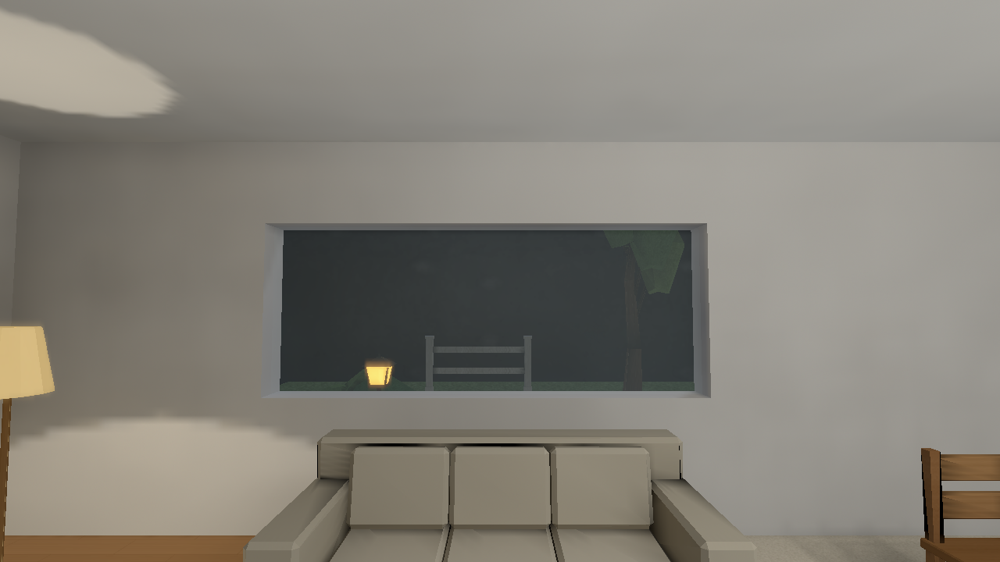

# 2026-10-08 — Stage 2: colour and material foundations

The hero now samples colour once into linear light, preserves HDR energy through
lighting/material/reflection composition, and converts for display at presentation.
Pale paint, upholstery, carpet and oak are clearer under the **same** lights,
cameras, exposure constants and source artwork. Hard low-poly faces, warm practical
pools and the night exterior remain. Sofa receiver seams and the flat/contact-free
spawned chair remain visible; Stages 3 and 4 own those lighting gaps.

[Chronological journal](../../style-upgrade-20261007/README.md) ·
[Authoring-to-display contracts](contracts.md) · [Costs](performance.md) ·
[Validation and handoff](handoff.md) · [Deferred ledger](../deferred-ledger.json)

## Genuine matched native images

| Stage 2 before / original Stage 1 | Stage 2 after |
| --- | --- |
|  |  |
|  |  |
|  |  |

More matched views: [hall before](before/high/hall.png) / [after](after/sealed-high/hall.png),
[contact before](before/high/contact.png) / [after](after/sealed-high/contact.png),
[corner before](before/high/corner.png) / [after](after/sealed-high/corner.png).
The hall reads more clearly as pale ceramic, satin plastic and cool brushed metal.
Its existing fine panel texture is still conspicuous. Carpet stays broad and matte;
oak and paint retain restrained authored sheen. Clear glass preserves the garden
opening. There is no geometry remodeling or new texture/normal noise.

All six before PNGs byte-match the immutable original Stage 1 baseline. Two
independent Stage 2 bakes produce identical package bytes, and two six-view native
galleries byte-match. The diagnostic feature's final view matches the normal
player. [Equality receipt](repeatability.json) records each result. Display-pixel
[checks](native-pixel-checks.json) find no all-channel-255 pixels in these final
High views; this supports the inspected images, not a claim about all HDR scenes.

Source and camera manifest remain unchanged: [hero settings](../hero-manifest.json),
[source JSON](../../../tests/fixtures/levels/art_style_hero.json). Fixed camera yaw/pitch,
60° FOV, 640×360 logical / 1280×720 drawable, High textures/filtering, Full
lightmaps/reflections, bloom On, VSync Off, capture at .5 ready-world seconds plus
15 warmup frames. No authored weather/random event; the chair spawns at .1 s and
stays fixed. Each gallery manifest records binary/package/source/catalog/tool
SHA256, working revision/diff, effective settings and native Metal adapter.
The [first Stage 2 gallery](after/high/manifest.json),
[independent repeat](after/final-high/manifest.json) and
[counter-corrected final gallery](after/sealed-high/manifest.json) are preserved; no PNG is synthesized,
retouched, relabeled or overwritten.

## What changed and why

- CPU transport now decodes sRGB texture reflectance, excludes architectural
  receiver shading from bounce albedo, averages model centroid factors and clamps
  model UVs consistently with sampling. Irradiance excludes receiver albedo.
- GPU colour sheets use sRGB resources; normals/masks stay numeric. Colour fitting
  and mips average linear energy with alpha-weighted RGB and separate coverage.
  Black/white reduces to byte188, rather than128; hidden transparent RGB cannot
  contaminate visible mips. Existing size budgets, trilinear filtering and
  supported 4×/8×/16× anisotropy remain independent of lighting quality.
- Float vertex colour replaces UNORM8 clipping. Scene, emission, bloom and
  reflection resources use RGBA16F. Removed pre-albedo light soft clips and the
  bright-light unlit bypass. HDR cube prefiltering retains energy above1. Low's
  identity presentation still encodes sRGB. Raw 8-bit surface fallbacks encode
  deliberately; HUD/native readback retain encoded display bytes.
- Missing source NORMAL consistently means flat geometric triangles. Static
  fallback corners preserve hard edges; movable/posed meshes retain authored
  normals or a missing-normal sentinel. Model and weighted pose normals use
  inverse transpose, while tangent transforms retain determinant/UV handedness.
- Scalar glTF roughness/metallic feed one compact sheen material on static,
  movable and character routes. Omitted controls stay matte. Alpha classes now
  agree, including static BLEND and character MASK. Model material identity
  includes full alpha and response. Legacy props/probe readers remain supported.
- Empty model alpha classes no longer contribute phantom visible vertices.
  This corrects accounting without changing images or geometry.

Geometry revision4 and solver revision12 invalidate prepared currency. Props
record4 and HDR probe positions3/capability are documented, with tests for legacy
props3 and display-probe2 conversion. Only the hero is compiled/baked here.
All PNG/GLB/catalog bytes and concept references are unchanged. Shared model
highlight adoption stays in the Stage 7 ledger, avoiding dependency churn in
completed non-hero asset passes.

## Restrained hero material set

These existing data-driven categories use the same linear shader; the compact
model controls extend this foundation without introducing a PBR framework.

| Category / hero material | Roughness | Specular control / native reading |
| --- | --- | --- |
| Cream carpet | .94 | 0; broad, matte floor |
| Warm oak | .68 | .22; controlled floor sheen; legacy furniture remains matte |
| Home tile | .70 | .24; smooth pale ceramic distinction |
| Warm paint | .78 | .10; restrained diffuse walls |
| Plastic panel | .60 | .30; broad white sheen, existing numeric dimples |
| Brushed metal | .65 | .60, cool tint/probe .25; distinct from plastic/paint |
| Clear glazing | .15 | .50, straight alpha; sealed opening remains visible |

Native [albedo](diagnostics/albedo/contact.png), [world normals](diagnostics/world-normal/contact.png),
[material roughness](diagnostics/roughness/hall.png) and
[lighting route](diagnostics/lighting-state/entities.png) accompany actual final
images. [Vertex normals](diagnostics/vertex-normal/entities.png) correctly mark
missing source NORMAL on the right chair; [shading normals](diagnostics/world-normal/entities.png)
recover matching flat faces from geometry. Resource receipts confirm linear HDR
scene, sRGB colour, two atlas pages, actual texture sizes and unchanged lighting
routes. Diagnostic views preserve numeric byte meaning through presentation.

[Low](controls/low/room.png) / [Medium](controls/medium/room.png) retain their
resolution and size behavior. High with [Low filtering](controls/high-filter-low/room.png)
and High with [lightmaps Off](controls/high-lightmaps-off/room.png) isolate the
independent controls. These are controls, not the accepted visual target.

## Acceptance and limits

Colour boundaries/HDR preservation, supported normals/transforms, flat-vs-authored
conventions, shared material/alpha evaluation and independent texture sampling are
implemented and tested. Rotation plus non-uniform matrix/skin transforms are
verified deterministically. JSON placement supports positive uniform scale;
there is no native non-uniform placement or posed-character capture claim.
The hero's same static/spawned chair exposes the remaining lighting-input gap.

The renderer is single-sample; attachments remain compatible. Mips/anisotropy
address texture sampling, while silhouette AA and Low/Medium upsampling remain
precisely documented Stage 5 work. No temporal system was introduced. glTF normal
textures remain unsupported; architectural normal-map frames are tested. Blend
emission coverage and cross-family ordering remain Stage 5 limits. Stage 3 owns
GI/receiver seams, Stage 4 probes/contact, Stage 5 exposure/bloom/atmosphere.
The hall table lies beyond its authored 5 m light range; no brightness correction
conceals that fact. No ambient multiplier, exposure override or map-name renderer
branch is added.

## Immutable queue evidence and replay

Original Stage 1 and all Stage 2 native galleries remain in tracked documentation.
Local runnable snapshots live outside target at
`debug-maps/art-style-hero/milestones/stage1` and `.../stage2`.
They preserve exact player/diagnostic/compiler binaries, hero source/package,
camera manifests, catalog, hash-verified asset dependencies and native SDL runtime.
[Stage 1 receipt](stage1-snapshot.json) and Stage 2 receipt record their identities.
The Stage 1 snapshot's room replay byte-matches the original baseline. These
native macOS bundles are local, ignored artifacts, not cross-platform distribution
or fabricated replay/video. Preserve them throughout the seven-stage queue.

Use `snapshot_art_style_hero.py` to create a **new** milestone; it refuses an
existing destination. Use the canonical capture tool with `--asset-root`, the
snapshot's replay manifest/player and a new output path. Snapshot paths and
revision associations will be finalized with verified publication links in the
handoff. No `cargo clean` is run while later stages need these artifacts.
