# Stage 3 — continuous surfaces and explicit light transport

2026-10-08 UTC · [Contracts and rationale](contracts.md) ·
[Costs](performance.md) · [Validation and publication](handoff.md) ·
[Chronological journal](../../style-upgrade-20261007/README.md)

The hero keeps its original lights, materials, source models, cameras and display
settings. This stage corrects physical sampling across chart cuts, integrates
broad-source directions accurately, and brings real architectural PNG colour and
alpha into offline transport. Cream reflectance contributes to diffuse bounce;
glass attenuates, cutouts retain covered occlusion, and water keeps its depth tint.

| Matched Stage 2 before | Stage 3 final native High |
| --- | --- |
|  |  |
|  |  |
|  | 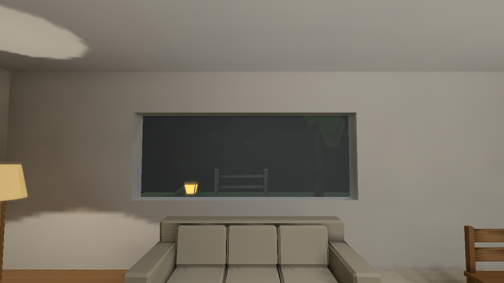 |
| 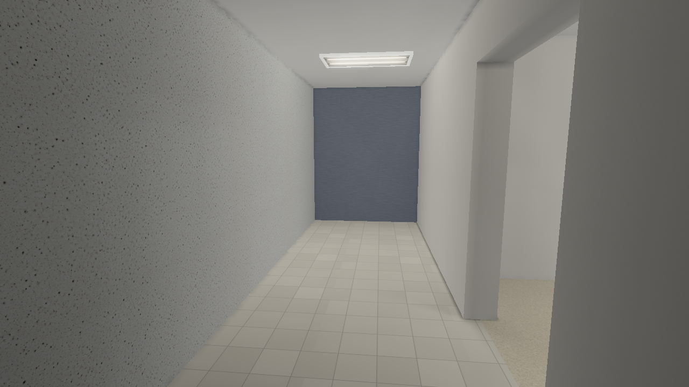 | 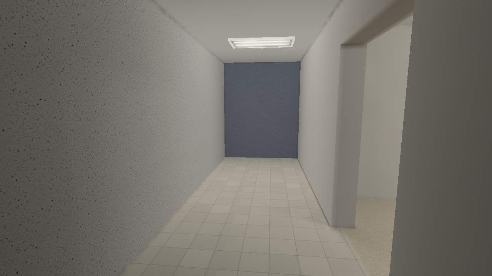 |
| 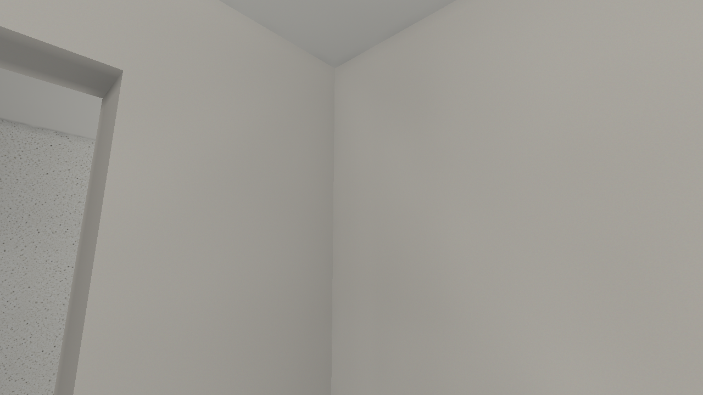 | 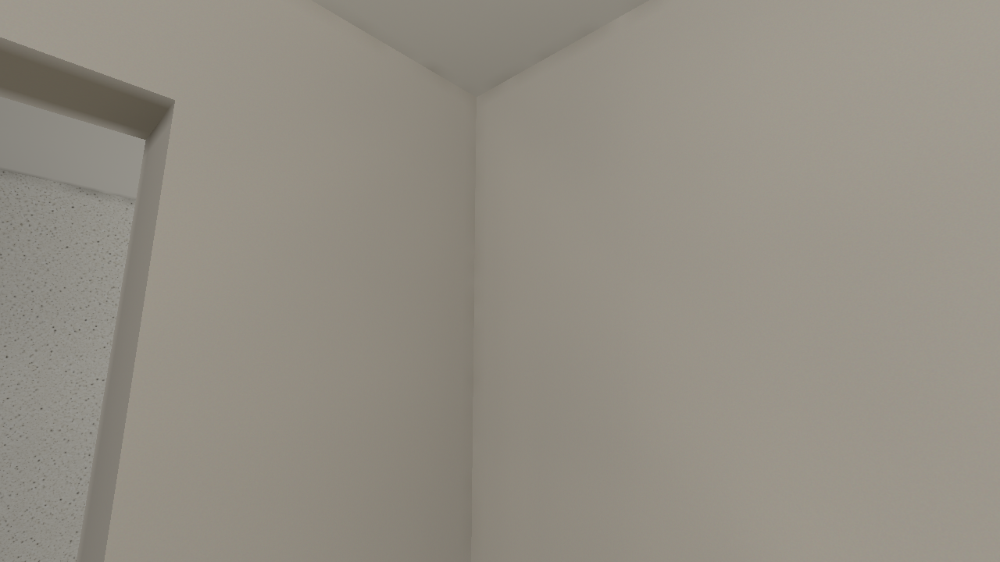 |
| 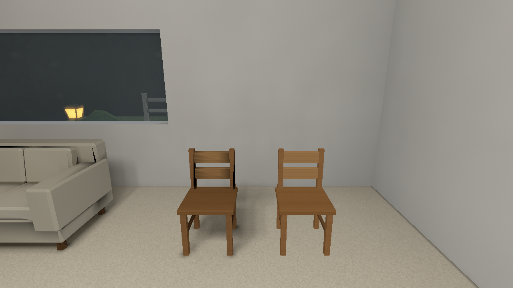 | 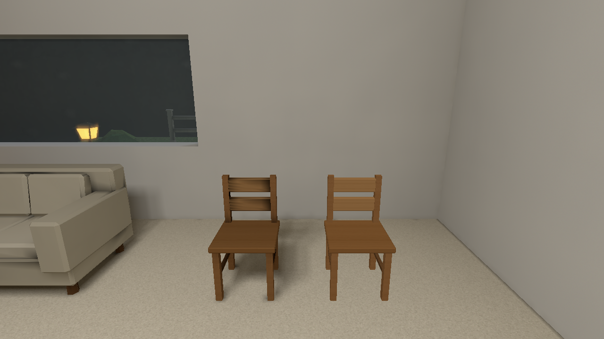 |

The six before images match Stage 2's sealed gallery byte for byte. The original
[Stage 1 baseline](../baseline/high/) remains unchanged, as do all intermediate
milestones. Each image is a raw native Metal capture, with its camera, settings,
drawable, binary/package/source hashes and effective renderer state beside it.
FOV is60°, window640×360 logical /1280×720 drawable, High textures/filtering,
Full lightmaps/reflections, bloom on, fixed half-second world readiness, no weather
or random animation. Presentation and authored brightness are unchanged.

The v3 sealed gallery and v4 adjacent-roof regression repeat remain immutable.
Their [byte comparison](accepted-equality.json) verifies all nine native images
and both packages were identical. The final v5 repair assigns exposed caps by
actual height containment, then the established wall parent. Its own published
capture manifests identify the final rebuilt binaries and packages; no historical
receipt is relabelled as a newer build. The [final comparison](published-equality.json)
finds seven images identical; small hall/corner lintel changes reach at most2/255
per channel. The final nine views are inspected directly.

## Controlled hero arrangements

The additive [control source](hero-controls.json) retains `art_style_hero` and the
original scene. A separate annex exercises a gable roof, four matching apertures
(open, clear, tinted, grille), opaque trim, thin decoration, actual alpha foliage
and a compact lowered water basin. [Camera/settings manifest](hero-controls-manifest.json)
and [ray selections](caster-ray-requests-v2.json) make the conditions explicit.
No other production map is compiled or visually accepted by this campaign.

| Matched Stage 2 control | Stage 3 final native control |
| --- | --- |
|  |  |
| 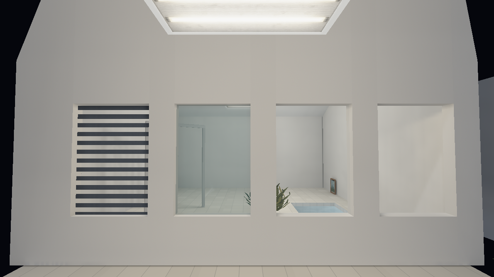 | 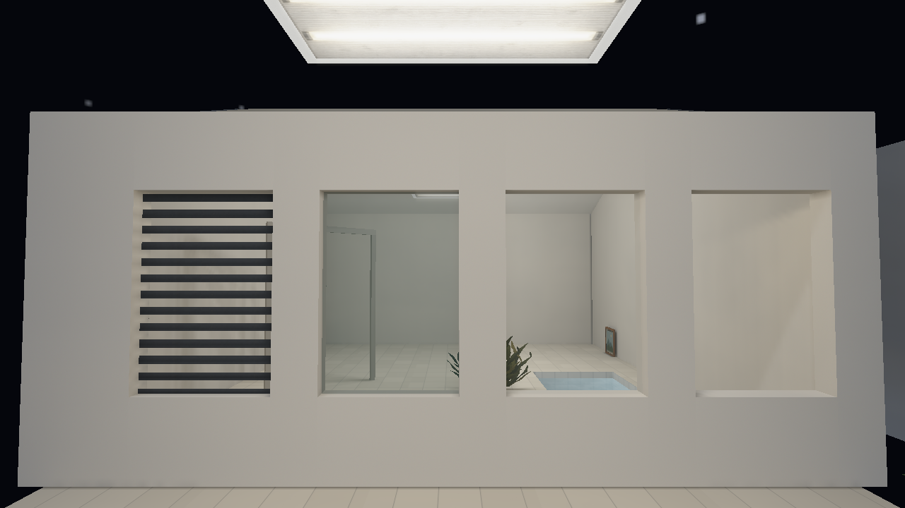 |
| 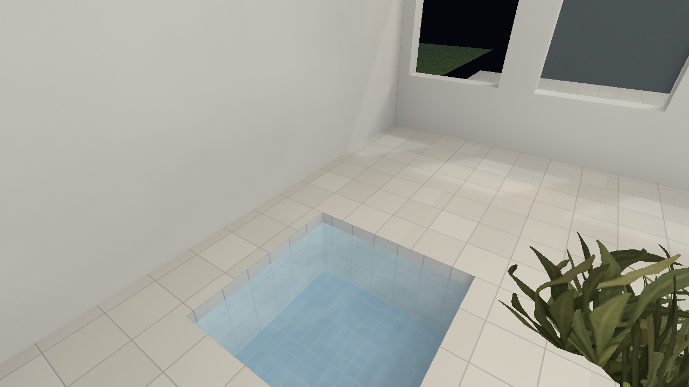 | 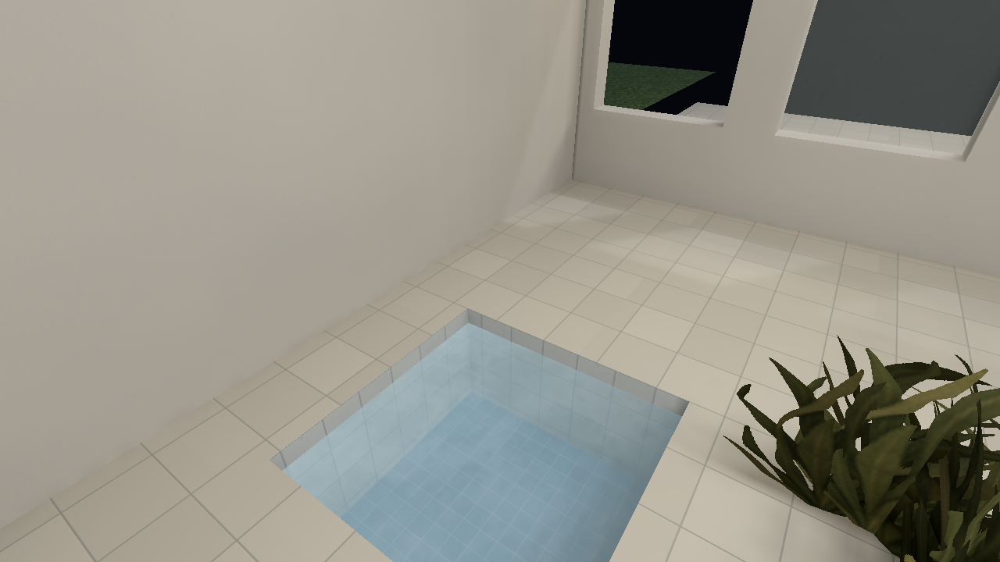 |

The original gable's black diagonal wedges also appear in the native albedo view:
they are missing wall geometry, not a shadow. Roof ownership and ridge cuts close
the wedges. A separate audit caught exposed rigid-wall tops omitted by the first
candidate; the final rule subtracts actual coplanar roof footprints and keeps the
remaining caps. No additional seam-cover geometry is authored.

## Evidence and limits

[Separated lighting/continuity evidence](diagnostics.md) distinguishes direct,
indirect, filtering, stored fill, chart boundaries, normals and caster results.
Indirect includes both sky and diffuse interreflection; no per-emitter bounce or
standalone AO layer is inferred from it. The initial [candidate findings](candidate-findings.json)
and [candidate native gallery](after/high/) remain available, including the
compiler-image and bevel-origin defects they helped expose. The invalid control
run with insufficient snapshot assets is preserved and excluded explicitly in
[baseline conditions](baseline-conditions.json).

The dark resin table remains outside the hallway source's authored range. Its
repeated central dark samples coincide with a penetrating plant, rather than an
extended missing-GI patch. Dynamic chair field/contact belongs to Stage 4;
screen silhouette AA and tiny cutout mip coverage belong to Stage 5. Transmission
is neutral and straight, with no refraction or coloured absorption. Full local
workspace discovery remains subject to the three inherited stale packages owned
by Stage 7; exact results and the clean-source CI gate are reported separately.

Runnable milestone bundles preserve the normal player, compiler, diagnostic
player, compatible packages, assets, source/settings and SDL outside `target`.
The [handoff](handoff.md) records verified locations, replay instructions,
implementation links and queue custody; historical snapshots are never replaced.
