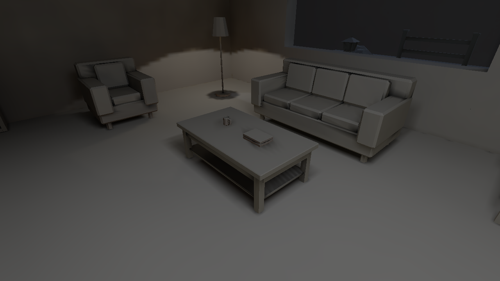

# Stage 3 diagnostic findings — 2026-10-08 UTC

The [native comparison](README.md) and [transport contract](contracts.md) accompany these final findings. Receiver analysis uses exact decoded positions/normals and live direct/indirect/filter/fill exports; analysis projections are distinct from native screenshots.

## What the evidence actually separates

The Stage 1 selector exposes actual normal, combined baked-light and stored-atlas
values. True direct, indirect, filtered and filled stages come from a live offline
solve. Indirect includes escaping sky and diffuse interreflection; it cannot
isolate one emitter's bounce. There is no standalone shadow/AO payload, and the
runtime has no true chart-ID view. Offline chart IDs and sample metadata supply
that evidence without mislabelling a runtime UV grid.

The stored atlas-value view
confirms that the improved sofa lies in baked data. Normals retain the intentional
hard planes and bevels. No albedo retouch, extra seam mesh, uniform brightness
lift or direct-light blur is responsible.

Reproducible receiver analysis, generated by
this analysis script, restricts continuity
comparisons to exact decoded positions and normals present in at least two
different charts. Full upward sofa groups 70→106 /samples 181→292: maximum
direct channel spread 0.0563606→0; filtered spread 0.0827011→2.09×10⁻⁷.
Across all sofa normals, 338→1096 qualifying groups: direct spread 0.115942→
2.16×10⁻⁷ and filtered spread 0.108664→0.0008297. The residual diffuse difference
is consistent with gather sensitivity at bevel origins differing by up to 0.145 mm;
the dump does not identify the individual responsible ray. This remains an
explicit finite-sampling limit, not bitwise partition invariance. Mean filtered
channel spreads are at most 1.84×10⁻⁶. At the investigated bevel point
`[4.45200157,0.36999851,0.84200001]`, both charts now store exactly the same
filtered RGB`[0.04082907,0.03689784,0.02943667]`.

## Coplanar cuts and diagonal shadows

These are **offline linear receiver projections**, not native screenshots and
not edited game images. Both versions use the same world bounds and 0.7 display
maximum. Commands record the plane, normal, bounds
and source directories. The native gallery remains the visual acceptance evidence.

Triangle-local footprints changed size and orientation at cuts. Canonical physical
footprints now cross compatible support while clipping real boundaries. Endpoint
counts remove thin one-sample axes, and diffuse interpolation follows the same
world pitch across charts. A later bevel audit traced a residual to filter
connections using different chart-inset ray origins at one identical physical
edge. Filtering now tests the physical positions; the regression retains rejection
by a genuine intervening blocker. Direct light is not filtered to hide its edge.

Before atlas audit and
after atlas audit both find zero
padding/bounds overlaps. Full chart texels 167,960→203,798; one-sample axes 6205→0.
The 28 elongated charts remain actual thin geometry, not automatic invalid samples.
Chart projections show that chart
cuts still exist while the lighting becomes continuous.

## Apertures, glass, cutouts and water

The resolved material table is essential: an initial candidate solved with a
logical table lacking architectural images, so its glass and grille rays were
wrong. The compiler now shares resolved images with preparation and capture;
the final alpha inventory reports 5714
opaque, 44 cutout, 6 Blend and 2 water-surface triangles in the control arrangement.

Exact requested segments and
actual returned caster/throughput evidence:

| Tested segment | Throughput / result |
| --- | --- |
| Open aperture, y 1.2 | 1.0 |
| Clear glass, y 1.2 | 0.8862745 |
| Tinted glass, y 1.2 | 0.5294118 |
| Grille covered slats, y 1.02 /1.26 | 0, actual grille triangle at 1.6 m |
| Grille holes, y 1.08 /1.2 | 1.0 |
| Opaque opening jamb | 0, actual cream wall at 1.5 m |
| Covered foliage pixel | 0, actual leaf card at 0.075 m |
| Transparent pixel of that same leaf card | 1.0 |
| Water surface into basin | 1.0 surface throughput; endpoint depth RGB attenuation 0.8277865 /0.9372549 /0.97336125 |
| Opaque basin skirt | 0, tile wall at 0.20 m |
| Gable side above eave | 0, actual wall at 0.50 m |

The foliage selection identifies the real GLB
primitive/triangle, source alpha pixels and world transformation. Each short
segment tests one card and excludes the floor and other leaves. The broad
downward grass query intentionally hits the real floor; it is not proof that
all foliage is opaque. Water attenuation is receiver-depth evidence, not an
integrated arbitrary ray-path absorption claim. Drawing opacity, collision and
straight transport are distinct documented contracts.

## Roof ownership, caps and corners

The wedges existed even without lighting: centre-plane room selection omitted
the gable ridge while face evaluation followed another roof. Shared physical
roof ownership and per-owner cuts fix the geometry and its shadows. Scaled
closed-corner tests also caught tiny footprint excursions caused by expanded
half planes; true support clipping closes that leak without discarding taps.

The first cap candidate incorrectly removed 3.33 m² of exposed north wall tops.
Actual coplanar footprint subtraction restores these and 8.28 m² of historically
missing exposed exterior rigid tops. Relative to that candidate, nine up-facing
quads /18 triangles /11.61 m² at y 2.8 return; the 14 original ranges are retained.
An adjacent descending roof predicate is additionally tested across wall thickness,
so an exact shared endpoint cannot borrow the taller neighbour's roof and shorten
the next face. Explicit heights, nonterminal opening slices and real roof gaps
retain their intended meaning. No extra authored cover strip is introduced.

## Remaining distinctions

The resin table still lies outside the hallway light's authored 5 m range.
Repeated central zero samples coincide with the plant penetrating its tabletop;
the surrounding upward surface has indirect support. The stage preserves that
contact and does not add an asset-specific brightness correction. Bounded gathers
can miss visible cache support or supply zero radiance; counters are disclosed
without treating sample percentages as measured missing energy.

Full raw indirect means in matched physical floor regions change as follows:
room 0.160596→0.100100; warm practical 0.178804→0.107808; broad panel pool
0.190677→0.115880; far recess 0.091928→0.052544. These are unweighted receiver
RGB averages on different densities, not isolated bounce energy or displayed
brightness. Resolving the real architectural reflectance reduces the earlier
white-table overestimate and strengthens the warm relationship: final warm
indirect RGB`[0.135207,0.109807,0.078410]`, panel region
`[0.132400,0.118853,0.096387]`. Useful diffuse support remains; no claim of a
uniform increase or emitter-isolated causal effect is made.

The dump counts 13,043,072 Full geometric gather samples per order. Escaping paths
are 25.39% /25.32%; cache-empty visible support is 1.572% /1.579% of front hits;
nearest fallbacks 0.186% /0.164%; zero-radiance hits 18.123% /3.142%. Empty support
is included in zero-radiance counts, and neither percentage measures lost energy.
Order-two escaping paths add no duplicate sky term. The unchanged finite gather
budget, thin geometry and legitimately occluded contacts remain practical limits.

Broad lamps now integrate individual cosines and coverage; cream reflectance
actually reaches the offline gather. This corrects distribution and continuity,
not an overall lift. The room remains night-lit, the warm lamp pool survives,
and the cool glazing/garden relationship stays restrained. Small finite-budget
shadow variation, screen diagonal aliasing and distant alpha mip edges remain;
Stage 5 evaluates coverage/presentation; it adds no screen antialiasing. Stage 4 subsequently addresses the spawned chair probe/contact route.
No moving-entity or non-hero rendering acceptance is claimed here.

## Final cap ownership verification

The published v 5 normal and instrumented packages match exactly in both hero
arrangements. Raw stage comparison preserves
the differences from v 3: direct, indirect, filtered, global-direct, bounced,
receiver positions, surface IDs and normals are byte-identical. The published
analysis confirms all preceding sofa, region, bevel and gather values unchanged.
Only chart 37's downward cap at `[8.3,2.3,3.45]` changes stored fill: its room hint
moves from corridor 1 to the complete wall parent 0. Full changes 49 of 150
receivers, maximum RGB-channel difference 0.007603; Medium changes 37 of 95, maximum
0.007641. No filled receiver outside room-hint charts changes. Five exterior
upward cap hints also change but their filled values stay identical.

Native repeat comparison finds seven of nine images
identical. Hall changes 2695 pixels and corner 4497 of 921600, maximum 2/255 channel
difference in small upper lintel areas; read-only deltas
record their bounds. All nine final native images were inspected. Neither
package is claimed identical to v 4; historical captures and dumps remain intact.

The supported albedo selector is `albedo`. An earlier `texture-albedo` invocation exited 1 and produced no image; it remains excluded from acceptance.

Geometry validation retains a reviewed warning for wall 2's newly divided collider.
Exact geometry audit proves that the tail is inside
an existing return-wall solid, its east face has 100% real mesh coverage, and the
occupied collision union is unchanged. The checker rejects a larger supporting
triangle whose centroid lies outside the tiny box. This is an explicit validator
limit, not a missing wall/shadow; the Stage 7 follow-up preserves true ghost/hole
rejection. Original/control geometry checks both have 0 errors; their open exterior
warnings remain recorded rather than suppressed.
