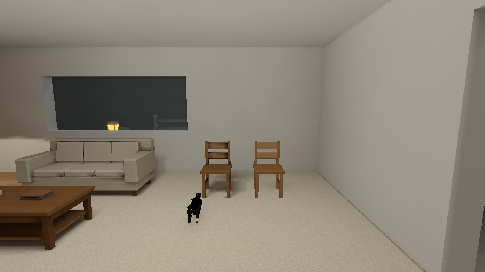

# Stage 4 — Light that follows objects

2026-10-08.

Placed, World-spawned and runtime-spawned models retain their material/normal paths while receiving spatial residual probes and selected direct light. Ordinary door motion changes real entity visibility and returns its lighting payload when closed.

| Before | Final |
| --- | --- |
|  |  |

## Implemented behavior and limits

Eight inset support anchors avoid sampling the frame stops around a closed leaf without changing its mesh/collision bounds. Real frame-crossing remains blocked. The stationary chair's selected-source visibility changes 0→0.96875→0 when the ordinary door opens and closes; returned leaf/chair payloads are exact. Position controls move and rotate the same mesh through a real opening, with no disconnected-room leak established in those bounded native cases.

Static self-occlusion/switch layers and live selected-direct/residual lighting are distinct inputs. PLPF v3 retains an aligned zero direct sidecar even when the always-on source list is empty; indirect-only and switch-only fields remain spatial. Genuine v 2 fields keep their legacy combined centre path. Both codecs reject malformed alignment/truncation and nonzero selected energy without a source.

Forty-eight visible-actor preset transitions cover each directed quality pair twice in actor/dim/exterior controls; independent lighting/filter/atlas changes preserve unrelated texture state. Settled resources restore, while actor animation can advance between different frames. This does not measure every presented loading frame.

Characters use clamped bind-bound support and floor proxies, not full posed-body ray shadows. Rigid objects use actual triangle/PNG-alpha casters. Up to eight grounding footprints cap diffuse removal at 22%; doors do not rebake static atlas direct or indirect. Conservative global caster invalidation costs are retained in [performance](performance.md): 32 moving-caster receivers measured 7.56 ms whole-engine update versus 0.70 ms stationary in the historical control.

[Contracts](contracts.md) retain the implemented technical boundaries; [measured costs](performance.md) retain the dated work/resource methods and limits. The [seven-stage history](../../style-upgrade-20261007/art-style-history.md) records completed integration and distinguishes this milestone from later model-lighting work. Current reproduction and repository gates are in [Verification](../../VERIFICATION.md). Historical stage source/format numbers are not a claim about the current solver revision.

## Actual door visibility control

| Closed | Open |
| --- | --- |
|  |  |

## Historical implementation and checks

Original implementation [2615b9b](https://github.com/csd113/Places/commit/2615b9bc787a116bca1d9bc9d9deb855ed87724d) passes strict debug/release Clippy and formatting. Its local workspace run passes 2,097 library tests with 23 ignored before the three inherited package-discovery failures. Fifteen support regressions and seven Python decoder checks pass. The intermediate [c6 publication CI](https://github.com/csd113/Places/actions/runs/37799238665) succeeds, but that result precedes the zero-source defect discovery and is not proof of its repair.

The final solver-15 repair [7d80433](https://github.com/csd113/Places/commit/7d80433ccb77d828a8c519ffa8da935fcbcac4c4) retains the aligned zero sidecar and passes focused authored-solver, label, codec, compiler, package/runtime, architecture and nine Python checks, plus formatting and strict debug/release Clippy. Its local workspace run passes 2,102 library tests with 23 ignored, then exits 101 at the same inherited package-discovery cases. Both dated local runs remain qualified; the later Stage 7 gate closes those dependencies.
