# Stage 4 — light that follows objects

2026-10-08 UTC · [Contracts](contracts.md) · [Measured costs](performance.md) ·
[Validation and publication](handoff.md) · [Final-audit correction](zero-source-repair.md) · [Chronological journal](../../style-upgrade-20261007/README.md)

Movable chairs and characters now carry spatial residual irradiance and evaluate
important practical lights at their actual fragments. Stable source identities,
real moving occluders and restrained floor footprints connect them to the same
scene as the baked furniture. The original room keeps its soft, low-poly look.
This is a lighting foundation with modest visible gains, not new artwork or exposure.

## Matched native milestone

| Stage 3 before | Stage 4 final, same camera/settings/content |
| --- | --- |
|  |  |
|  |  |
|  |  |
| 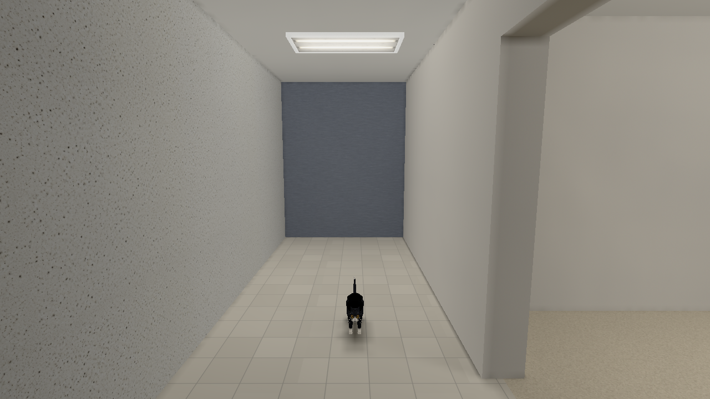 | 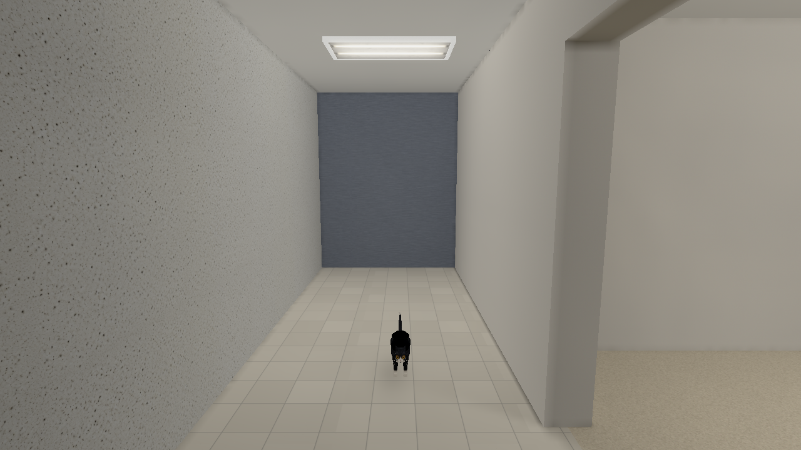 |
| 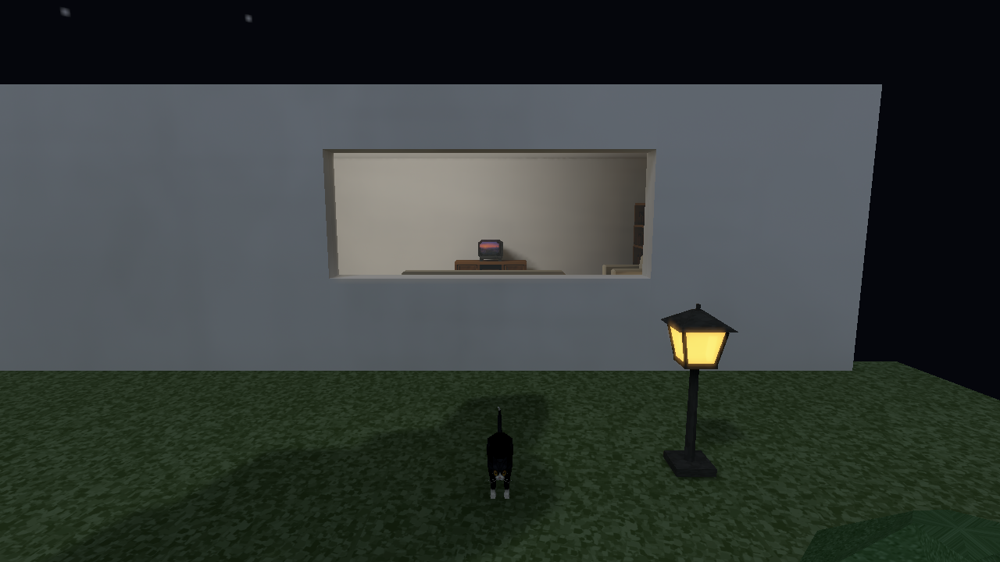 | 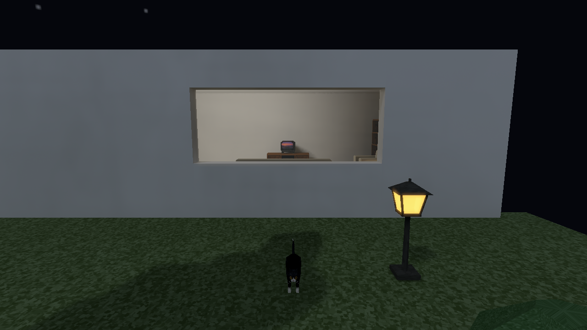 |

The right chair gains a softer floor relationship and spatially oriented direct
response. Its baked neighbor retains its existing self-occlusion. Exact pixel
comparisons in [the final gallery receipt](after/comparison-final.json) show hall,
contact and corner unchanged, one channel of one window pixel changed, and the
room/entity differences confined to the movable chair and its floor footprint.
Black coat remains authored black reflectance; visible paws, highlights and
unit-light diagnostics distinguish it from missing illumination. A generalized
fullbright/dark-model defect was not reproduced in the original hero.

All raw PNGs are native framebuffer captures. Six original before views match
the sealed Stage 3 gallery. Original Stage 1 and Stage 2 captures and runnable
bundles remain immutable. [Concept hashes](concept-preservation.json) and
[prior snapshot hashes](prior-snapshot-preservation.json) verify preservation.

## A real door, a real receiver

| Stage 3 same control/camera | Stage 4 runnable replay, same content |
| --- | --- |
| 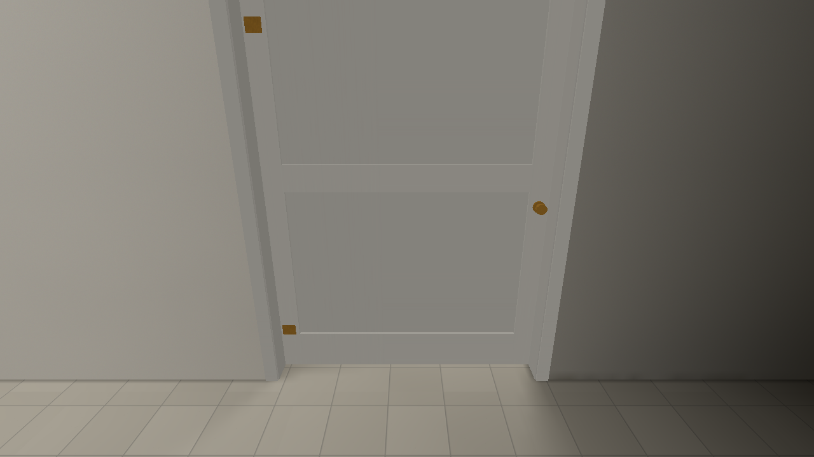 | 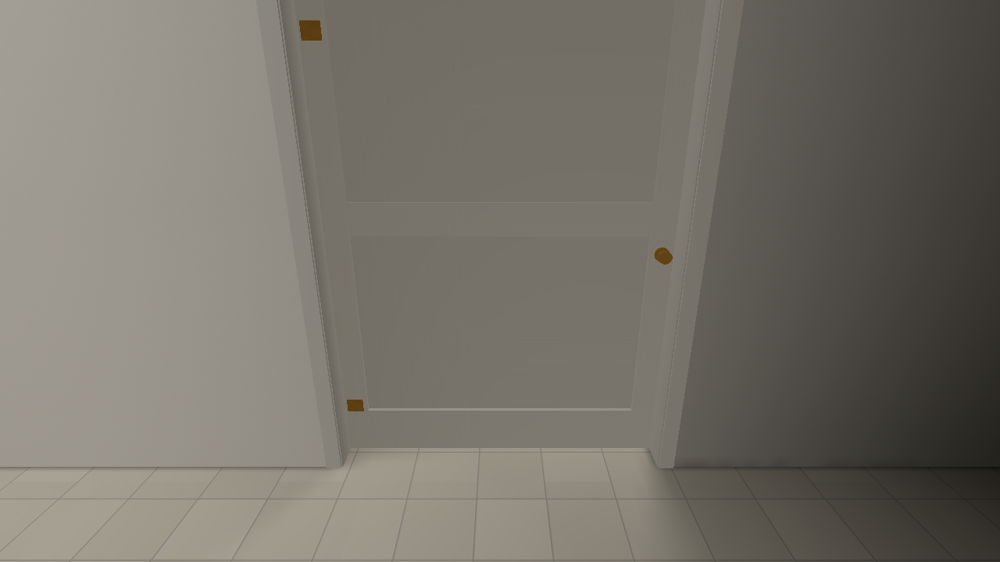 |

This like-for-like pair preserves the lit leaf while changing its spatial response.
The following sequence adds a stationary chair to expose actual occlusion changes.

| Closed final | Open final | Closed again |
| --- | --- | --- |
| 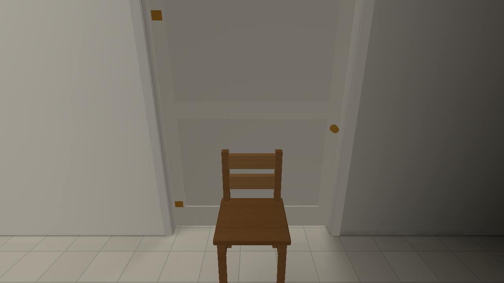 | 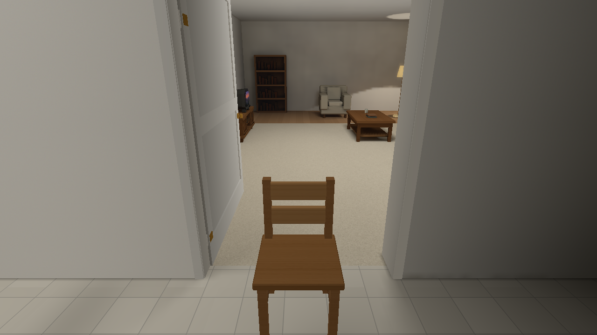 |  |

This additive hero control uses the normal authored door, frame and chair. Its
first Stage 4 candidate exposed a black closed leaf: all eight extreme bounds
samples sat in neighboring frame stops. The generic support inset now clears
those stops without changing mesh/collision bounds. A real assembly regression
proves that frame crossing remains blocked. The stationary chair's selected room
source visibility changes from zero to 0.96875 and back to zero. Leaf and chair
payloads restore exactly in [the movement acceptance receipt](movement/acceptance-final.json).
The failed candidate and its raw images remain preserved under their original paths.

| Exterior start | Entering the room | Return exterior |
| --- | --- | --- |
| 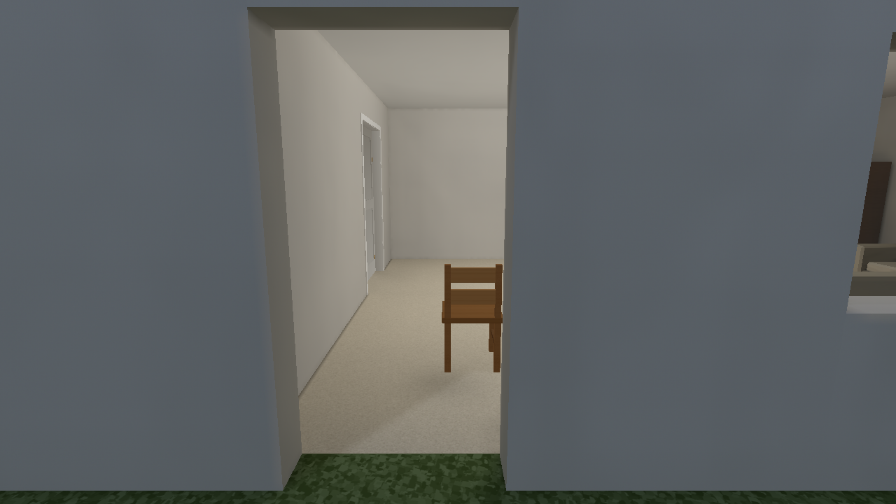 | 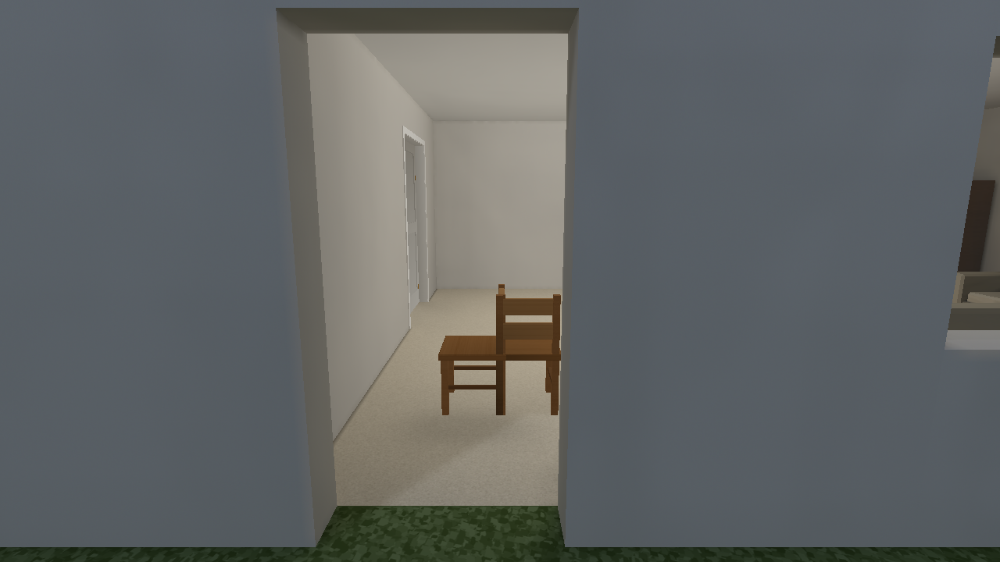 |  |

The bounded [ordinary API sequence](sequences/crossing-final.json) translates and
rotates the same mesh in both directions through a real opening. Probe/support
payloads change continuously at recorded positions, with no major flicker or
disconnected-room leak in these native cases. This is a bounded position sequence,
not a claim of every possible animated boundary trajectory.

## Same mesh, three routes

The comparison control adds an identical chair through prepared static, ordinary
World spawning and explicit runtime spawning. [Source and cameras](comparison-manifest.json)
retain authored material and normal paths. Static self-occlusion and switch layers
are distinct inputs; live entities receive selected direct plus residual probes.

| Broad panel on | Same view, panel off / residual light |
| --- | --- |
| 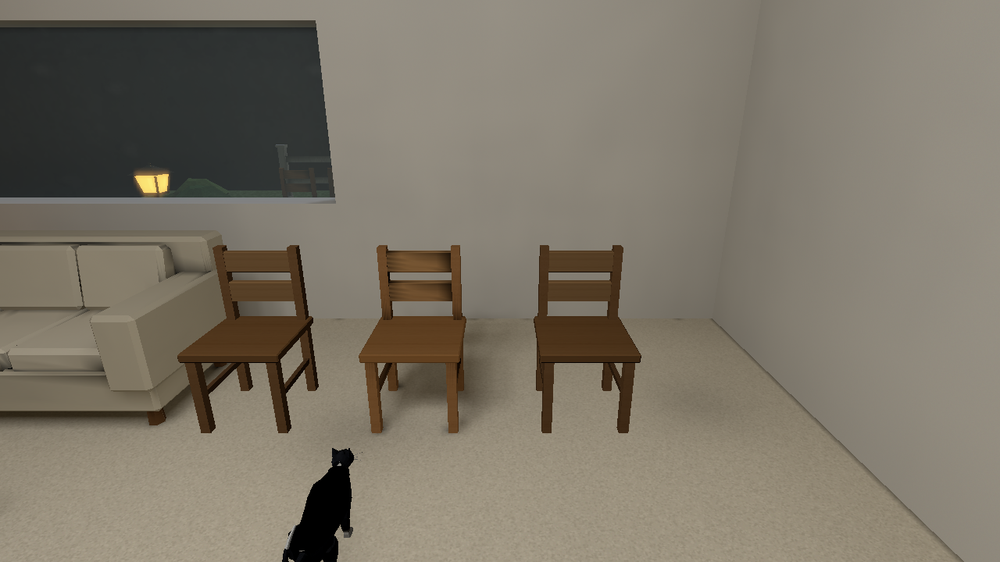 | 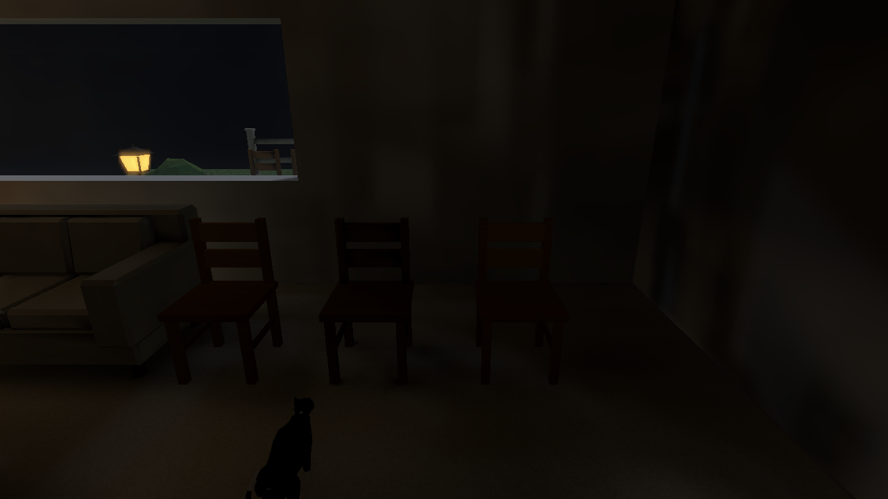 |

[Warm practical](comparison/warm/final/on.png), [shaded hall](comparison/shaded/final/on.png)
and [night exterior](comparison/exterior/final/on.png) cover the remaining cases.
The three routes retain coherent color and bright/dark response. All dim when the
panel is off; no arbitrary brightness floor or per-model correction is added.
Switchable diffuse bounce remains absent from the entity base field and is disclosed.
[Native transforms](transforms/live/original.png) exercise translation/rotation and
ordinary uniform scale at 0.65, 1.25 and restored 1.0; non-uniform matrices are
covered by deterministic tests because native authoring/API scale is uniform.

## Quality without a restart

[The resource matrix](quality/acceptance.json) records every directed Low/Medium/High
pair twice in each of actor, dim and exterior views. The final binary repeats all
six pairs twice with visible actors: **48 preset transitions in total**. Ten
independent lighting/filter/atlas changes keep High texture storage fixed
(5,264,704 prop bytes; 53,127,840 world cache bytes at 1024px). The
stationary advanced-settings restored image is pixel-identical to its initial
state. Preset endpoints may differ only where normal actor animation advances.
Low releases atlas/probe resources; Medium/High recreate valid resources and
restore the captured settings. No player restart, rebake or reload command is used.

| Final High actor endpoint | Low in the same live loop | Restored High |
| --- | --- | --- |
|  | 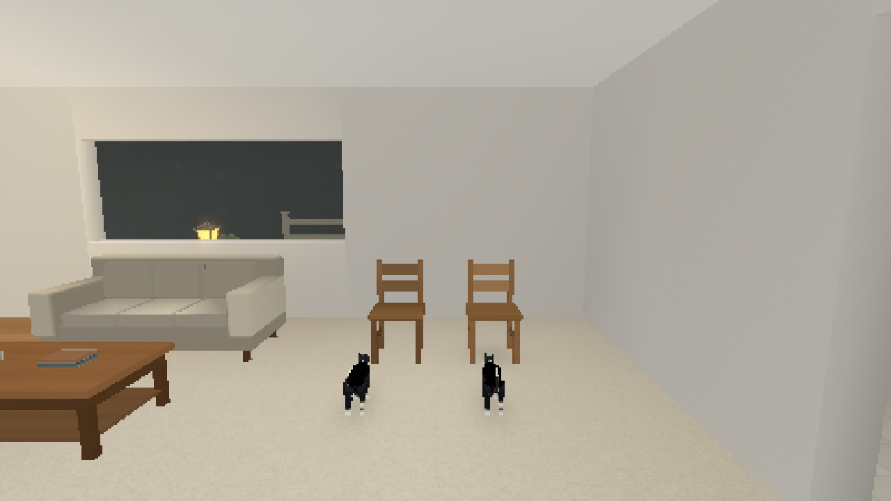 | 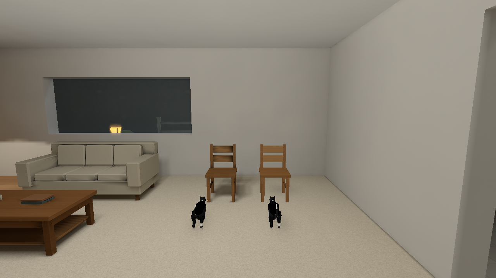 |

The original Stage 3 Low→High failure was not reproduced in this hero; its
restored before image is byte-identical. The fix addresses the audited premature
resident-state mutation and captures the complete staged request. Ready-gated
PNG receipts establish settled results and resource correctness, not every
presented loading-transition frame.

## Truthful diagnostics and limits

[Probe field](diagnostics/probe-field/entities.png) shows real validity markers;
[neighborhood](diagnostics/probe-neighborhood/entities.png) links accepted weighted
contributors and distinguishes rejected valid samples. [Compiler validity](probe-audit/summary.json)
counts 260 valid air samples among 495 slots. [Entity direct](diagnostics/entity-direct-final/actors.png)
and [residual](diagnostics/entity-indirect-final/actors.png) show actual uploaded
contributions. Magenta marks a route without that entity-only contribution view;
it is a diagnostic label, not lost transport. Feature `final` pixels exactly
match the normal player in [the parity receipt](diagnostics/final-parity/equality.json).

Eight inset bind-bounds anchors and clamped pose support are approximations.
Characters provide floor bounds proxies, not full posed body ray shadows; rigid
objects use actual triangle/PNG-alpha casters. Eight soft footprints add no draw
or texture and cap total diffuse removal at 22%. Doors do not recompute static atlas direct or indirect; moving ray occlusion
applies to entity receivers and floor footprints provide approximate static grounding. Genuine legacy v2 fields retain the prior center path. Newly solved indirect-only and switch-only fields preserve spatial sampling through a validated zero direct sidecar.
The conservative global caster revision costs 7.56 ms whole-engine update for
32 receivers while one caster moves, versus 0.70 ms stationary. The measured
original-view GPU increase is 0.306 ms. [Performance](performance.md) reports
these costs without inferring isolated shader timing or physical display cadence.

Runnable milestone receipts, exact commands, implementation/remote/CI identities
and custody release are recorded in [the handoff](handoff.md).
