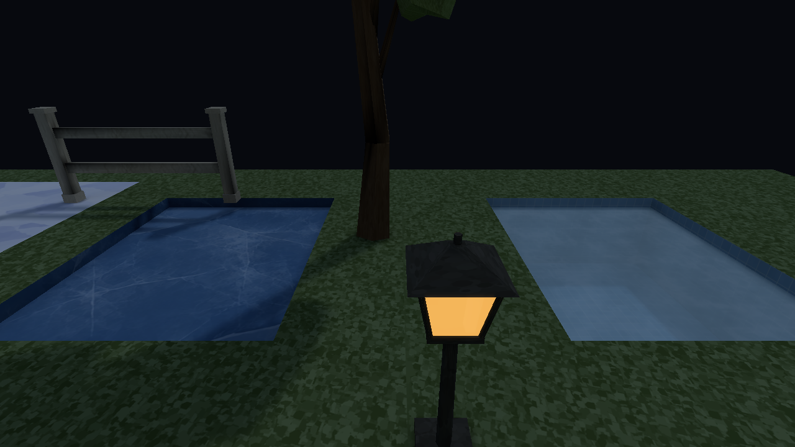
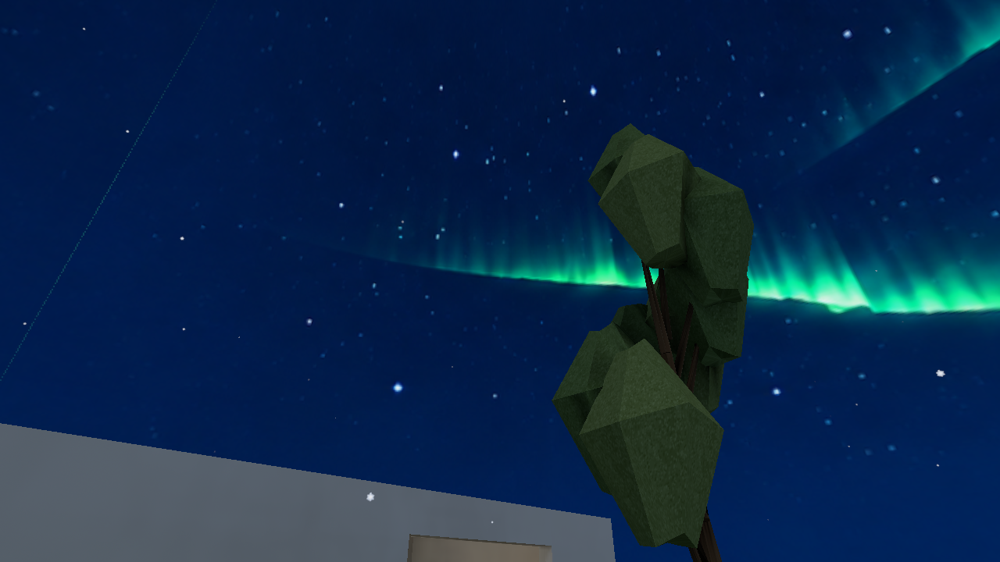
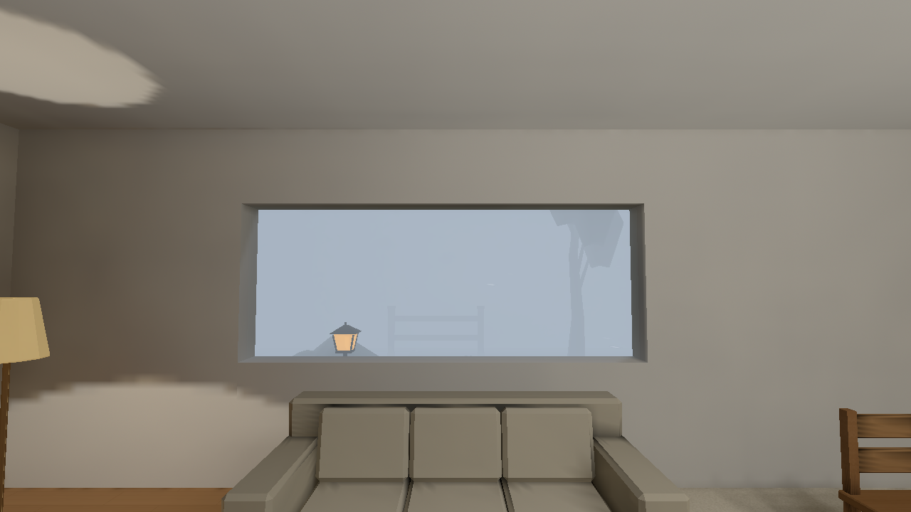

# Stage 5 — controlled highlights and a coherent night — 2026-10-08 UTC

[Contracts](contracts.md) · [Measured costs](performance.md) ·
[Validation, runnable bundles and custody](handoff.md) ·
[Chronological journal](../../style-upgrade-20261007/README.md)

The accepted Stage 4 room is retained. This stage makes presentation consistent
across quality, preserves warm highlight colour, reduces translucent bloom and
puts water on the same prepared incident-light contract as its surroundings.
Reusable sky, fixed exposure and global atmosphere controls support the additive
hero night arrangements. All images below are untouched native Metal captures.

## Matched views

| Stage 4 before, same source and camera | Stage 5 after |
| --- | --- |
|  |  |
|  |  |
|  |  |
|  |  |

The lantern changes from a pale yellow highlight to warm orange, with a smaller
halo. Water becomes cooler and its tiled basin more legible. Ice keeps its distinct
cracked appearance; snow remains diffuse and opaque. The translucent ghost keeps
its cyan body with less glow. Original wall/furniture midtones and grounding change
very little. These are bounded presentation and surface gains, not a new GI solve
or a claim that every surface now matches the concepts. Texture detail, silhouettes
and some small edges remain sharper than the soft concept artwork.

All six original views are preserved in [before](before/original/manifest.json)
and [after](after/original/manifest.json): room, window, hall, contact, entities and
corner. The [three surface cameras](hero-control-manifest.json) add surfaces,
night and water without replacing the original hero. FOV is 60°, logical viewport
640×360, native drawable 1280×720, High / Full lightmaps / High filtering / Full
reflections, bloom on, VSync off. Captures wait for 0.5 s of the ready world.
Receipts retain binary/package/catalog/source hashes, requested settings, camera
transforms and the dirty precommit base `b00123f9`; frozen build inputs identify the
implementation exactly in [build provenance](build-provenance.json).

An initial Stage 5 before-control compile discovered a minimal adjacent Stage 4
asset root and omitted four added dependencies. Its snapshot replay displayed
missing textures. That attempt is preserved and rejected; the gallery above uses
the [corrected baseline](before-control-correction.json), explicitly compiled and
verified against the old catalogue plus the full unchanged PNG/model root. This
was preparation error, not an engine failure. No gain is claimed against that
invalid package. Original Stage 1–4 evidence and bundles remain unchanged.

The initial ghost bundles omitted a model referenced only by a runtime spawn
template. Their incomplete replay is rejected separately in
[snapshot corrections](snapshot-corrections.json). Corrected v2 bundles preserve
the real GLB/PNG via reusable explicit runtime-asset support; the native gallery
here already used those real repository assets. Compiler dependency traversal is
assigned to Stage 6, rather than claiming incomplete package provenance is valid.

## Intentional night and weather arrangements

These are authored environment comparisons, not like-for-like before/after gains.
The same ordinary hero geometry uses fixed exposure 1, cooler sky radiance, darker
distance/height fog and one regional garden haze. Night grading changes to 1.01
saturation / 1.00 contrast, versus shared defaults 1.03 / 1.02. Vertical water
attenuation is 0.3 per metre, versus zero in the matched control. Moon/global
directional and warm practical paths remain the established transport/runtime
accounting. No environment contribution is added a second time at presentation.

| Authored cool night | Existing aurora and calm snow | Severe snow, sheltered interior |
| --- | --- | --- |
|  |  |  |

[Night](after/night/manifest.json), [aurora](after/aurora/manifest.json) and
[storm](after/storm/manifest.json) receipts retain the exact states. Existing
aurora PNG, precipitation seeds, snow budgets and shelter logic are preserved.
Exterior storm extinction is strong while indoor furniture remains readable.
The aurora artwork's visible line is retained, not retouched. Sky artwork is still
a background excluded from reflection captures; incident sky light contributes
to baked surfaces and probes, while bounded reflection probes capture geometry.

## Truthful diagnostics and quality restoration

[Albedo](diagnostics/albedo/surfaces.png),
[world normal](diagnostics/world-normal/surfaces.png),
[baked incident light](diagnostics/baked-light/surfaces.png) and
[lighting state](diagnostics/lighting-state/surfaces.png) bypass exposure, shoulder,
grade, bloom, fog, sky, decals and weather overlays. Logs explicitly label mapped
linear values followed by one sRGB encoding. Thus mapped normal 0.5 displays at
about 0.735; diagnostic display brightness is not an irradiance measurement.
Water has a real prepared chart in the lighting-state view. Normal `final` remains
separately checked: original entity and control surface PNGs match the ordinary
player pixel for pixel.

The fixed bloom-on/off control alters 7419 of 921600 pixels (0.81%), with a mean
absolute difference of 0.016 display-byte units across the frame. The
[water camera](after/control-no-bloom/water.png) is byte-identical with bloom off;
lit ordinary surfaces do not enter the emission source. The
[surface comparison](after/control-no-bloom/surfaces.png) retains a small practical
halo, documented in [pixel comparison](image-comparison-v2.json).

Each of the six directed quality pairs runs once without restarting in the warm
original hero and cool night control: twelve transitions. Actual capture receipts
confirm requested/applied state. Both restored High endpoints in each sequence
are pixel-identical to the initial High image, recorded in
[quality verification](quality/verification.json). Low retains its historical
vertex-light approximation; shared exposure does not make its transport equal to
prepared High. Ready-only endpoints do not measure every loading frame.

The original Stage 1 baseline, all fourteen preceding runnable bundles and all
seven concept PNGs hash-verify unchanged. New accepted compatible bundles and
verified launch commands are recorded in the handoff; all are outside `target/`.
Native window acquisition was unavailable for steady-frame profiling. The cost
report uses real native capture GPU work, explicitly including copy/readback;
zero-draw timings are rejected. No CPU/GPU speedup is claimed.
