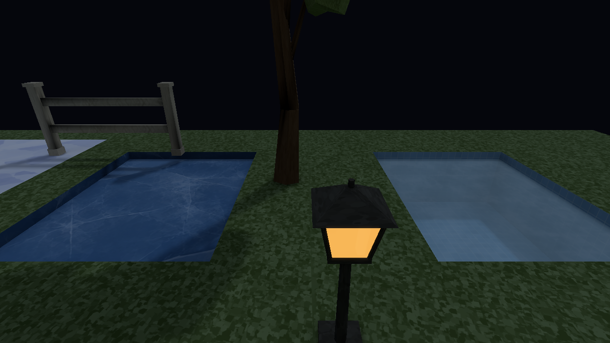

# Stage 5 — Controlled highlights and coherent night

2026-10-08.

A hue-preserving highlight shoulder, selective covered emission and authored sky/fog/water controls retain readable bright material and weather without adding incident lighting again at presentation.

| Before | Final |
| --- | --- |
|  |  |

## Implemented behavior and limits

The ordinary scene carries linear HDR through bloom/exposure/shoulder and encodes for display once. Bloom sources use covered emission; lit ordinary surfaces do not become an emission source. The matched bloom control changes 7419/921600 pixels (0.81%), with mean absolute difference 0.016 display-byte units. Its water view is byte-identical with bloom disabled.

Night/aurora/storm arrangements are authored environment variants, not like-for-like before/after improvements. The night variant keeps exposure 1, cooler sky, darker distance/height fog, garden haze, saturation 1.01/contrast 1.00 versus shared 1.03/1.02, and optional vertical water attenuation 0.3 per metre. Sky artwork is a background excluded from reflection captures; incident sky contributes through baked surfaces/probes. Storm extinction remains strong outside while sheltered furniture stays readable.

Twelve directed quality transitions in the warm and night scenes restore High endpoints byte exactly in their controlled captures. Low's historical vertex approximation remains different transport. Diagnostic numeric colours already pass through inverse-sRGB before the one presentation encoding; the old log wording describing mapped 0.5 as display 0.735 was inaccurate, not a conversion change. Albedo is already linear. Diagnostic values are mapped inspection data, not raw irradiance meters.

Centre/range blend ordering does not solve intersecting triangles or every effect overlay. Water attenuation is authored vertical basin depth rather than screen-space refraction. Static atlases under actors, skinned bound proxies, single-sample silhouettes and small alpha-mip limits remain. Native capture profiling includes copy/readback; no ordinary window cadence or isolated weather-kernel speedup is claimed.

[Contracts](contracts.md) retain the implemented technical boundaries; [measured costs](performance.md) retain the dated work/resource methods and limits. The [seven-stage history](../../style-upgrade-20261007/art-style-history.md) records completed integration and distinguishes this milestone from later model-lighting work. Current reproduction and repository gates are in [Verification](../../VERIFICATION.md). Historical stage source/format numbers are not a claim about the current solver revision.

## Prepared water, ice, snow and emission control

## Historical implementation and checks

Implementation [5a44e9d](https://github.com/csd113/Places/commit/5a44e9d3c461bd427830c5815738ba841342fc6a) passes formatting and strict debug/release Clippy. The local workspace run passes 2,112 library tests with 23 ignored, compiler/command-line targets and a separately run macOS CPU target, but exits 101 at three inherited stale-package discovery cases. Focused presentation/environment, transport/alpha and fog checks pass. The failed initial or zero-scene profiling attempts are excluded from final evidence; later Stage 7 supplies complete supported package acceptance.
