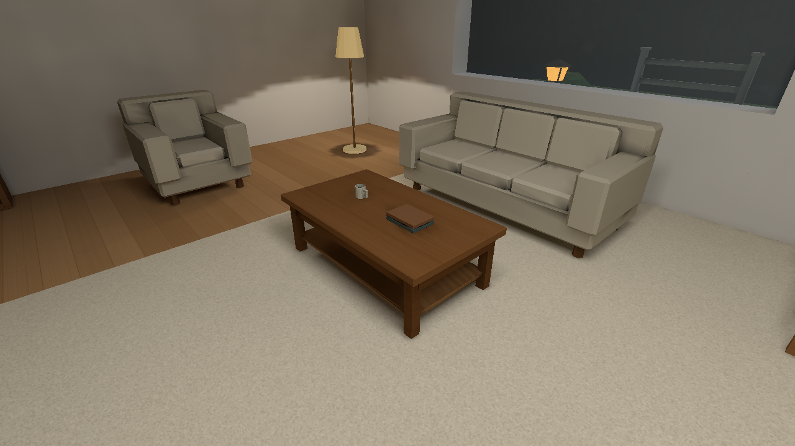
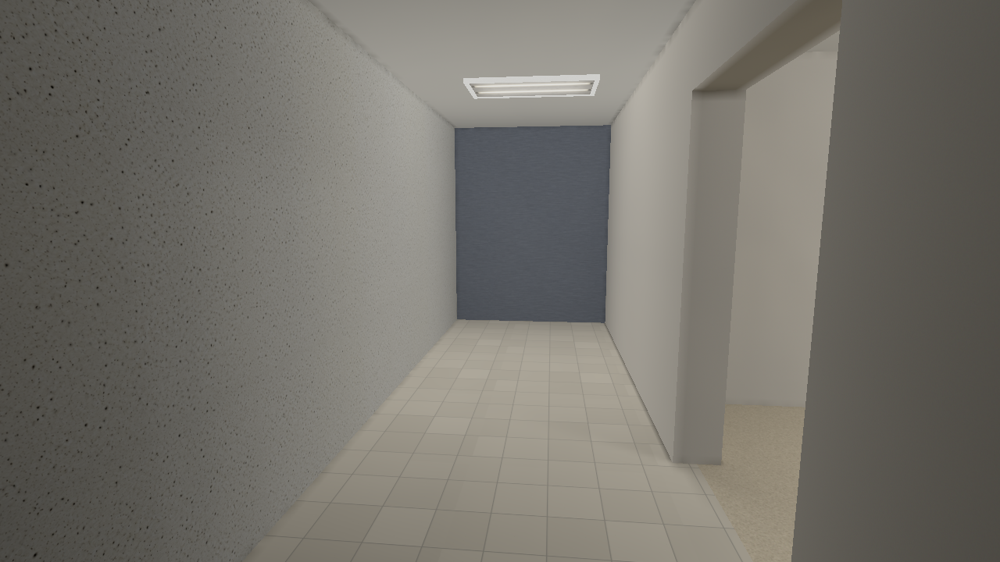

# Stage 6 — a furnished hero and dependable rebuilds

2026-10-08 UTC · [Contracts](contracts.md) · [Measured costs](performance.md) ·
[Validation and handoff](handoff.md) · [Chronological journal](../../style-upgrade-20261007/README.md)

The hero keeps Stage 5's lighting and surface controls while gaining a fitted
rug over oak, a throw cushion, two plants, framed art, baseboards and passage
casing. A separate reusable chair softens the seat, rails, back and feet. The
immutable [Home concept](../../../assets/environment/home/Home%20Environment%20Asset%20Sheet.png)
guides timber proportions, cream upholstery and restrained domestic density.
No concept or texture master changes; strong forms and existing 256² prop sheets
carry the result. The original chair remains byte-identical for prior packages.

## Matched native High views

| Stage 5 control, fresh Stage 6 before | Stage 6 refinement |
| --- | --- |
|  |  |
|  |  |
|  |  |
|  |  |

Oak now connects the room rather than ending in a narrow strip. The rug's bound
edge and table-foot shadows give the seating a clear footprint. Plants and art
break the bare corner without a new material system. Bevels catch narrow edge
light, and the crowned back/tapered feet improve the paired chairs' silhouette.
The left chair is baked; the right receives runtime spatial lighting. Their
remaining difference is the established static/runtime transport approximation,
not a per-model brightness correction.

The casing gives the passage visible thickness; its stock proportions are
uniformly scaled to the existing opening. Its raised feet remain a reuse
compromise. Baseboards are non-solid, and the main walking route stays clear.
The floor plant and lamp overlap in projection in the broad camera but occupy
separate authored footprints. No new physical intersection is used to hide a
lighting defect.

Every other matched raw view is retained: [window before](before/refinement-control/window.png)
/[after](after/refined/window.png), [corner before](before/refinement-control/corner.png)
/[after](after/refined/corner.png), [surfaces before](before/refinement-control/surfaces.png)
/[after](after/refined/surfaces.png), [night before](before/refinement-control/night.png)
/[after](after/refined/night.png), and [water before](before/refinement-control/water.png)
/[after](after/refined/water.png). Water, ice, snow, warm practicals and the ghost
remain real scene content. Floor reflectance changes legitimately affect the
shared solve, so their pixels are not asserted unchanged.

The [before receipt](before/refinement-control/manifest.json),
[after receipt](after/refined/manifest.json), [camera/settings source](hero-manifest.json)
and [immutable image identities](matched-native-inventory.json) record nine
identical cameras, FOV 60°, logical 640×360/native 1280×720, High filtering,
Full lightmaps/reflections, bloom on and ready-world time 0.5 s. Source JSON is
authoritative for sky/environment and deterministic timers. These are untouched
native PNGs, not generated artwork or retouched comparisons.

## Foundations that are visible through reliable work

Ordinary compilation now discovers all runtime spawn-template GLBs, including
unused override choices. Their embedded images travel under the GLB identity;
a snapshot no longer needs a manual ghost exception. Package reuse also pins
the catalogue, compiler executable, capture mode and settings. Missing/corrupt
provenance forces a full rebuild. Named cache decisions explain what changed.

An unchanged valid package stays byte-identical. Metadata and final exposure/
grade edits reuse prepared geometry, solved lighting and captures, refreshing
semantics/navigation/provenance correctly. Real texture, material, model,
geometry, light and entity edits rebuild conservatively. The recorded hero edit
matrix compares every result with an independent forced archive, including HDR
atlases and all probe mips. Native texture/light pairs confirm relevant images.

At package-open, streamed dependency hashes reject same-size PNG/GLB changes;
new provenance also checks catalogue identity. Older bundles retain their
supported contract. No file hashing or static baking occurs per frame. The
profiled receiver change removes a duplicate anchor sample while retaining
conservative global caster invalidation and the exact old native output.

## Preservation and practical limits

The original Stage 1 baseline, original PNGs and every earlier snapshot remain
intact. Six fresh original-hero before captures exactly match Stage 5. Their
[receipt](baseline-preservation.json) also pins seven immutable concept PNGs.
Earlier incomplete ghost bundles remain honestly rejected; corrected v2 bundles
supply the before control. No failed historical replay is relabelled successful.

The [asset audit](assets/hero-assets-final-audit.json) checks topology, winding,
UV area, embedded image identity and exact chair bounds. [Compiled movement](movement/)
checks 284 normal player frames and navigation through the passage both ways.
Six furniture boxes adopt the existing local size/yaw representation; trim,
bevels and decoration never generate new collision. The generated catalogue
registration adds just one Zoo apron display, preserving all 217 old placements;
its compiled adoption belongs to Stage 7.

The measured room has 6,944 submitted triangles/43 base-scene draws versus
5,234/38 before, two atlas pages unchanged, and a 6,632,334-byte archive.
Configurable [warning budgets](budgets/hero-warning-budgets.json) retain headroom
without changing safety bounds. Capture GPU work includes copy/readback;
ordinary presented-frame CPU/FPS and fragment overdraw remain unmeasured.
Static atlases under moving actors, skinned shadow proxies and the remaining
conservative 32-receiver refresh cost remain documented approximations.

[Implementation daa9642](https://github.com/csd113/Places/commit/daa9642fbe2e9cae91d95f667bcf50e1fefe585b) is pushed and remote-verified.
[Source publication](source-publication.json) binds all 219 frozen Rust/WGSL/Cargo
inputs to that revision. The [52-file runnable milestone](stage6-snapshot.json)
uses automatic dependencies without runtime-asset exceptions; isolated room and
ghost/surface replays match accepted native PNGs exactly. [Handoff](handoff.md)
contains launch instructions. Final seal/remote/exact-SHA CI and explicit custody
release are recorded after the gate in the durable completion receipt.
