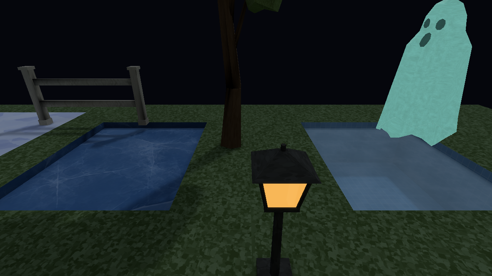

# Stage 7 — completed integration across Places

Stage 7 completed on 2026-10-09 with explicit animated-image and platform qualifications. [Implementation 4ef8c88](https://github.com/csd113/Places/commit/4ef8c8857b759b5b5f19357f437e7a9367456e59) was published as [a1e7122](https://github.com/csd113/Places/commit/a1e7122bba5df549c2e82c16371bcc57db99e976); the exact-publication [CI run 37906450891](https://github.com/csd113/Places/actions/runs/37906450891) succeeded. Earlier stopped campaigns remain historical failures, not retroactive passes.

The stage integrates the preceding colour, surface transport, live-entity, atmosphere, content and cache work across the supported inventory. It preserves the furnished hero and its approved artwork. The later [production model-lighting correction](../../model-lighting-root-cause-and-fix.md) is separate: Stage 7's representative controls did not investigate kitchen cupboards/sinks/fridges, specific Home ceiling joins or the close Hallows skeleton report.

| Before | Final |
| --- | --- |
|  |  |

## Final inventory and outcomes

The recursive inventory contains 50 source paths: five shipped maps, five local maps and 40 fixtures. All 48 supported package cases pass ordinary Off/Medium/Full compilation, required-current verification, decoding and normal native loading. The synthetic capacity source is a positive CPU/count/u32 boundary control without an archive; the invalid Arc is a negative loader control. Expected negative geometry fixtures retain their required findings. The optional sibling-archive reader control is not claimed executed when its archive is absent.

Bounded timber/resin/chrome/ice scalar adoption preserves source PNGs, model positions, UVs, triangles and collision. Original and refined chairs both remain available. The Zoo retains all 217 preceding placements plus its additive refined-chair exhibit. Original camera/concept identity and meaningful comparison roles remain intact.

Geometry 7 made wall/roof endpoints agree across renderer, collision and loader, including the recovered Blizzard roof underbound. The coplanar ghost check clips actual triangles to the face rectangle and still requires real face-centre support; it is not a watertight-collider theorem. Outdoor duplicate perimeter faces and Snowfall's inward backdrop were corrected. Outdoor's step-valued occupied union agrees over 52,785 boundary/midpoint samples; Snowfall collision and both maps' navigation remain exact.

Solver 16 scores probe phases using the same strict placement predicate as final labels. It leaves already-covered grids unchanged and considers at most 63 alternative quarter-cell phases for actual misses, retaining every originally covered room. Final Demo rooms 7/8 have Prepared entity support; room 10 improves observed rescue support without claiming its original ownership warning alone proved a lighting defect. [Coverage audit](integration-demo-probe-coverage-audit.md) explains the actual radius/visibility distinction; [Pit audit](integration-pit-probe-coverage-audit.md) explains valid overlapping shaft ownership.

The first Hallows Full rebuild lost its atlas and field through page overflow. It was rejected despite decoding successfully. Historical Full planning required ten pages for unchanged charts. Demo's ten-page/two-group atlas required a measured typed record allowance of320 MiB+64 KiB; general entry/mesh/aggregate guards were retained. PLMP v6 exact vertex/frame sharing brought the dense package under the unchanged 1 GiB aggregate guard without deleting geometry or illumination. These are Stage 7 figures; [current verification contracts](../../VERIFICATION.md) and the separate correction define later geometry/solver/layout revisions.

## Actual validation and qualified native acceptance

The complete normal gate passed strict debug/release Clippy, format/checks, 2169 all-feature library tests and every integration target, 286 Python tests and scoped Metal controls. The literal default `cargo test --workspace` subsequently passed 2163 library tests and all integrations. Six additional content controls, generator currentness and 353-asset validation (205 placeables/five themes/zero warnings) passed. The final two source repairs rebuilt and 46 unchanged packages reused safely. Ten installed-map full/reuse comparisons and 22 preceding edit controls agree with forced compilation.

Linux ARM 64 passes the final library/integration and strict source checks. Windows GNU links normal PE release and all-feature test binaries and passes strict checks. Physical Linux/Windows GPU/window execution is unclaimed. A path-canonicalization test correction preserves ordered IDs/sources, rejects missing or wrong same-named packages, and changes no runtime binary. The directional-pixel test correction accounts for committed texel decoding, fog and one display encoding: original/final actual facing 127/127/128 and reversed 88/88/89 pixels are unchanged, retaining strict tolerance and wrong-normal rejection.

Native evidence closes 52 original failed/blocked obligations:48 direct passes and four qualified Home comparisons. Six lighting environments exercise all six directed quality pairs twice, independent filtering/lighting/reflection changes, resource state and applicable Prepared support. A 13-map journey records real scene presentation. Empty camera samples remain rejected; corrected views submit nonzero geometry. The failed attempt to register a seventeenth Demo mesh enforced the unchanged 16-mesh guard. Registered washer-drum reuse supplies a valid witness without relaxing that guard.

**Home is qualified animated-image acceptance, not whole-image equality.** Its two original strict whole-image assertions remain failed. All ten RGBA pairs agree outside the source-derived conditional idle-skin envelope `[1012,263,1260,411]`. All 12 actual cat/drum centres and uploaded spatial payloads agree; eleven optional world/props/lighting snapshots agree. The normal run lacks that optional snapshot but retains actual entity traces and exact outside pixels. Negative controls reject outside-envelope and payload changes. Joint pose/time, posed vertex/normal/opacity buffers were not traced. The envelope assumes idle, the fixed camera and rigid transform; containment does not prove animation caused every actor-region difference.

## Costs and limits

The paired native hero control submits 43 draws/6944 triangles unchanged. One comparable capture/readback pair measures CPU update/render means 0.068/0.354→0.074/0.371 ms, Metal surface-scene medians 0.957→1.023 ms and capture-scene 1.662→1.893 ms. Traced allocation medians 176,472,064 B and observed peaks 184,156,160 B are unchanged. Capture blocks approximately 81 ms; this is not gameplay FPS. The hero archive changes 6,632,335→6,599,506 B. Dense decoded storage changes 1,435,049,755 rejected→1,035,943,642 accepted, saving 399,106,113 B. See [measured costs](performance.md) and [lossless storage](integration-capacity-storage-audit.md).

Pool capture-run OS maximum RSS is 3,445,620,736 B and the journey's 2,408,808,448 B. Coarse samples do not prove exact peaks, total GPU memory, a plateau, physical cadence or loading/gameplay stalls. A capture-trace parser correction accepts independently ordered JSON fields while retaining generation, route, payload and endpoint checks; four restored endpoint audits pass. Final source review rejects map-specific renderer exceptions and documents the approximations below.

Static atlases stay baked during actor motion; skinned shadows use bound proxies; conservative global receiver refresh, single-sample silhouettes and tiny alpha mips remain approximations. Model normalTexture/tangent-space authoring is unsupported. Outdoor High retains its established very dark appearance.

[Integration contracts](integration-contract-audit.md), [content/reference findings](content-reference-audit.md) and [recovered weather compatibility](integration-recovered-review-final.md) retain the technical methods. [Seven-stage history](../../style-upgrade-20261007/art-style-history.md) provides the visual progression. Functional [hero cameras](../../../tests/fixtures/native/hero-manifest.json) and [diagnostic cameras](../../../tests/fixtures/native/hero-diagnostics-manifest.json) support maintained reproduction; raw execution journals are not required to understand these final conclusions.

## Historical supported native examples

