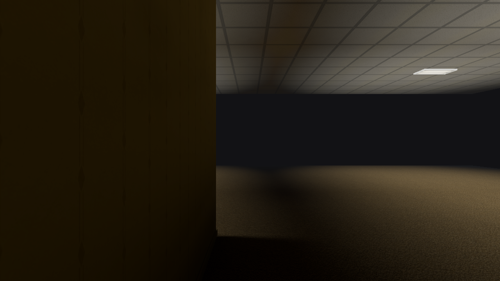
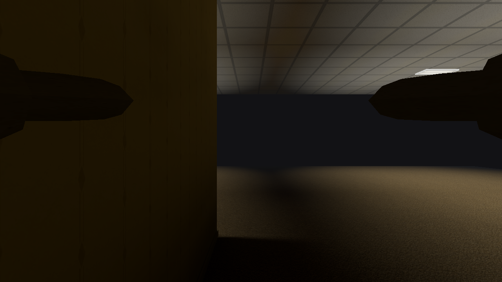

# Culling correctness — October 10, 2026

This bounded renderer pass restores animated limbs incorrectly rejected by the
CPU frustum, honors eligible opaque entity materials' single-sided contract,
and avoids some unnecessary static-prop submissions. Baseline:
`dbbf54e4c1f8902cd98ba9650a969381cb22c39f` on `Art-style`.

## Confirmed behavior and changes

The existing CPU frustum rejected whole world ranges, prop draws and entities;
a surviving draw submitted its complete index range. All shared world/entity
pipelines rendered both sides. That was necessary for some content, but glTF
`doubleSided` was discarded even for opaque entities that authored one side.

The importer now retains and validates `doubleSided` (omitted means false,
following the [glTF material contract](https://registry.khronos.org/glTF/specs/2.0/glTF-2.0.html#double-sided)).
Eligible opaque dynamic/character primitives select back-face-culling pipelines.
Scene and emission agree; reflected placements reverse facing and compose with
the existing reflection-camera convention. Finite nonuniform placements retain
their determinant parity. Singular or invalid transforms fall back to two sides.
No shipped winding defect was demonstrated: a read-only audit of thirteen
single-sided opaque entity primitives, totaling 10,884 triangles, found no
degenerate, inconsistent or nonmanifold topology and no required winding flips.
Authored normals agreed with winding; missing normals already use posed geometry.

Character GPU bounds previously used a padded bind-pose box. The mannequin's
forward arms extend about 0.449 m beyond its old local Z limit; raised hands and
the skeleton's seated pose also exceed their old boxes. Bounds now accumulate
the exact positions in the existing skinning/upload loop, cache held poses,
and refresh after animation or placement changes. Eight-corner placement
transformation and a small numeric margin preserve conservative frustum tests.

Opaque/cutout static-prop draws now use their referenced primitive's bounds,
computed once during upload. Blended draws keep their previous batch bounds and
sorting centre. Invalid metadata retains the original conservative bounds.
Prop vertex telemetry now counts distinct references per draw; its former
whole-chunk charge could exceed the scene's total. This counter correction is
separate from actual draw/index savings.

## Intentionally two-sided

| Category | Reason |
| --- | --- |
| Architecture and prepared static props | Opaque opening panes are mid-plane quads; void shells promise visibility from either side; curtains and fitted planes need their backs. All shipped static prop materials explicitly request two sides. Prepared records retain their existing layout. |
| Explicit `doubleSided`, MASK and BLEND | Preserve cloth, foliage, cutout coverage, glass and transparent entities. |
| Water, decals, sky and effects | Preserve underwater views and their existing dedicated pipeline contracts. |
| Uncertain characters | Reflected/singular retained bind hierarchies or inverse binds, scale-animation channels and morph targets cannot establish stable facing. |
| Dynamic models with skins or morphs | This bind/default-pose path does not retain enough rig information to establish orientation. Code-built doors also retain two sides. |

Mixed-joint rotation deformation follows the authored material side; the guard
does not prove every future deformation avoids folding a triangle. Authors must
request two sides when their content needs it. Static single-sided material
support would require preserving new prepared-record semantics and remains outside
this format-preserving pass. No PVS, occlusion system, meshlets, LOD, map changes,
lighting changes or water-height gameplay fix were introduced.

## Native evidence

The preserved ordinary baseline and candidate run on Apple M2 Pro / Metal at
1280×720, FOV 60°, fixed simulation step 1/60 s, isolated state, unchanged assets
and compiled packages. Static captures use ready frame 120; affected entity
details use frame 230. Live movement, weather controls and Low→Medium→High
transitions use the existing benchmark scripts.

Of 59 accepted paired screenshots, 52 are pixel-identical. Four differences restore the
missing extended arms, including camera samples across the old bound. The other
three changes are four pixels on the skeleton's back, five pixels on the
pumpkin skeleton's back and one pixel in Demo's night view. The return-to-standing samples match. Independent review found no visible
culling regression; six current world-normal/vertex-normal diagnostics also
look correct. The renderer has no existing wireframe mode to check.

Before: the old box rejects the entire mannequin despite visible hands.

After: the uploaded pose's bound keeps both hands visible at the same camera.

The unchanged [underwater view](images/culling-correctness/underwater-preserved.png)
and [beach shore](images/culling-correctness/shore-preserved.png) provide compact
material and outdoor controls. Atrium, hero movement and entity-detail captures
provide useful glass, doorway and backside coverage. Front/back carved-pumpkin,
pumpkin-skeleton and benchmark-spawned Spooner Man pairs cover additional entity
families. Three weakly framed shots
(the labeled glass/doorway/poses views) are not treated as strong evidence.
Screenshots sample motion; they do not prove continuous visibility at every
possible camera or animation frame. Focused Rust tests additionally reproduce
the old near-plane rejection, cover transformed posed positions, stale-bound
replacement, invalid metadata and conservative sidedness fallbacks.

## Submission and frame-cost evidence

High-quality fixed-camera telemetry shows real submission reductions:

| View | Draws before → after | Submitted triangles before → after |
| --- | ---: | ---: |
| Hero room | 31 → 31 | 4,954 → 4,954 |
| Hero contact | 23 → 21 | 3,682 → 2,962 |
| Demo doorway | 299 → 296 | 107,436 → 104,760 |
| Beach shore | 85 → 84 | 18,118 → 16,554 |

These are tighter-frustum savings. Back-face culling rejects back-facing
triangles during rasterization; it does not necessarily avoid vertex processing
or reduce submitted indices. No GPU timestamp, vertex-invocation or disk-saving
claim is made.

Timing used three sequential pairs per view, alternated ordering, 120 warmup
frames and 600 measured frames per run (10,800 measured frames). Owned test CPU
workloads were temporarily paused and resumed around the campaign. The existing
GPU-drain option measures renderer completion wall time, not GPU timestamps.
Below are ranges of the three run medians in milliseconds; all runs are retained.

| View | Frame before → after | Renderer before → after |
| --- | ---: | ---: |
| Hero room | 1.149–1.259 → 1.155–1.830 | 1.107–1.219 → 1.114–1.788 |
| Entity front | 2.059–2.070 → 2.033–2.065 | 1.511–1.536 → 1.460–1.471 |
| Beach shore | 2.497–2.503 → 2.572–2.591 | 1.603–1.605 → 1.590–1.599 |

Entity renderer medians improve 2.98–4.95%; its whole-frame changes range from
−0.24% to −1.69%. Beach whole-frame medians regress 2.76–3.66%
(+0.069–0.092 ms), with update medians +0.065–0.075 ms and renderer medians
slightly lower. This is an observed small absolute frame-cost increase, not an
overall performance win; precise causal attribution is unavailable.

Hero paired frame deltas are +2.36%, +45.41% and +0.52%. The second pair's
time series shows the same roughly 1.8-ms renderer regime in both executables
before returning toward 1.1 ms, so a pooled speedup/regression inference would
be unreliable. The prior refinement's unresolved hero timing variation remains
unresolved, and this campaign includes a larger transient. No significant or
general speedup is claimed. Numeric pose-bound accumulation and per-primitive
pipeline selection have costs; correctness and demonstrated submission savings
are the verified gains.

## Verification

Passed:

- `cargo fmt --all --check` and `git diff --check`.
- Required `cargo clippy --workspace --all-targets --all-features -- -D warnings`.
- Required `cargo test --workspace`: 2,237 library tests plus seven integration
  tests passed on the initial implementation. The final all-features gate below
  includes the subsequent dynamic skin/morph fallback regression test.
- Final `sh tools/check-rust.sh`: locked check, debug and release strict Clippy,
  and all-features tests (2,244 library plus seven integration tests; 32 ignored).
- Full Python discovery: all 362 package, asset, compatibility and native checks.
- Existing ignored Low-lighting GPU tests: both passed on Metal, including live
  High→On→Medium→Off→High resource changes and the Low override's material paths.
- All seven bundled packages validate. New Off/Medium/Full `test_room` and
  `entity_showcase` packages both validate and pass `verify --require-current`:
  thirteen successful compiler build/verify/validate commands in total.

Rust ran with `RUSTC_WRAPPER=` because this session's sccache daemon returned
`Operation not permitted`; the configured Rust toolchain and lint policy were
unchanged. No lint levels were lowered. CI exact-commit status is verified in
the final handoff. The whole-library preparation phase of `tools/verify.sh` was
not rerun: this pass changed neither assets nor prepared record semantics.
Bulk logs preserve actual outcomes; legacy PLMP3/4/5 and current PLMP6 compatibility
tests are part of the passed Rust gate.

## Reproduction and retained evidence

Bulk evidence is ignored under `tools/bench/results/culling-20261010/`: manifests
record binary/package/source hashes, settings, adapter, capture receipts and
exit codes. It retains `captures.py`, `extra_captures.py`, `motion.py`, camera
sequences, `paired_perf.py`, package checks and independent source/visual reviews.
The existing tracked harness is `tools/bench/capture_art_style_hero.py`.
`before/arm-gap` is an excluded initial camera pilot; `arm-correct` is the accepted
reproduction. Initial Halloween/Spooner placement and wrong-yaw camera pilots
are excluded from the comparison manifest; accepted family views use
`halloween-detail/pumpkin_*`, `halloween-facing/walker_*` and `spooner-spawn`. Only the four curated native PNGs above are added to documentation.

Ordinary candidate player SHA-256:
`acf06a0c62b1410e2b4b3c6c04fac1b6de3de127a390390ae13b7fe19dc9701d`.
Compiler SHA-256:
`c9a28170e84d36f8aacae86dbc07d12ffd931df21ed8613890b4c4b7e187f39c`.
No package/schema/geometry/solver revision changed. Compiler executable identity
is part of developer currency checks, so historical packages are validated and
preserved, while focused new fixture packages verify current with the new
compiler. There is no renderer dependency requiring a whole-library rebake.
