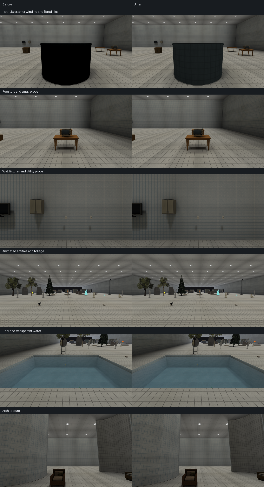
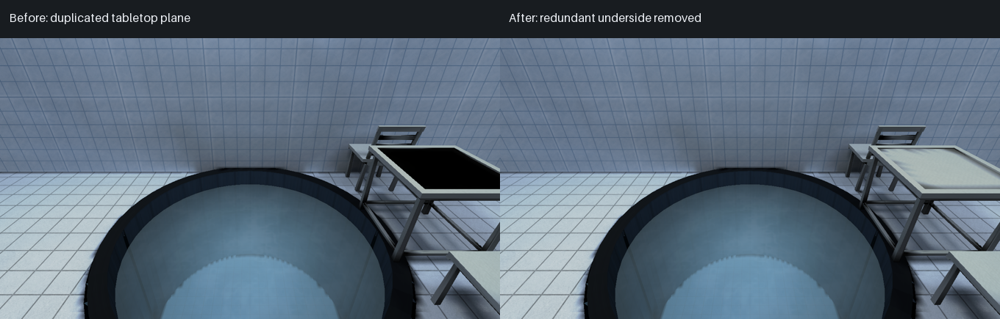

# Places asset library audit — 2 October 2026

The complete current asset library was inventoried before edits, checked technically,
and inspected in front/top and rear/underside views. The hot tub had a definite
geometry and UV defect, and the pool table had a duplicated coplanar tabletop
closure. Both were repaired without changing their textures, dimensions or placements.
Twenty-eight missing standalone PNG records were recovered from the existing GLBs,
without changing their pixels. The existing art direction and valid assets were retained.
Preservation checks
confirm that all pre-existing PNGs and every GLB except the hot tub and pool table are byte-unchanged,
the new sources are exact original embedded PNGs, and the tub re-export is deterministic.

The house kit's lighter cladding above doors and windows remains a documented
shading issue. The user explicitly excluded lighting code from this pass. Its cause
is already present in exported vertex colours, produced by the shared offline
contact-shading helper; it is not a discontinuity in the PNG. No shared shading,
runtime renderer or baker code was changed.

The final canonical gate passed with both repairs installed. All four shipped
packages are current and valid at off/medium/full. No Rust production or gameplay
code changed,

## Inventory and coverage

The complete inventory records paths, hashes, formats, dimensions, alpha ranges, bounds, vertices,
triangles, materials, embedded images and their standalone sources, transforms,
skins, clip channels/durations, map uses, code literals, unused data and duplicates.
It also inventories the other files under `assets/` and the application icon.

| Item | Inspected |
| --- | ---: |
| GLB 2.0 models | 134 |
| Standalone PNGs under `assets/`, before → after | 131 → 159 |
| Embedded PNG images, all checked against standalone pixels | 136 |
| Application icon outside `assets/` | 1 |
| Catalog material definitions | 52 |
| GLB material slots / maximum per model | 160 / 4 |
| Animated models | 10 |
| Animation clips | 29 |
| Skinned assets / clips / posed frames tested | 8 / 27 / 3,227 |
| Rigid clips / posed frames tested | 2 / 98 |
| Triangles / expanded inspection vertices, before → after | 35,483 → 35,481 / 75,825 → 75,821 |
| Catalog entries, including native fixtures/decals | 247 |
| JSON map sources inspected for uses, including developer/test fixtures | 34 |

The catalog model categories contain 72 Structure, 24 Decorative, 12 Furniture,
8 Utility, 7 Appliances, 5 Vegetation, 5 Lighting and 1 Other entries. This includes
the original and five themed house kits, porches, fences, ground modules, rocks,
trees, furniture, appliances, bathroom/pool props, tableware, switches, displays,
fixtures, mannequin, rat, Spooner-Man and the Halloween characters. Native doors,
walls, archways, pillars, stairs, trim and fixtures were covered by map geometry
checks, existing runtime/compiler tests and native captures. There are no current
loose GLTF files or separate roughness/metalness texture packs under `assets/`.
Two catalog materials reference normal maps; these remain ordinary PNG assets.

Every GLB has a map reference, including Model Zoo. Source masters, diagnostic
textures and alternative catalog materials are deliberately retained. An image
without a direct catalog ID is not necessarily unused: the inventory connects
pixel-equivalent PNGs to their embedding models and those models' map/code uses.

All 134 models were rendered with the corrected inspection reader and reviewed
from front/top and rear/underside, with backface culling to expose winding problems.
All original standalone textures and all recovered images were reviewed in contact
sheets. Native comparisons cover furniture/small props, fixtures, architecture,
entities, foliage, water and the hot tub. Outdoor captures cover the maintained
28-view kit, including all five house families. Maintained door views cover the
interior, sauna and outdoor entry. These are inspection views, not a claim that
every possible animation transition or camera angle was manually played.

## Findings by category

| Category | Finding and disposition |
| --- | --- |
| Geometry | Hot-tub outer wall was wound inward, conflicting with its caps. Corrected 96 exterior triangles. Pool-table closure duplicated its top with the opposite diagonal/winding; removed two redundant triangles. No degenerate or exactly coincident triangle faces were found elsewhere. Assembled shells, cavities, foliage cards and intentionally open props were retained. |
| Normals | Reversed tub faces generated inward exterior normals and a black exterior in the native bake. Fixed at the source winding. Authored normals/tangents across the library are finite and within unit-length tolerances; smoothing/silhouettes were inspected. |
| UVs | Tub tiles were stretched around a complete circumference with one atlas span. Changed to four fitted spans around each wall and seven painted rows up the wall. Other fitted/swatches/repeated UVs were retained after visual review. |
| Textures | Twenty-eight existing embedded images lacked equivalent standalone PNG files. Recovered their exact original PNG payloads. All 39 intended tiled surface sheets pass horizontal/vertical raw and smoothed seam metrics. No texture painting, resizing or upscaling was needed. |
| Materials | House cladding has approximately 11% brighter vertex tints above openings in all five themed door/window families. Documented below; shared authoring shading is excluded by the user's instruction. No extreme new reflectivity, emission or PBR treatment was introduced. |
| Scale | Bounds were compared with catalog sizes and architectural references. Table 1.40×0.75×0.80 m, stove 0.60×0.90×0.60 m, fridge 0.70×1.80×0.70 m, bed 1.40×0.55×2.00 m, plate 0.22 m diameter, bowl 0.15 m diameter, switch approximately 0.086×0.12 m, mannequin/skeleton approximately 1.72 m tall. House modules remain 3.0×2.7 m with a 1.10×2.15 m opening. Character pose bounds and the tub's 35 mm apron explain small catalog-envelope differences; no arbitrary rescaling. |
| Pivots | Rest transforms, bases and placement origins were recorded; native door hinges and the switch rocker/animated roots are covered by existing tests and clips. No origin changes were necessary. |
| Animations | All 29 clips parsed, channels/times/transforms checked. Skinned clips swept at 60 Hz through exact endpoints; rigid clips additionally sampled at 60 Hz using shortest-arc quaternion interpolation. Existing Halloween regeneration and clip-boundary checks protect the exported contracts. No clip rename, rig change or animation deletion. |
| Collision | Tub positions, bounds and map recess/water relationships are unchanged. Existing collider/route/controller tests cover doors, stairs, props and outdoor fixtures. Trunk-sized tree colliders and non-solid facade dressing are intentional map contracts; no physics or collision changes. |
| Organization | Standalone native records now accompany their GLBs; house families keep shared 128/256 px derivatives beside their 1024 px masters. Documented source/runtime distinction. No ID/path renames or compatibility aliases. |
| Performance | No accidental high-poly import or excessive material-slot count. Largest models are deliberate animated characters; pumpkin skeleton is 2,278 triangles, most static props much smaller. No unused material/accessor/image data was found that warranted removal. PNG decoding dominates the new audit; bounded process execution was used and serial/12-worker inventories were byte-identical. |
| Broken references | No unresolved catalog/model/material/texture references in the final checks. Source coverage now includes every embedded image. The old Demo package initially recorded the old tub hash, requiring the normal package rebuild. |

Topology is interpreted conservatively: a welded position count is not a reason
to merge UV seams or hard edges, and a signed-volume heuristic cannot decide
whether an inner basin or open foliage sheet should face outward. These checks
produce review data; they do not automatically repair the library. The new quad
comparison detects opposite diagonals that exact triangle hashing misses. One
remaining doubled quad belongs to the closed joint between a porch railing rail
and its end post; it is hidden assembly geometry and was conservatively retained.

## Changes made

| Asset/tool | Problem | Change and reason |
| --- | --- | --- |
| `core:hot_tub` / `assets/environment/pool/props/models/hot_tub.glb` | Exterior wall faced into the basin; tile cells were stretched approximately 4.7:1 before fitting. | Flipped exterior winding and fitted four atlas spans/seven vertical tile rows. Inner basin still faces inward and rim/apron face up. Physical cells are approximately 23–26 cm wide and 22 cm tall. |
| `core:pool_table` / `assets/environment/pool/props/models/pool_table.glb` | A generic boundary closure put a second, downward-facing quad exactly on the tray top, making it black in the bake. | Removed that two-triangle closure and four now-unused vertices. All surviving position/UV/colour records and the embedded PNG/materials are unchanged. The native tabletop receives light again. Its top sheet's boundary is buried in the rim; the lower apron remains intact. |
| `tools/props/repair_geometry.py` | The maintenance pass treated the tray sheet boundary as a missing solid face. | Added a reviewed, fail-closed table-cap removal and excluded this particular tray boundary from hole closure, so maintenance does not recreate the defect. |
| `tools/props/parts/pool.py` | Builder recreated the tub artwork instead of loading a standalone asset. | Loads the recovered, unchanged `hot_tub.png` and `pool_table.png` instead of recreating artwork. Keeps the tub's original two-region atlas, colours, geometry, pivot and 384 triangles. Removed the unused tub/tray painters; shared resin/metal painters for untouched assets remain unchanged. |
| 28 native PNG records | Existing artwork was available only inside GLBs. | Extracted byte-identical existing PNGs into the corresponding asset directories. The full source list identifies every added file. Only the tub and table GLBs changed. |
| `tools/assets/audit.py` | No one inventory joined all models, images, clips, duplicates and map uses. | Added a read-only stdlib audit with finite data, topology, coincident quads including opposite diagonals, UV, normal/tangent, skin, animation, native-image-budget and standalone-source checks. Uses the established bounded execution/atomic-write helpers. |
| `tools/props/glb.py` | Inspection kept only the first texture and lost primitive material assignment. | Retains every texture slot and triangle material, preserving the legacy first-texture field for existing callers. Game loading code is unchanged. |
| `tools/props/preview.py` | Multi-material models, foliage and translucent inspection views could be misleading; no rear/culling view. | Uses primitive textures/factors, MASK cutoff and BLEND compositing; adds `--cull` and `--rear`. Remains a bind-pose software inspection renderer. |
| `tools/bench/capture_zoo.sh` | Cameras still pointed at the former, smaller Zoo layout. | Updated fixed cameras to the current rows, pool, fixtures, table setting and architecture. No map rearrangement. |
| `tests/test_asset_audit.py` | No focused regression for these actual asset/tool contracts. | Seven tests cover coplanar quads with opposite diagonals, the table closure contract, exterior/interior tub normals and tile cell proportions, all material slots, NaN geometry, invalid clip data, rigid rotation/endpoints and cutout texture selection. |
| `tools/verify.sh` and documentation | New inventory/source guarantees were not part of the gate. | Added the audit and regressions, and documented the source policy and inspection limitations. |
| Bundled map packages | Prepared records must reflect the modified GLB. | Recompiled the Demo and Zoo packages; verified all four shipped maps against their current sources/assets. Source maps and placements are unchanged. |

The 28 PNGs total **1,505,666 bytes** of repository/source artwork. They are not
additional runtime texture allocations: models retain their original embedded
images. The new source groups are seven core props, two home cabinets, four office
props, collision peg, ten shared house derivatives and four pool props.

## Optimization and duplicate content

| Measure | Result |
| --- | ---: |
| Triangles removed / added | 2 / 0 |
| Unused table vertices removed | 4 |
| Texture-size reductions | 0 |
| Duplicate model files removed | 0 |
| Duplicate PNGs removed | 0 |
| Unused material/image/accessor data removed | 0 |
| Runtime model bytes, before → after | 11,219,756 → 11,219,648 (108 fewer) |

There are no byte-identical GLB files. Five groups share position geometry across
house family pieces, intentionally carrying different family artwork/semantics.
Seven groups of standalone PNGs have identical bytes/pixels: shared Halloween
surface art, concrete/showcase surface, fence/showcase wood, two grass patch
sources, original house wall sources, lamp sources and porch railing sources.
These are authoring/semantic family records, not accidental duplicate imports.
They were retained instead of introducing aliases or changing authoring contracts.
Skins' unweighted joint slots are support/root hierarchy nodes; removing them
without understanding the hierarchy would be unsafe.

All model files together contain 11,219,648 bytes. Their 136 embedded images decode
to 25,071,616 RGBA bytes before any runtime sharing/downsampling. Native embedded
sheets stay at or below 256 px; larger standalone masters are intentionally retained.
No nominal-resolution upscaling or simplification was performed for cosmetic diffs.

## Visual evidence

Native baseline views used the same binary, cameras and scratch settings with the
tracked pre-edit asset/package files from HEAD in a separate read-only package root.
The runtime's `PLACES_ASSET_ROOT` points to the parent containing `assets/`;
compiler `--asset-root` instead points directly to `assets/`. Baseline captures
were regenerated after correcting that distinction, and capture logs were checked
for requested-level fallback. An early door capture started before package
installation and entered the menu; it was discarded. Final door views were
rerun after `verify --require-current` and native level discovery confirmed the
installed package. The table comparison isolates its two-face removal
in the already-corrected pool fixture and a freshly rebuilt off/medium/full package.
Unchanged categories are intentionally very similar. Frame-count captures can
differ slightly in moving entities; no pixel-identical animation claim is made.
Initial old-camera Zoo captures are excluded from the comparison because several
views no longer framed the intended exhibits.

The tub is no longer completely black, but its exterior remains dark under the
existing bake. Its unchanged albedo is plainly visible in the unlit inspection
view. This residual lighting concern was not hidden by whitening its texture.

## Validation

The complete `sh tools/verify.sh` gate exited **0** with `set -eu`; every
required step passed. Additional checks are listed below:

| Command/check | Result |
| --- | --- |
| `cargo fmt --all --check` | Passed in the final canonical gate. |
| `cargo clippy --workspace --all-targets --all-features -- -D warnings -D clippy::all -D clippy::pedantic -D clippy::nursery -D clippy::cargo` | Passed in the final canonical gate. |
| `cargo test --workspace --all-features` | Passed: 1,912 library tests, 3 integration tests; 21 default ignored diagnostics. The gate additionally runs the maintained atlas-budget check and two native GPU checks, all passed. |
| `cargo check --workspace --all-targets --all-features` | Passed; final package refresh checked again. |
| `sh tools/verify.sh` | Passed, exit 0. All asset/source checks, seven Python suites, full package current/decode checks, geometry repair, native GPU and startup checks passed. |
| `cargo build --release` | Passed. |
| `python3 -m unittest tests.test_asset_audit tests.test_glb_accessors` | Passed, 18 tests. |
| `python3 tools/assets/audit.py --workers 1 --out target/asset-audit/serial.json` | Passed, zero integrity errors. |
| `python3 tools/assets/audit.py --workers 12 --out target/asset-audit/parallel.json` | Passed, zero integrity errors; JSON byte-identical to serial run. |
| Final `audit.py --workers 1 --out target/asset-audit/serial-final.json` / `--workers 12 --out target/asset-audit/parallel-final.json` and `cmp` | Both passed after both model/package repairs; JSON byte-identical and final inventory retained. |
| `python3 tools/entities/validate_entities.py --workers 12 --json` | Passed, eight assets/27 clips/3,227 posed frames; requested 12, effective 11 under existing memory cap. |
| `python3 tools/entities/check_clip_boundaries.py` | Passed. |
| `python3 tools/entities/author_halloween_assets.py --check` | Passed. |
| `python3 tools/textures/seam_repair.py --check <39 intended tiled PNGs> --workers 12` | 39/39 passed; no repair writes. |
| `python3 tools/props/build.py --only core:hot_tub` | Exported the focused repair; original artwork preserved. |
| In-memory `build.build_one(..., publish=False)` comparison | Tub re-export byte-identical; bounds, triangle count, materials and embedded image bytes match the original. No filesystem writes during this check. |
| `target/release/places --check-geometry --level <source> --json <output>` | Seven sources, all exit 0; zero errors, warnings retained below. |
| `places-compile build/verify/validate` for Pit, Hallows entity fixture and pool showcase | Passed for vertex-lit structural variants; pool showcase additionally built/current/validated at off/medium/full. |
| `PLACES_STATE_ROOT=<scratch> sh tools/bench/capture_zoo.sh <out>` | Ten current views in each comparison phase captured and inspected. |
| `PLACES_KIT_PACKAGE=<compiled fixture> sh tools/bench/capture_outdoor_kit.sh` | 28/28 native views in each phase, no failures. |
| `sh tools/bench/capture_doors.sh` with five maintained view selections | Captured maintained interior, sauna and exterior door views. |
| Native tub capture at `PLACES_SPAWN=36.6,21.6,0`, `PLACES_CAMERA=0,-8`, frame 4 | Before/after capture succeeded. |
| Table-only `repair_geometry.process(path, apply=True)` and a second read-only pass | Removed two closure triangles/four unused vertices; second pass is byte-idempotent. Bounds, texture and material definitions preserved. |
| `python3 -m unittest discover -s tools/props -p test_geometry.py` | Passed, four existing winding/cavity/seam regressions. |
| Fresh pool-showcase package and identical-camera table comparison | Geometry-only proposal restored the pale tabletop under the existing baker; no lighting code or albedo change. |
| In-memory legacy table builder/source comparison | Loads the exact retained 256×256 PNG pixels. No blanket model regeneration; shipped hand-finished geometry retained. |
| CPU profile of the new inventory | PNG decoding dominated; reused existing bounded process helper instead of adding dependencies. |

The initial canonical gate stopped at a Rust test asserting that the Demo package
has no validation warnings. The old package recorded the old hot-tub content hash;
the independent validator confirms that exact stale dependency. This requires a
normal asset/package rebuild, not a lighting-code workaround. The focused atlas
test passed after rebuilding Demo; the full canonical gate passed after the tub
repair and again after the final table repair. The
initial failed run is retained
alongside the successful final output.

## Map compatibility

| Source | Geometry check | Package status |
| --- | --- | --- |
| Places Demo | 0 errors, 2 warnings | Affected off/medium/full package rebuilt in an isolated asset root, checked against the repository assets and installed; final gate confirms it is current. |
| Model Zoo | 0 errors, 1 warning | Affected full package rebuilt; native after captures used it. |
| Lantern Hollow | 0 errors, 0 warnings | Unmodified assets; build reports current, and off/medium/full shipped package passes current verification and validation. |
| Movement Test | 0 errors, 0 warnings | Unmodified assets; build reports current, and off/medium/full shipped package passes current verification and validation. |
| Pool Showcase fixture | 0 errors, 0 warnings | Affected by tub; off/medium/full package built/current/validated. |
| Pit (`level0_pit`) developer fixture | 0 errors, 68 warnings | Structural package built/current/validated. |
| Hallows (`halloween_entities`) developer fixture | 0 errors, 12 warnings | Structural package built/current/validated; all associated skins/clips tested. |
| Capacity Dense stress fixture | Valid collider/route stress checks | Table dependency; structural package built/current/validated. |
| Outdoor Kit Showcase | Native 28-view coverage | Existing full scratch package remains current: its models/textures are unchanged. |

All 34 JSON sources were scanned for references; intentionally invalid test maps
were not misrepresented as current playable levels. The four shipped playable
sources are `assets/levels/{places_demo,model_zoo,lantern_hollow,movement_test}.json`.
The tub is referenced by Demo, Zoo and the pool showcase. The table additionally
appears in the `capacity_dense` stress fixture; its structural package was
rebuilt/current/validated after the repair. No source JSON, collision
definition, navigation route or placement was edited.

## Remaining issues and scope limits

**Asset appearance / offline authoring shading:** The lighter house lintels are
confirmed in both doorway and window GLBs in the original kit and all five themed families. In the
blue/red family, ordinary cladding uses RGB `(154,158,156)` while the head bands
use `(171,176,173)`. The bands are about 11% brighter before runtime lighting.
The shared `PropBuilder._ao_at` darkens each primitive according to its base;
floor-reaching columns get 0.9 contact tint, raised head pieces get 1.0.
The themed house builder applies continuous module-space UVs and the same PNG to both.
The same shared helper is used by the original kit. This is a family-wide authored
shading discontinuity, not evidence of a damaged texture or proof of a global
runtime lightmap bug. It was left unchanged under the user's lighting-code
exclusion; asset tint hacks and texture repainting were not used to disguise it.

**Lighting/baker:** Residual tub darkness is still visible; the definite winding
fault is repaired. Full baking retains the existing sub-texel vertex-light fallback
(33 Demo and 35 Zoo quad slivers). No claim is made that these warnings cause the
house tint issue. Lighting code was only read for diagnosis.

**Renderer:** The software preview does not simulate game emission, reflections,
skinning or baked lightmaps; native images supply that evidence. No new runtime
renderer defect was confirmed. Existing documented renderer limits, such as
fixture UV stretching on rotated native geometry and glass/decal sampling limits,
were not expanded into this task.

**Map geometry:** Seven source checks have zero errors but 83 aggregate warnings:
Demo's tiny wall-joint sliver and porch dressing/floor coplanarity; Zoo's room-leak
candidate; Hallows' four joint slivers and eight opposite-facing coplanar wall
overlaps; Pit's sixteen slivers and fifty-two missing-wall candidates. These are
existing map/checker findings, not new GLB corruption. Intentionally open geometry
also appears in the checker's explicitly suppressed findings. No map redesign or compiler change was made to
silence them.

**Gameplay/collision:** No new issue was confirmed. Furniture may use coarse box
collision and vegetation uses authored trunk boxes; visual gaps are not a reason
to change established gameplay. Pose sweeps and tests do not substitute for playing
every interaction. No collision/movement/AI/navigation code was changed.

## Files and scope discipline

No Rust production code, game renderer, global/offline shared lighting helper, baker,
gameplay, UI, save system, map format, editor or dependency declaration was changed.
No retired platform code was introduced. No commit or publication was performed.

Non-asset changes are the audit, GLB inspection reader, software previews, focused
regressions, corrected Zoo capture cameras, canonical gate and its documentation;
each exists to inspect or prevent the asset failures described above. Documentation
changes cover the source PNG contract, validation commands, inspection workflow,
current library/image-memory counts and the existing cutout/translucent contract. This report is review material, not runtime content.

The complete changed-file manifest
lists every modified and added file, including the 28 exact PNG source records
and this report. The implementation/documentation files are
listed below; the PNG source list is also available separately above.

- `assets/environment/pool/props/models/hot_tub.glb`
- `assets/environment/pool/props/models/pool_table.glb`
- `assets/levels/places_demo.placesmap`
- `assets/levels/model_zoo.placesmap`
- `assets/README.md`
- `docs/ASSET_SPECIFICATION.md`
- `docs/MAP_AUTHORING_GUIDE.md`
- `docs/VERIFICATION.md`
- `tools/assets/audit.py`
- `tools/bench/capture_zoo.sh`
- `tools/props/README.md`
- `tools/props/glb.py`
- `tools/props/parts/pool.py`
- `tools/props/preview.py`
- `tools/props/repair_geometry.py`
- `tests/test_asset_audit.py`
- `tools/verify.sh`
- `docs/reports/asset-library-audit-2026-10-02.md`
