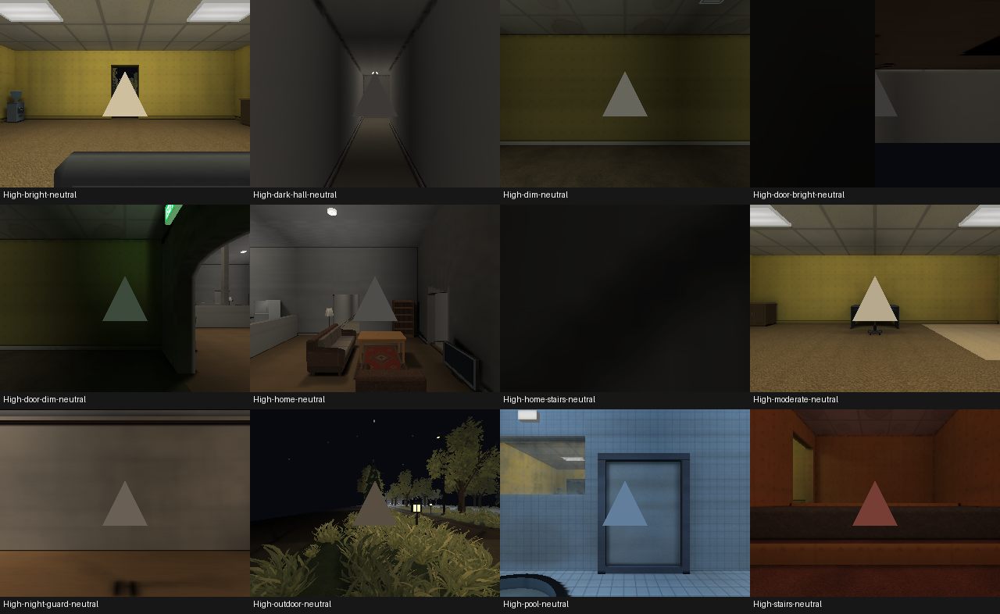
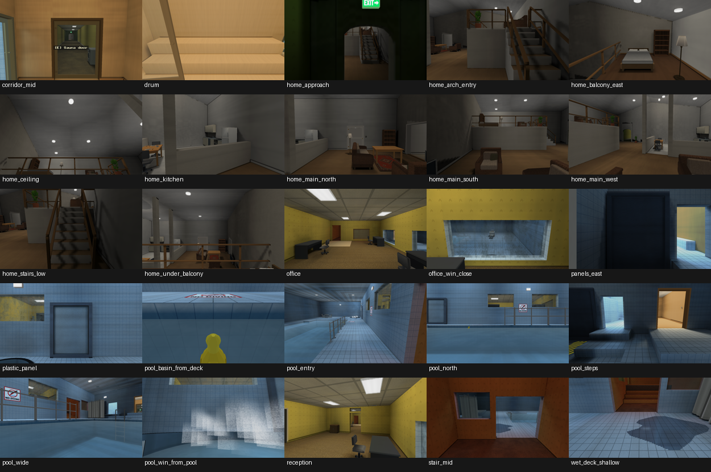

# Integrated compiler and entity lighting

The combined implementation fixes probe preparation and runtime consumption without
changing light calibration or making dark entities emissive. Compiler-owned air
labels, physical transport values, serialized coefficients, runtime weights and
GPU inputs now form one validated pipeline. An integration regression at real open
doorways was also fixed: room ownership no longer introduces an abrupt lighting
step when both populations are visible through the opening.

## Inputs and history

Integration started only after both tasks had completed their final handoffs,
were idle, had clean worktrees and had no remaining writers or validation processes.

| Owner | Task | Branch | Final commit |
| --- | --- | --- | --- |
| Compiler/baker | `01a0f56d-6874-7d01-ba5f-798f6023ff24` | `agent/probe-baker-audit` | `c56283765deb8a86bae191deb656e6ccf3a8b979` |
| Runtime/entities | `01a0f56d-8680-7ff0-ab3c-ffc4c7950468` | `agent/entity-lighting-audit` | `8d8c6190de0614db5b4ffd6b4fcd3174c52f8dad` |

The original branch was `main` at `ba16887516dda666ca499d92b473782a18ae7a9a`.
Integration uses `agent/entity-lighting-integration` in `Places-lighting-integration`.
The baker merge is `b666ded9d385a9404f34c78356611bd86e15f1de`; the subsequent runtime
merge preserves both source histories and includes the reconciliation below.
The enclosing integration commit and final primary-branch hash are recorded in the
execution handoff rather than inserting a self-referential hash into this file.

Full original reports remain available:
[compiler/baker](../PROBE_BAKER_AUDIT.md) and
[runtime/entities](runtime-entity-lighting-audit.md). Their branch-specific remaining
findings are historical; this report describes the combined result.

## Root causes and reconciliation

The baker discarded sky escape contributions, repeated sky in diffuse orders,
allowed cache/chart interpolation and authored recovery fill through occluders,
miscomputed lattice dimensions after increasing spacing, and labelled probes with
forgiving heights and incomplete solid tests. Independent per-probe rays added
noise. Whole alpha-tested vegetation cards blocked transport, making nearby ground
black while air probes saw fixtures. Invalid energy could be accepted or concealed.

Runtime multiplied spawn lighting into object albedo, used unstable sparse fallback,
applied a room-baseline floor to valid dark probes, omitted directional shader
reconstruction, and refreshed some moving samples only after a distance threshold.
Asset pivots and independently implemented rigid/animated paths disagreed about
sampling positions. Quality reinstalls could discard live entity state/resources.

The only textual merge conflict was `src/lighting/probes.rs`. The resolution retains
baker validation and byte-preserving serialization, runtime compact interpolation
and diagnostics, and tests from both branches. The common transport file retains
both MASK transmission and the runtime lighting representation. No `ours`/`theirs`
resolution dropped either implementation.

The branches disagreed about HDR validation: runtime had a 65504 bound and the baker
accepted larger finite values. The shared validator now rejects coefficients above
65504, matching the static atlas representable range. This rejects unrepresentable
inputs; it does not clip legitimate light or tune entity brightness. Malformed
reader tests corrupt valid serialized bytes after proving that the writer rejects
the same invalid record.

Strict same-room interpolation left an approximately 0.109 display step across a
1 cm ownership boundary in the combined diagnostic. Runtime now blends supported
probes across room/zone boundaries only through clear compiled-solid segments.
Within an existing connected area, the prepared field retains its local interpolation.
The opening's actual centre is `[9,1,3.6]`; `[9,1,3]` lies on its solid jamb edge and
is retained as a separate boundary diagnostic, not misreported as an open doorway.

Cross-room filtering verifies each stored label against the probe's actual owner.
Package loading rejects labels outside its compiled room list. Invalid records cannot
become a bright neighbouring-room contribution. Horizontal/prop segment indices are
derived once during preparation/deserialization; each limits solid references to
16 MiB and falls back to exact linear geometry queries if that budget is exceeded.
They change neither serialization nor bake values.

## Final probe contract

[PACKAGE_FORMAT.md §6.1](../PACKAGE_FORMAT.md#61-irradiance-field-for-moving-objects)
is the shared reference. PLPF remains version 2; solver revision 8 invalidates old
bakes through the normal fingerprint.

| Property | Meaning |
| --- | --- |
| Coordinates | World metres, +Y up; no model-relative origin or repeated transform |
| Lattice | Lower-boundary origin; centre `origin + (index + 0.5) * cell`; X fastest, then Y, then Z; common spacing, at most 64 cells/axis |
| Irradiance | Finite nonnegative RGB mean in calibrated linear HDR light units, each channel at most 65504; no sRGB conversion/exposure/material albedo |
| Direction | Signed aggregate first moment in world XYZ irradiance units; coefficient order XYZ; never normalized to unit length |
| Validation | `length(moment) <= sum(I) * (1 + 32*f32::EPSILON)`; reserved axes bounded to `[0,1]`, writer emits `[0.5,0.5]` |
| Storage | Little-endian f32, 38-byte header, 36-byte samples, original accepted bits preserved |
| Labels | `-1` unavailable; nonnegative compiled room index, checked against room list and air ownership; valid zero is darkness |
| Interpolation | Exact-centre path, otherwise normalized `(1 - d/2)^2 / d^2` inside two cells; f64 sums, one conversion to f32; ownership/visibility predicates shared with diagnostics |
| Anchor | Transformed bind-pose bounds centre, shared by rigid and animated models, refreshed every frame |
| Reconstruction | Interpolate mean/moment first; shared `LightmapTexel::light_at` fit using actual world face normal; albedo multiplied once |
| Missing support | Explicit Prepared/NoField/Roomless/Unresolved/InvalidPosition source; existing authored environment fallback, finite display RGB; no fabricated full-white/full-black result |

GPU environment uniforms retain the tested 1280-byte layout: energy at offset 1248,
moment at 1264. Energy W is 1 for prepared probes, -1 for defined fallback, and 0 for
static geometry; moment W is 0. HDR coefficients reach the shader unchanged. The
untextured material fallback is genuinely white. No entity-specific multiplier,
ambient boost, room exception, brightness floor or new emissive material was added.

## Placement, fresh maps and determinism

All checked-in playable packages were rebuilt through the normal compiler with a
sequential shared budget of 12 workers; compiled outputs were not hand-edited.

| Map | Package bytes | Forced build wall time | Maximum RSS / peak footprint |
| --- | ---: | ---: | ---: |
| `places_demo` | 74,576,091 | 914.44 s | 2,965,716,992 / 4,451,209,080 bytes |
| `model_zoo` | 58,788,712 | 241.30 s | 2,634,530,816 / 2,621,278,848 bytes |

Both builds report zero warnings. Demo has `[42,5,64]` cells, 13,440 records and
2,470 valid probes, with coverage in every one of its 14 rooms. Zoo has 6,912 records
and 5,182 valid probes. Actual floor/stair/ramp/region heights, ceilings, 3D walls,
5 cm surface clearance and closed outward-wound prop rejection determine validity.
Openings and air above partial walls remain usable. Placement and closed-divider
regressions retain the baker's tests.

Both demo payloads exactly match the independent completed baker build:

* Medium: `fd290b4c9eeb121d6c5f4a7749c7c8ee424f8be51126f67ac35b73dcb8bbd1f1`.
* Full: `a5043d093a9cea89b765a84f85f3d86bc2d7e605383e809e4bb508e57879fd4c`.

Zoo also matches bit-for-bit: Medium
`13bb40133f54f65bcd5dda69d9fc1a1d3ab5fac48335d6c55747c3e3bed98c16`, Full
`f744ba98069e7808c6fe914c4c74f9b59933eceaab9999225f7ceaba8c618a9f`.
Whole package archive metadata is not used as a lighting-determinism claim. Shared
serial arithmetic and explicit 1-versus-12-worker tests prove deterministic probe
and filled-atlas values.

For both fresh demo variants, every raw baked mean/moment and final room label was
correlated with its serialized record: all 13,440 records agree bit-for-bit. Across
24 actual entity traces, decoded candidates, normalized weights, f64 interpolation,
f32 results and the GPU uniform mirror agree with zero observed rounding difference.
The retained [pipeline agreement](entity-lighting-integration/pipeline-agreement.json)
records representative positions and final coefficients.

| Full variant location | Final shader mean RGB | Source |
| --- | --- | --- |
| bright room | .897626, .836478, .689093 | Prepared |
| moderate room | .837016, .775888, .643092 | Prepared |
| dim corridor | .310227, .309140, .269467 | Prepared |
| dark hallway | .337314, .321121, .299270 | Prepared |
| home | .383070, .373014, .353522 | Prepared |
| pool | .377830, .497737, .615603 | Prepared |
| stairs | .473110, .254370, .217435 | Prepared |
| outdoor | .206113, .181929, .154495 | Prepared |
| doorway centre | .727943, .675784, .548322 | Prepared |
| pumpkin area | .060431, .051688, .042152 | Prepared |
| skeleton area | .328256, .290414, .247273 | Prepared |

These are raw means, not tonemapped pixel RGB. Historical baker and runtime tables
in the source reports retain their before/after measurements. In particular, the
baker's previously zero outdoor physical receiver becomes
`[.449155,.380149,.299301]`; its upward probe/static-under-probe luminance becomes
`.506678/.431217`. The old runtime room floor made the pumpkin-area diagnostic
approximately `.354,.346,.332` regardless of real darkness. The merged system
preserves dim data instead of reintroducing that floor.

## Visual, movement, model and quality checks

The explicit native Metal GPU suite passes all four tests, including real compiled
demo geometry/materials, 12 locations at both prepared qualities, shifted asset
pivots, and rat, sheet-ghost-cat and skeleton assets placed at the same world anchors.
Their coefficients agree; authored material/albedo/emission differences remain.
The controlled fixture excludes authored actor static batches to prevent an actor
at the exact sample anchor from occluding the neutral model. Normal production
captures retain authored actors and normal reflections.



White neutral models inherit warm office/stair color, cool pool color, and genuine
dimness in halls/home/night locations. Static surfaces and models broadly belong to
the same lighting environment. Some additional home-stair/door-approach viewpoints
are geometrically occluded; native stair/home views and numerical traces cover those
areas without treating an occluded model as a lighting failure.

Production captures include all 25 canonical views in High and Low (50 captures),
48 High night-route frames, 11 final-release audit viewpoints, a final-release zoo
view, and direct/restored High native quality snapshots. Every capture command exits
successfully and produces a PNG. Existing ghosts are intentionally emissive; their
appearance does not serve as a neutral diffuse-lighting assertion.



Three 501-position paths exercise open office-to-office transitions, vertical
stairs and the night area. Actual GPU coefficients refresh at every position;
stationary and reverse samples are identical. Maximum adjacent display steps are
`.0132924`, `.0001497`, `.0002401`; there are no source/fallback changes or bright/black
snaps on those paths. The 1 cm aperture-centre XYZ diagnostic peaks at `.0125874`.
The adversarial opening/closed-wall test proves smooth blending through an opening
and isolation behind the same wall when closed.

High → Medium → Low → Medium → High preserves entity handles/playback and restores
correct prepared resources. The compiled-scene GPU fixture's final High pixels are
exactly identical to direct High. The native cycle records all four production
settings changes and successful installations; all 26 stationary actors restore
identical lighting inputs out of 32 actors, with the other six moving normally.
31 actors use Prepared; one moving duck's bounds centre is outside probe air and
uses the explicit finite authored Roomless fallback. That is recorded rather than
concealed by a probe brightness hack. Native snapshots have advancing animation/UI,
so they are not asserted pixel-identical.

## Regression coverage and validation

New integration regressions prove generated HDR sky → compiler air labels → f32
serialization → runtime interpolation; open-door blending versus a solid wall;
wrong/missing room labels; bounded segment-index fallback; compiled environment
pixels and asset-pivot parity; real-model parity; moving GPU uniform updates; and
compiled quality restoration. Original baker, runtime, malformed-value and
serialization tests are retained.

The final canonical gate uses explicit executable paths for the external cache:

```sh
PLACES_BIN=/tmp/places-lighting-target/release/places \
PLACES_SMOKE_BIN=/tmp/places-lighting-target/release/places \
PLACES_COMPILE_BIN=/tmp/places-lighting-target/release/places-compile \
RUST_TEST_THREADS=4 CARGO_TARGET_DIR=/tmp/places-lighting-target sh tools/verify.sh
```

It passes fmt, strict repository Clippy, 1,856 unit tests, all 3 CLI tests, package/
asset/generator validation, both current-map verifications, both package validators,
all 14 geometry-repair tests, all 10 compiled-build smoke tests, and release build.
The Python package/tool groups pass 47 + 16 + 39 tests. The 18 normal Rust ignores
are developer diagnostics/GPU cases; all four entity GPU tests and the four
relevant reflection, packaged-chain, sRGB and odd-index GPU tests were explicitly
run and passed. The canonical native bootstrap run initially passed 15 tests and explicitly skipped
11 while the console was locked; the unlocked rerun is recorded below. No skipped
or zero-draw native run is counted as a rendering/performance pass.

The unlocked native bootstrap rerun passes all 26 tests with no skips, including
actual presentation, graphics-only state preservation, Low/Full rebuild restoration,
request cancellation/retry and world replacement. All 10 compiled-build and 14
geometry-repair tests run without skips. The expected failure messages in the
package/tool logs belong to negative-path regression fixtures; their test groups pass.

## Performance and remaining limits

The final compiled movement diagnostic measures approximately 2.81–3.99 microseconds
per allocation-free CPU lookup in the optimized test profile. This is a local cost
measurement, not a controlled historical speedup or GPU timestamp measurement.
Bounded segment indices and a constant-size two-cell neighbourhood remain suitable
for multiple moving entities. Map size, probe counts, bounded worker execution and
memory measurements are reported above. Fresh probe hashes prove that derived
runtime indices do not change compiler output.

Unlocked cold/warm native startup reaches the usable demo scene in 1774.62 /
1731.12 ms and zoo in 1034.73 / 1027.21 ms. Package loading windows are
1610.54 / 1552.69 ms and 855.44 / 850.66 ms respectively. These isolate empty
application caches, not OS/GPU caches. Peak RSS is approximately 1.68 GB for
demo and 0.789 GB for zoo.

Three final High runs each measure 120 frames after 20 warm-up frames, with
GPU completion enabled. Render submission means are 6.598–6.666 ms; median
complete frames are 8.279–8.316 ms and p95 frames 14.513–15.238 ms. Each run
records 247 draws, 148 texture binds and 149 material changes in the pinned view. Full observed render/frame ranges are
retained in [render metrics](entity-lighting-integration/render-performance.json);
[loading metrics](entity-lighting-integration/loading-performance.json) retain
startup events and cache definitions. CPU render submission and end-to-end
frame completion are not presented as isolated GPU timestamp costs or a
controlled before/after benchmark. Earlier occluded zero-draw runs are excluded.

Systemic limitations: a bounded uniform lattice and compact first moment cannot
resolve every tiny shadow, narrow passage or arbitrary multi-direction field.
Uncharted surfaces do not supply solved indirect radiance. Cutout cards transmit
as whole cards, without per-texel blade shadows. Permanent probes exclude switchable
lights. Material albedo retains the engine's existing display-authored convention;
this pass does not introduce a complete radiometric sRGB pipeline. Derived compiled
visibility does not rebake dynamic door-leaf occlusion.

Map/content limitations: dark-albedo models remain dark; existing emissive ghosts
remain emissive. Sparse samples in the home's furniture shadows can differ from a
nearby floor texel, and outdoor fixture reach creates legitimate very dim tails.
An actor centre outside actual probe air uses the defined authored fallback. Artistic
light placement and malformed/non-manifold prop interiors are distinct content work;
no map-specific engine exception was added.

The original checkout's unrelated authored map, generator and test changes are
preserved separately from the integration commit. Old local compiled bytes are
backed up before merge, then user-authored maps are compiled with the validated
compiler so local play does not silently restore the obsolete lighting pipeline.
The execution handoff records the subsequent primary-branch merge, smoke
validation and exact GitHub commit verification. No unrelated source changes
are included in this integration history.

Raw logs, per-stage bake dumps and full captures remain at
`/tmp/places-lighting-integration-evidence/`; compact evidence is retained beside
this report. The new nighttime map is outside this integration and has not started.
