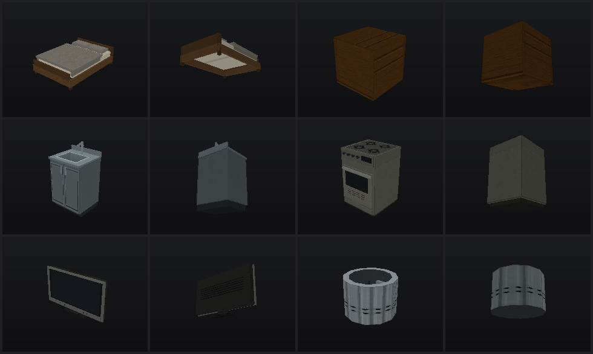
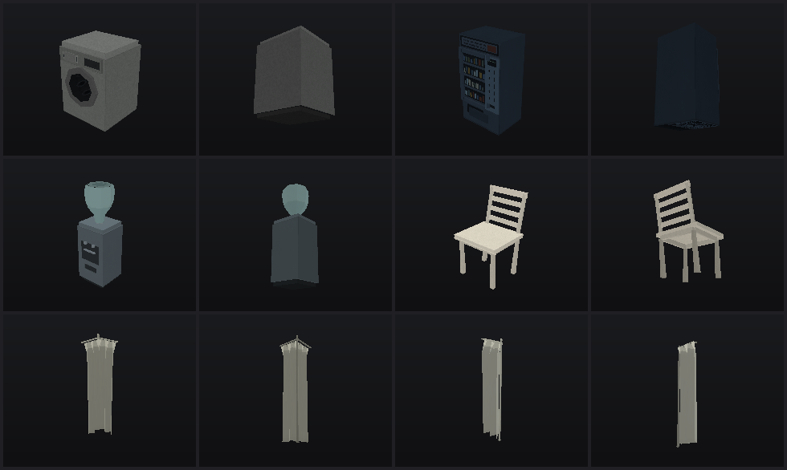
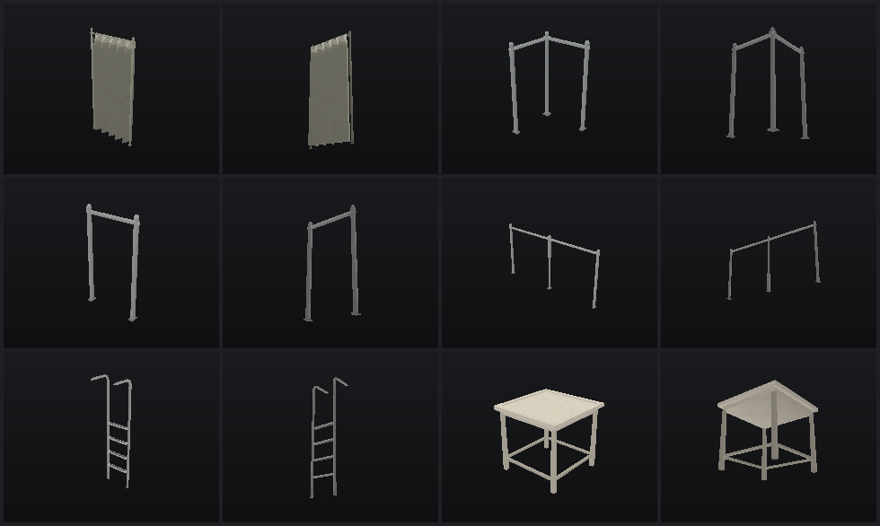

# Remaining model geometry repairs

Inspected all 48 repository GLBs: the 16 assets from the preceding polish pass were preserved byte-for-byte; the other 32 received topology and visual review. Repaired 18 and left 14 sound models unchanged. No textures, materials, rigs, animations, catalog entries, pivots, or node transforms were changed. No commits were created.

Existing triangle UVs and vertex colors are preserved. Added closure faces reuse neighboring atlas regions. Exact duplicate vertex records and obsolete geometry buffers were removed from edited GLBs; UV and shading seams remain separate. All edited models remain at 60–472 triangles.

## Per-model results

Paths below are relative to the repository root. The JSON manifest contains exact hashes, bounds, vertex counts and topology counts.

| Model file | Triangles before → after | Result |
|---|---:|---|
| `assets/core/props/models/armchair.glb` | 368 → 368 | Inspected; no geometry repair needed. |
| `assets/core/props/models/bed.glb` | 230 → 276 | Closed frame, foot, headboard, mattress, blanket and pillow undersides; corrected mixed winding. |
| `assets/core/props/models/bookshelf.glb` | 180 → 180 | Inspected; no geometry repair needed. |
| `assets/core/props/models/cardboard_box.glb` | 12 → 12 | Inspected; no geometry repair needed. |
| `assets/core/props/models/couch.glb` | 588 → 588 | Inspected; no geometry repair needed. |
| `assets/core/props/models/crate.glb` | 60 → 60 | Corrected inward-facing crate and batten surfaces. |
| `assets/core/props/models/fridge.glb` | 108 → 108 | Inspected; no geometry repair needed. |
| `assets/core/props/models/lamp.glb` | 448 → 448 | Inspected; no geometry repair needed. |
| `assets/core/props/models/plant.glb` | 512 → 512 | Inspected; no geometry repair needed. |
| `assets/core/props/models/rug.glb` | 12 → 12 | Inspected; no geometry repair needed. |
| `assets/core/props/models/sink.glb` | 208 → 230 | Closed door backs/undersides and faucet/drain component ends; corrected winding; retained the basin opening. |
| `assets/core/props/models/stove.glb` | 126 → 144 | Closed cabinet, oven-door and knob component gaps; corrected winding; retained the cooking-surface plane. |
| `assets/core/props/models/table.glb` | 136 → 136 | Inspected; no geometry repair needed. |
| `assets/core/props/models/tv.glb` | 68 → 86 | Moved the screen 21 mm back into the bezel; closed housing underside and bezel backs/undersides; corrected winding. |
| `assets/core/props/models/washer_drum.glb` | 144 → 154 | Joined the outer shell across the 40 mm rim gap, closed its base, and oriented the basket surfaces correctly; mouth remains open. |
| `assets/core/props/models/washing_machine.glb` | 140 → 150 | Closed top-cover/control-strip/dial gaps; corrected body winding; explicitly oriented cavity surfaces toward the opening. |
| `assets/environment/home/props/models/cabinet_base.glb` | 102 → 102 | Inspected; no geometry repair needed. |
| `assets/environment/home/props/models/cabinet_wall.glb` | 70 → 70 | Inspected; no geometry repair needed. |
| `assets/environment/office/props/models/cabinet.glb` | 192 → 192 | Inspected; no geometry repair needed. |
| `assets/environment/office/props/models/chair.glb` | 392 → 392 | Inspected; no geometry repair needed. |
| `assets/environment/office/props/models/desk.glb` | 96 → 96 | Inspected; no geometry repair needed. |
| `assets/environment/office/props/models/vending_machine.glb` | 106 → 110 | Closed selection-column gaps and corrected inward surfaces. |
| `assets/environment/office/props/models/water_cooler.glb` | 192 → 206 | Closed bottle-neck and tap backs; corrected the bottle and cabinet winding. |
| `assets/environment/pool/props/models/pool_chair.glb` | 216 → 218 | Closed the seat underside and corrected its inward component. |
| `assets/environment/pool/props/models/pool_curtain_corner.glb` | 202 → 218 | Closed support/carrier component bottoms and corrected frame winding; preserved both sides of the folded cloth. |
| `assets/environment/pool/props/models/pool_curtain_end.glb` | 130 → 142 | Closed support/carrier component bottoms and corrected frame winding; preserved both sides of the folded cloth. |
| `assets/environment/pool/props/models/pool_curtain_straight.glb` | 258 → 284 | Closed support/carrier component bottoms and corrected frame winding; preserved both sides of the folded cloth. |
| `assets/environment/pool/props/models/pool_guardrail_corner.glb` | 262 → 262 | Corrected inward post/cap surfaces; preserved module dimensions and rail connections. |
| `assets/environment/pool/props/models/pool_guardrail_end.glb` | 164 → 164 | Corrected inward post/cap surfaces; preserved module dimensions and rail connections. |
| `assets/environment/pool/props/models/pool_guardrail_straight.glb` | 230 → 230 | Corrected inward post/cap surfaces; preserved module dimensions and rail connections. |
| `assets/environment/pool/props/models/pool_ladder.glb` | 464 → 472 | Closed tread-insert undersides and corrected foot-boot winding. |
| `assets/environment/pool/props/models/pool_table.glb` | 174 → 176 | Closed the table underside and corrected winding. |

## Geometry checks and limits

- All original triangle surfaces were retained, apart from the documented TV-screen and drum-wall position corrections. Existing UV/color values match the baseline.
- All 48 embedded PNG payloads and every source PNG under `assets/` match their pre-task SHA-256 hashes.
- Zero degenerate triangles and zero inconsistent winding across two-face shared edges in all 32 reviewed models. Re-running the repair tool proposes no further edits.
- The manifest’s `flipped_triangles` field is a generic signed-volume suggestion, not an unresolved-error count: open washer cavities and doubled curtain cloth intentionally override that heuristic. The asset-specific repair pass is idempotent.
- Models are assembled game props, not Boolean-unioned manufacturing meshes. Touching/overlapping components remain, as do deliberately doubled curtain cloth and independent textured planes. Position-welded non-manifold-edge counts therefore remain on some assemblies; they are recorded, not hidden, in `geometry-repair/models.json`.
- The sink retains seven boundary edges around its open carcass/trim assembly; the washer retains 26 around its frame/cavity assembly. The stove and TV each retain four edges on their independent textured surface plane. These were not blindly capped. The drum itself is now a closed material shell around an open mouth.
- No rigging or animation work was required in this pass. The previous character assets and animations remain unchanged.

## Produced files

- The 18 GLBs marked repaired above, in their existing project locations.
- `tools/props/geometry.py`: seam-aware topology audit and winding logic.
- `tools/props/repair_geometry.py`: reviewed, geometry-only GLB repair CLI; read-only by default.
- `tools/props/test_geometry.py`: four regression checks for closed-shell orientation, float32 planar surfaces, cavity direction and UV/color seams.
- `tools/props/README.md`: geometry maintenance instructions and rebuild caveat.
- `docs/reports/geometry-repair.md`: this report.
- `docs/reports/geometry-repair/files.json`: complete changed/produced file list.
- `docs/reports/geometry-repair/models.json`: all 32 inspection results and final GLB/embedded-image hashes.
- `docs/reports/geometry-repair/inspection-1.png`, `inspection-2.png`, `inspection-3.png`: front/top and rear/underside inspection sheets with back-face culling enabled.
- `docs/reports/geometry-repair/validation.txt`: final validation results.

## Inspection sheets

Each model occupies two adjacent cells: front/top, then rear/underside. These use the project’s software preview renderer with back-face culling added for inspection. They are development previews, not runtime texture assets.

1. Bed, crate; sink, stove; TV, washer drum.
2. Washing machine, vending machine; water cooler, pool chair; corner curtain, end curtain.
3. Straight curtain, corner guardrail; end guardrail, straight guardrail; pool ladder, pool table.

## Validation

See `geometry-repair/validation.txt` for commands and results. Asset format/catalog validation, source/embedded texture preservation, regression checks and the targeted engine import/budget test pass. Full workspace test results are recorded after completion.
