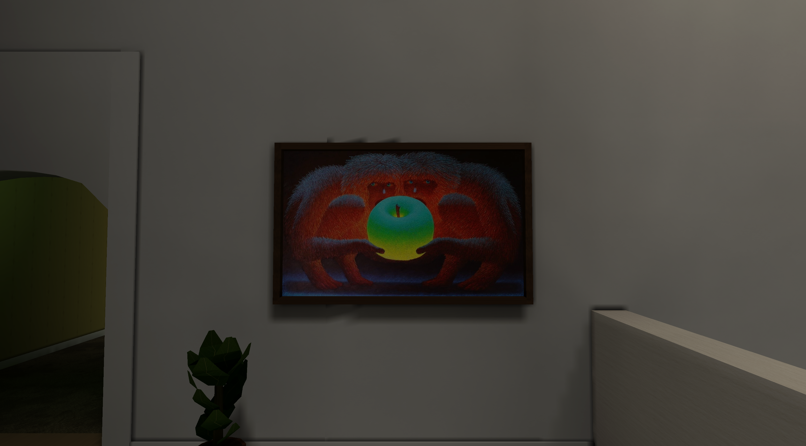

# The Temptation of Adam and Eve

Historical acceptance: October 2026 painting integration. Counts, timings and validation below describe
that tested version; the canonical guides govern current contracts.

The supplied photograph is now a hanging timber-framed painting in the Home
section of Places Demo and in Model Zoo. Aim at the Home frame and press E to
toggle the title through the existing interaction system.

The source is 900×546 pixels. Every decoded source pixel is preserved without
cropping, resizing or colour adjustments in a transparent 1024×1024 PNG.
High quality uploads that sheet unchanged; Medium and Low use the existing
decal texture budgets. The visible artwork is 1.800×1.092 m, with a 50 mm
frame. The frame reuses the existing bookshelf PNG atlas and has 48 triangles.

## Files

- `assets/core/decals/temptation_adam_eve_01.png`
- `assets/core/props/models/painting_frame_landscape_01.glb`
- `assets/catalog.json`
- `assets/levels/places_demo.json` and `assets/levels/places_demo.placesmap`
- `assets/levels/model_zoo.json` and `assets/levels/model_zoo.placesmap`
- `tools/props/parts/decor.py`
- `tools/textures/decal_art.py`
- `tools/levels/build_model_zoo.py`
- `src/loader/tests.rs` (add the painting to the existing expected decal list)
- `docs/ASSET_SPECIFICATION.md`
- `docs/MAP_AUTHORING_GUIDE.md`
- `assets/environment/home/README.md`

## Validation

Passed:

- Exact decoded source-photo/PNG active-rectangle pixel comparison passed.
- `cargo fmt --all --check`.
- `cargo clippy --workspace --all-targets --all-features -- -D warnings -D clippy::all -D clippy::pedantic -D clippy::nursery -D clippy::cargo`.
- `python3 tools/assets/validate.py` (290 assets, zero warnings).
- `python3 tools/textures/build.py --check` (68 textures; existing soft budget
  warnings, including this intentionally higher-resolution artwork).
- `python3 tools/props/build.py --check` (166 models; within geometry/texture budgets).
- `python3 tools/assets/audit.py --workers 2` (zero errors).
- `python3 tools/levels/build_model_zoo.py --check --quiet` and its shipped-level
  generator test.
- Fresh uncached targeted showcase coverage, embedded-demo loader, decal-depth
  and official-demo feature tests. The existing exact decal-list assertion was
  updated to include the new painting sheet.
- Demo and Model Zoo builds with off/medium/full lightmap variants,
  `places-compile validate`, and `places-compile verify --require-current`.
- Final demo geometry audit: zero errors; two existing warnings for a tiny wall
  overlap and the night-house porch floor.
- Actual native High-quality game launch/capture in Places Demo, inspected for
  correct framing, orientation, proportions and wall placement.

`env RUSTC_WRAPPER= CARGO_INCREMENTAL=0 cargo test --workspace --all-features -- --test-threads=4`
finished with **2,005 passed, 3 failed and 23 ignored** (674.15 seconds).
The painting's existing demo decal-list fixture failed in that already-running
binary; its one-line update subsequently passed the fresh targeted test and
final strict Clippy. The two unresolved failures are external to the painting:
`loader::tests::test_the_default_level_is_the_shipped_demo` and
`static_prop_lighting_tests::real_dense_showcase_metadata_exceeds_material_budget_and_loads_under_its_own_limit`.
Both reject stale `lantern_hollow.placesmap`: its Office cabinet dependency
records 97,468 bytes, while the final concurrent Office asset is 104,356 bytes.
The subsequent combined package refresh and integrated gate passed, as recorded
in the October 7 integration note. No checks were skipped or assertions weakened.

The full workspace command has **not** passed yet. Binary and documentation
integration tests after the failing library stage remain unverified in this run.

The subsequent [October 7 integration](integration-provenance-20261007.md)
records the combined package refresh and successful final gate. The initial
asset-only run above retains its actual stale-package failures; it is not
relabeled as a complete workspace pass.
