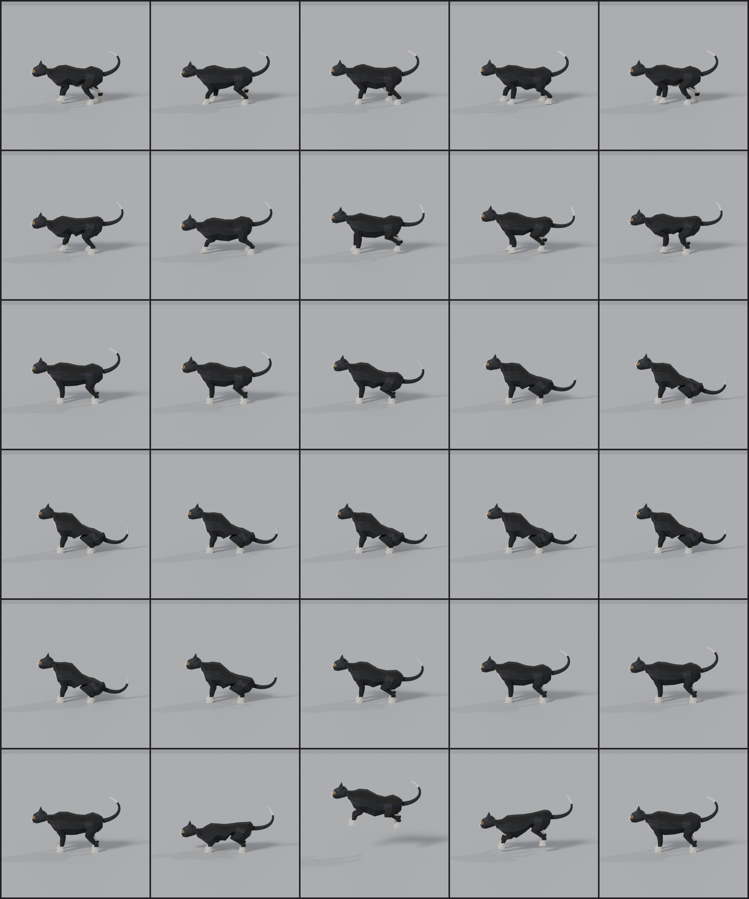

# Spoonerman: feline animation remake

Reworked the existing Spoonerman rig into a four-beat walk, a haunch-supported sit/stand set, a faster bounding run, and a one-shot pounce. The canonical GLB remains in `assets/entities/spooner-man/model/spooner-man.glb`.

| Clip | Duration | Playback | Change |
|---|---:|---|---|
| `idle` | 4.0 s | Loop | Preserved unchanged. |
| `walk` | 0.6 s | Loop | Hind-left, fore-left, hind-right, fore-right; long support phases and low lifted paws. |
| `run` | 0.46 s | Loop | Hind push-off followed by offset foreleg catches, spinal flex and tail balance. |
| `sit_down` | 1.8 s | Once | Forepaws brace while the pelvis settles over folded hind legs. |
| `sit_idle` | 5.0 s | Loop | Upright chest, folded hocks, tail swept aside, restrained breathing. |
| `stand_up` | 1.5 s | Once | Rises from exactly the same seated pose into the standing stance. |
| `pounce` | 1.4 s | Once | Crouch, hind-leg launch, airborne reach, foreleg landing and recovery. |

Two-bone leg IK maintains bone lengths and compensates paw orientation. Dense sampled LINEAR keys and mesh-based ground correction keep feet from passing visibly through the floor. Loop endpoints and sit/stand/pounce connections match exactly.

All locomotion is in place. `walk` declares a 0.20 m/s reference speed and `run` declares 0.60 m/s, so the existing character path can scale playback. Pounce has a vertical pelvis arc but no horizontal root travel and adds no attack AI. Play it through the existing named-clip route step:

```json
{ "step": "play", "clip": "pounce", "seconds": 1.4, "loop": false }
```

## Preserved asset data

The first 450,412 canonical BIN bytes are byte-for-byte unchanged, including geometry, UVs, textures, skin weights and inverse bind matrices. Nodes, mesh definitions, materials, rest pose and the original standing-idle channels also match the baseline. The model retains its 26-joint rig and 1,380 triangles. No new textures or rig were created.

## Validation

- `python3 tools/props/animate_spooner_man.py --check`: passed; all seven clips present and loop keys continuous.
- `python3 tools/entities/check_clip_boundaries.py`: passed; loop boundaries, transition endpoints and skin weights valid.
- `python3 tools/entities/validate_entities.py --glb assets/entities/spooner-man/model/spooner-man.glb --workers 2 --samples-per-second 60 --json`: passed with no reported problems.
- Export independently imported and sampled in Blender; side-view motion previews and contact sheets reviewed.
- Regeneration: byte-for-byte idempotent (final SHA-256 in `preservation.json`).
- Python compilation and scoped `git diff --check`: passed. No Rust tests or Cargo commands run.

| Clip | Frames sampled | Lowest vertex (m) | Maximum edge stretch |
|---|---:|---:|---:|
| `idle` | 241 | -0.000000 | 1.099× |
| `walk` | 38 | -0.000032 | 1.668× |
| `run` | 29 | -0.000145 | 1.885× |
| `sit_down` | 109 | -0.000096 | 1.799× |
| `sit_idle` | 301 | 0.000000 | 1.816× |
| `stand_up` | 91 | -0.000096 | 1.799× |
| `pounce` | 85 | -0.000179 | 1.824× |

Maximum edge stretch measures deformation against the unchanged bind mesh, not bone scaling. The mesh’s existing leg/body weight transitions constrain extreme poses; the final clips stay within the project’s 2× gate without altering those weights.

## Files produced or changed

- `assets/entities/spooner-man/model/spooner-man.glb` — updated animations and playback metadata.
- `assets/entities/spooner-man/README.md` — clip table and integration notes.
- `tools/props/animate_spooner_man.py` — seven-clip export, updated checks, cached pose-wide skin matrices.
- `tools/props/cat_motion.py` — deterministic feline gait, IK, sitting and pounce authoring.
- `tools/entities/check_clip_boundaries.py` — one-shot pounce and idle endpoint checks.
- `docs/reports/spoonerman-cat-motion.md` — this report.
- `docs/reports/spoonerman-cat-motion/preservation.json` — canonical binary hash and clip metadata.
- `docs/reports/spoonerman-cat-motion/validation.json` — full 60 Hz sweep results.
- `docs/reports/spoonerman-cat-motion/{walk,run,sit_down,sit_idle,stand_up,pounce}.mp4` — Blender-imported motion previews.
- `docs/reports/spoonerman-cat-motion/contact-sheet.png` — sampled final poses.

## Motion previews

[Walk](spoonerman-cat-motion/walk.mp4) · [Run](spoonerman-cat-motion/run.mp4) · [Sit down](spoonerman-cat-motion/sit_down.mp4) · [Seated idle](spoonerman-cat-motion/sit_idle.mp4) · [Stand up](spoonerman-cat-motion/stand_up.mp4) · [Pounce](spoonerman-cat-motion/pounce.mp4)

Contact-sheet rows, top to bottom: walk, run, sit down, seated idle, stand up, pounce. Each row progresses through its clip from left to right.


