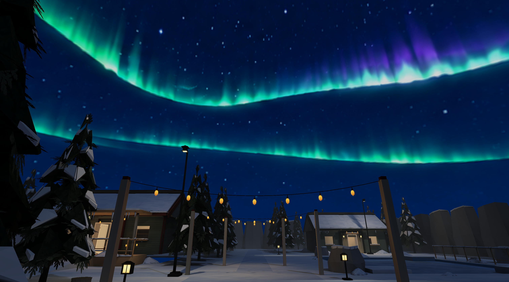
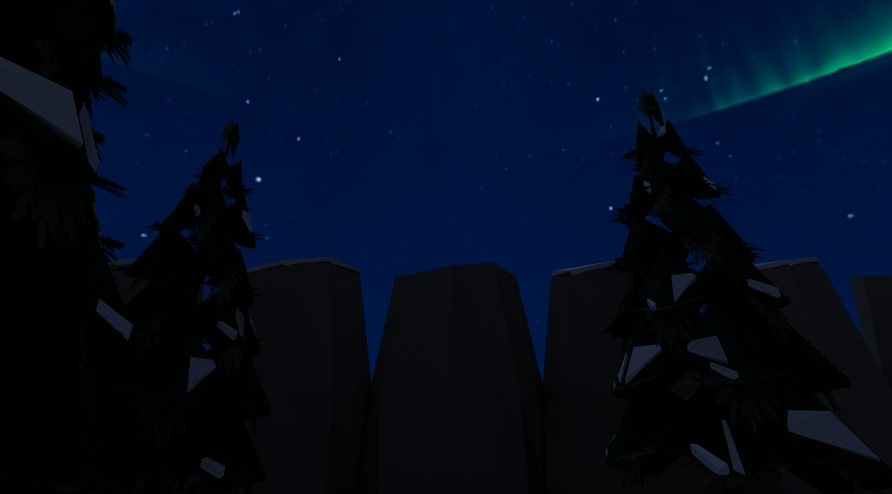

# Winter northern-lights sky — 2026-10-06

Winter now uses a dedicated deep-blue night panorama with small stars,
distant green/cyan aurora ribbons and restrained violet fringes. The ribbons
leave open blue sky above the real tree/rock horizon. Their smaller vertical
extent avoids a close curtain filling the player's view. The visual reference
is panel 8 of the committed Winter Expansion Environment Concept Sheet.

The opaque RGB 2048×1024 PNG uses the existing 2:1 equirectangular sky pass,
brightness .85, U repeat and V clamp. U=.5 faces north (−Z); U=0/1 is the
south-facing wrap; V=0 is zenith, .5 horizon and 1 nadir. The existing renderer now accepts 2048×1024 sky panoramas through a dedicated
bounded decoder, while ordinary PNGs retain their 1024-pixel limit. No
dependencies, geometry, atmospheric scattering or animation were added.
The built-in `image_gen.imagegen` tool created the artwork; offline `sips`
resizing preserved its 2:1 contract. The sharper generated source is 1774×887,
fitted slightly upward to a 2048×1024 power-of-two sheet. This retains more
source detail than the prior 1024×512 downsize; it is not native 4K artwork. The runtime loads the committed PNG without generating artwork.

Existing ambient .24 and the blue `winter_moon` directional source (intensity
.18) remain independent of the aurora. Warm lamps and string-light pools stay
amber. The package comparison confirms
byte-identical lighting, lightmap pixels, irradiance, mesh, props, collision
and navigation against the preceding commit. Lightmap metadata changes only
its content keys. There is no green contribution from the sky artwork.

## Visual inspection

Seventeen final native SDL3/wgpu Metal captures cover four sky directions,
the south seam, zenith, square, forest, frozen pond and a closed interior.
High/Medium/Low check the northern ribbons, seam and square; High also checks
the Low lighting override. Native records
include final package, binary and capture identities and accepted settings.

| Requested check | Result |
| --- | --- |
| Sky seams | Offline seam metric passes; quiet south wrap has no visible vertical join at all presets. Edge-channel mean delta 0.97/255, maximum 7/255. |
| Horizon | Open blue beneath the ribbons; real geometry supplies the silhouette, with no painted landscape or hard sky cutoff. |
| Exposure | Sky brightness .85 preserves deep blue; aurora has no white clipping; cool paths remain readable alongside warm local pools. |
| Banding | Smooth blue and cyan falloffs inspected at all presets; no conspicuous posterized gradient steps. |
| Texture resolution | Canonical 2048×1024 RGB source; High uploads 2048×1024, Medium 1024×512, Low 512×256. Low intentionally softens small details. |
| Orientation | Cardinal captures match yaw; zenith stays dark and clear of aurora. |
| Map transitions | Winter → no sky removes the aurora; Winter → ordinary stars replaces it; Winter → no sky → stars → Winter restores it. Native captures and matching renderer/world IDs pass. |
| Fog | Existing global distance fog still softens distant world geometry; the infinite sky remains unfogged, following the renderer contract. Winter adds no regional fog. |
| Baked lighting | Lighting and lightmap pixels remain byte-identical. Closed ceilings cover the sky; indoor light stays warm. Low lighting remains readable with its existing brighter vertex lighting. |

The three transition runs use test-owned minimal compiled maps under
the independent transition-control source set. They do not add shipped maps.
Transition records retain action scripts,
committed world IDs and screenshot hashes. The full round trip presented each
world and reused Winter's sky texture from the existing GPU cache.

## Validation

| Command | Result |
| --- | --- |
| `cargo fmt --all --check` | PASS |
| `cargo clippy --workspace --all-targets --all-features -- -D warnings -D clippy::all -D clippy::pedantic -D clippy::nursery -D clippy::cargo` | PASS |
| `cargo test --workspace --all-features` in clean HEAD + sky snapshot | 2,008 library tests and the compiler-binary test PASS (23 library tests ignored); one CLI integration layout reached the mixed asset tree through the shared target, corrected by the separate isolated CLI run below |
| `cargo test --workspace --all-features --test '*'` with a target inside the clean snapshot | PASS: all five integration tests |
| `cargo build --release --bins` | PASS |
| `python3 -m unittest tests.test_package.EnvironmentTextureTests` | PASS: six tests, including the sky-only dimension/POT contract |
| `python3 -m unittest tests.test_winter tests.test_winter_assets` | PASS: ten tests; rerun after final artwork |
| `python3 tools/assets/validate.py` | PASS: zero warnings |
| `python3 tools/textures/build.py --check --quiet` | PASS: existing source-resolution/manual-art advisories, including the intentional sky source |
| `python3 tools/textures/seam_repair.py --check assets/environment/winter/textures/sky/sky_aurora_01.png` | PASS |
| `python3 tools/levels/build_winter.py --check` | PASS |
| `target/release/places-compile build assets/levels/winter.json --workers 4` | PASS: off/medium/full rebuilt |
| `target/release/places-compile verify assets/levels/winter.json --package assets/levels/winter.placesmap --require-current` | PASS |
| `target/release/places-compile validate assets/levels/winter.placesmap` | PASS: three variants, 19 entries, 66 dependencies |
| `target/release/places --check-geometry --level assets/levels/winter.json --json target/aurora-evidence/geometry.json` | PASS: zero errors/warnings; existing outdoor intent annotations retained |
| `git diff --check` | PASS |

The full Rust suite and native captures used a fixed catalog/source/asset
snapshot, excluding concurrent Office/painting edits. The runtime asset root
was that payload's repository root; CLI executable lookup resolved the same
inputs. Earlier mixed-checkout failures were excluded. Combined catalog changes
require normal package rebuilding; no fingerprint was bypassed.

Final capture commands:

```sh
python3 tools/bench/capture_winter.py --root "$PWD" --quality high --views sky-north,sky-east,sky-seam,sky-west,sky-zenith,square,pond,forest,interior
python3 tools/bench/capture_winter.py --root "$PWD" --quality medium --views sky-north,sky-seam,square
python3 tools/bench/capture_winter.py --root "$PWD" --quality low --views sky-north,sky-seam,square
python3 tools/bench/capture_winter.py --root "$PWD" --quality high --low-lighting --views sky-north,square
```

The final package SHA256 is
`ad97e5ae2de22d550ca5d8995e58d88c196edef2f582336b0c170367eddfeab6`.
The release binary SHA256 is
`b15bdf1fa6475350c7ef5f9b6f900a9c24ad6672b88013f2b4666dea488f3f2b`.
Rendering remains one static fullscreen sky draw with the same
draw count as the previous star sky. The High aurora texture is 8 MiB RGBA8
before mipmaps (four times the previous 2 MiB); Medium and Low upload budgets
remain unchanged. Only one sky is drawn per frame. Native inspection was performed on this Mac;
other desktop backends were not exercised in this pass.





## Reproduction

Use `tools/bench/capture_winter.py` and its maintained four-direction/zenith/wrap
cameras. The authoring master is the original 1774×887 PNG; the committed native
sky is its mechanically resized 2048×1024 output. A native capture is not a
replacement for that original source. Current sky and normal asset decoder bounds
are documented in the asset specification.
