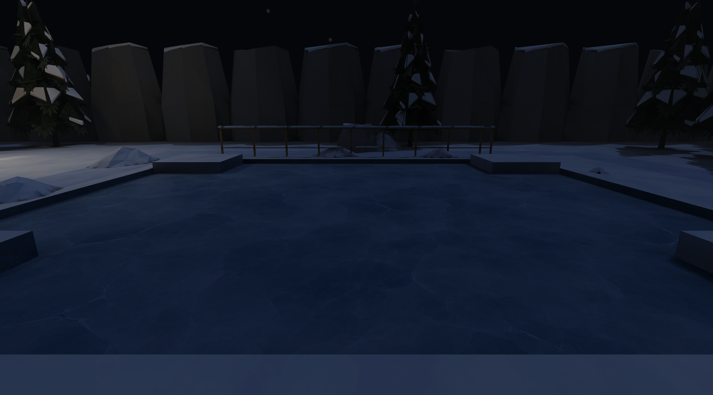

# Winter ice pass — 2026-10-06

Historical acceptance: 2026-10-06 ice/controller pass. Counts, timings and validation below describe
that tested version; the canonical guides govern current contracts.

Winter's existing 10 × 12 m pond now has blue-gray translucent ice with quiet
cloudy facets, sparse cracks and pale highlights. The dedicated 1024² PNG uses
the existing world-aligned floor/material system at an 8 m repeat. Material
opacity is 0.84 with modest specular/shine, without reflection passes, normal
maps or emission. A darker opaque backing provides depth beneath the blended
surface; six existing snow drift assets gather around the dry shoreline.

## Surface behavior and map integration

`ground_surface: "ice"` is a material property carried through catalog and pack
resolution. Missing values preserve normal ground. Catalog values are validated
as an enum and permitted only on material definitions; malformed optional pack
values follow the pack parser's existing default behavior and remain normal.
The controller samples the material of its actual supporting floor, with the
same room/patch/region/ramp/stair precedence and height tolerance as collision.
Prop tops and other storeys above ice retain ordinary traction. The compiled
collision format is unchanged; validated source/material descriptors are
installed alongside prepared collision when a world loads.

Ice approaches input velocity at 4.5/s, decays with 1.6/s drag after release and
keeps the normal maximum walk speed, including diagonal input. Reversing spends
momentum before changing direction. Ice takeoff keeps planar momentum with
restrained 1.2/s air steering; landing resumes the supporting surface's traction.
Normal terrain uses the original immediate movement/stop path. Collision spends
blocked momentum; reset and ladder attachment clear it. Gravity, jump height,
step reach, vertical support and collision sweeps retain their existing behavior.

The existing pond floor remains at -0.16 m. Its depth backing is non-solid at
-0.31 m, and all added drifts are non-solid. The source comparison
against `ec533422fcb45c8b1f20be3da7b5047d7f6ff004` confirms rooms, walls,
floor regions, stairs, ramps, doors, guardrails and existing solid props/void
walls retain their geometry: zero new colliders. West/south approaches stay
clear. Winter already had a solid placeholder floor and no liquid pond volume.

The authoring guide documents the winter substitution recipe: remove the
corresponding liquid volume and author an ice floor region at the waterline.
Ice is not a global change to water or movement. Liquid swimming and ordinary
maps retain their existing behavior. No dependencies or unrelated maps changed.

## Validation

| Command | Result |
| --- | --- |
| `cargo fmt --all --check` | PASS |
| `cargo clippy --workspace --all-targets --all-features -- -D warnings -D clippy::all -D clippy::pedantic -D clippy::nursery -D clippy::cargo` | PASS |
| `cargo build --release` | PASS |
| `cargo test --workspace --all-features game::tests::ice` | PASS; seven traction/support regressions |
| `cargo test --workspace --all-features game::tests::winter` | PASS; six existing Winter traversal tests |
| `cargo test --workspace --all-features game::tests` | PASS; 201 tests, three opt-in tests ignored |
| `cargo test --workspace --all-features` | 2,004 pass, two pre-existing Model Zoo failures, 23 ignored; 396.74 s |
| `cargo test --workspace --all-features --bins --test command_line --test list_levels --test macos_cpu_port` | PASS; six tests, run separately because the full suite stops at its library failures |
| `cargo test --lib movement_performance -- --ignored --nocapture` | PASS; ordinary/dense/ice controller benchmark |
| `python3 -m unittest tests.test_winter tests.test_winter_assets` | PASS; ten tests |
| `python3 tools/assets/validate.py` | PASS; 284 assets, 162 placeables, zero warnings |
| `python3 tools/props/build.py --check` | PASS |
| `python3 tools/textures/build.py --check --quiet` | PASS; existing source-resolution/manual-art manifest advisories, including the intentional ice artwork |
| `python3 tools/textures/seam_repair.py --check assets/environment/winter/textures/floors/ice_01.png` | PASS |
| `python3 tools/levels/build_winter.py --check` | PASS; deterministic and current |
| `target/release/places-compile build assets/levels/winter.json --workers 12 --json` | PASS; all three lighting variants rebuilt |
| `target/release/places-compile verify assets/levels/winter.json --package assets/levels/winter.placesmap --require-current --json` | PASS; current, no differences |
| `target/release/places-compile validate assets/levels/winter.placesmap --json` | PASS; three variants, 19 entries, 63 dependencies |
| `target/release/places --check-geometry --level assets/levels/winter.json --json target/ice-evidence/geometry.json` | PASS; zero errors/warnings, existing outdoor intent annotations retained |
| `git diff --check` | PASS |

The two full-suite failures are
`render::tests::the_showcase_level_renders_every_core_prop_with_real_geometry`
and `zoo_audit::the_zoo_displays_every_catalogued_placeable`. They require the
Model Zoo/showcase to display the 28 snow props already missing before this
pass. The [preceding snow report](winter-static-assets.md) records both failures.
Both were also reproduced individually with this pass's test binary pointed at
an asset root containing the original `HEAD:assets/catalog.json`, confirming
they do not depend on the new ice entries. Tests were not suppressed or weakened.
At this pass's completion the repository-wide gate remained red for that
showcase issue. The subsequent [string-light integration](winter-string-lights.md)
refreshed Zoo and passed the full gate; these earlier failures remain recorded.

The new controller tests cover entering/leaving ice, coasting and stopping,
reversal, bounded diagonal speed, takeoff, landing, reset, a thin collision wall,
snow overrides, slopes into/out of ice and unchanged liquid swimming. Movement
endpoints at 30/60/144 Hz stay within 4 cm. Existing movement tests also cover
steps, pond rims, headroom and vertical clipping regressions.

## Native presentation, movement and performance

Thirteen scripted runs loaded the final package through the real SDL3/wgpu
Metal desktop renderer. Every run exited zero, presented Winter, applied the
requested quality and passed its applicable traversal bounds. High checks
pond entry, jump/landing, reverse/return to snow, coast versus snow stopping and
the pond rail boundary. High/Medium/Low pond and close views show distinct ice;
the High pond also passes with Low lighting forced. Native records
preserve package/binary/capture identities and movement bounds.

```sh
python3 tools/bench/capture_winter.py --root "$PWD" --quality high --views pond,ice-close,walk-pond,walk-ice-coast,walk-snow-stop,walk-ice-wall
python3 tools/bench/capture_winter.py --root "$PWD" --quality medium --views pond,ice-close,walk-ice-coast
python3 tools/bench/capture_winter.py --root "$PWD" --quality low --views pond,ice-close,walk-ice-coast
python3 tools/bench/capture_winter.py --root "$PWD" --quality high --low-lighting --views pond
```

From x=8 with one second of forward input then release, ice endpoints are
x=12.1667/12.1595/12.1568 for High/Medium/Low (less than 1 cm apart). The same
snow route stops at x=10.9786. The pond entry/jump/return route reaches eye
heights 1.44–2.4398 m and returns to 1.6 m on snow. The rail route stops at
x=16.465 with ordinary shoreline height, without vertical recovery or clipping.

| Same High pond camera | Previous snow pass | Ice pass |
| --- | ---: | ---: |
| Expanded world vertices | 382,340 | 383,660 |
| Total drawable ranges | 455 | 462 |
| Visible draws | 62 | 69 |
| Vertex-buffer bytes | 24,469,760 | 24,554,240 |
| Texture binds | 36 | 39 |
| Material changes | 37 | 44 |
| Reflection passes | 0 | 0 |

The cost comparison adds 1,320 expanded vertices,
seven draws and 82.5 KiB of vertex buffers. One 4 MiB decoded RGBA albedo is shared
with the depth backing. The rebuilt package is 52,244,409 bytes. Medium/Full
retain three/five lightmap pages, 256 collision wall boxes and 57,120 navigation
cells. The 45 existing subtexel architectural slivers retain their vertex-lit
fallback; no atlas overflow or package warnings occurred.

A separate High native benchmark measured 1,200 frames after 240 warmup frames
with vsync enabled: mean 119.99 FPS, median loop 8.331 ms, p99 loop 9.213 ms and
mean update 0.082 ms. Run configuration and
measurements preserve the setup and summary.
The final seven-sample controller benchmark
measures medians of 0.847 µs/frame on ordinary ground, 1.019 µs in the dense
4,000-wall fixture and 0.920 µs on ice. These are local measurements on this Mac,
not a performance guarantee for other hardware; the short screenshot timings
are used only for draw-cost comparison.

Package SHA256:
`1f0639d912a4398e3200b089196e0e21b9db5029da0a52d88b968910ee05cd44`.
Release binary SHA256:
`9bead0d18b7eca4e4d58636266f29c6a2796992f24d95dae24f57fa11c34d862`.



## Image source

The final workspace asset is
`assets/environment/winter/textures/floors/ice_01.png`. It was generated with the
built-in `image_gen.imagegen` tool, resized offline to the required 1024² floor
contract and repaired with the existing offline seam tool. It is an opaque RGB
PNG; translucency belongs to the material. No runtime image generation was added.
The final generation prompt was:

> Use case: stylized-concept. Asset type: a single seamless tiling square 1024x1024 albedo PNG for a retro low-poly first-person game's frozen pond floor. Orthographic flat top-down texture only, fills entire square edge to edge, no scene, no borders, no perspective. Quiet blue-gray ice, muted pale slate and soft steel blue with very subtle large flat polygonal cloudy variations suggesting trapped air beneath translucent frozen water. A few sparse hairline angular cracks, short broken pale blue highlights adjacent to cracks, restrained rather than a dense web. Approximately an 8-metre square patch of ice, cracks small and sparse at that scale. Even neutral albedo illumination, no baked shadows, no central spotlight, no mirror reflection, no glossy photographed surface, no snow clumps or shoreline, no objects, no text. Perfectly seamless repeat in both axes: matching edge colors and marks; avoid cracks reaching image boundary. Stylized handcrafted PS1/low-poly game artwork, readable at distance, large quiet areas, low contrast variation. All pixels opaque; actual translucency will be supplied by the game's material, not holes or transparent pixels.

## Reproduction

Use the authored Winter pond and `tools/bench/capture_winter.py` for native
pond/entry/coast/wall controls. The controller tests provide fixed 30/60/144 Hz
endpoint checks independently of frame-sampled native trajectories. Current
material/ground-surface contracts are in the map and asset guides.
