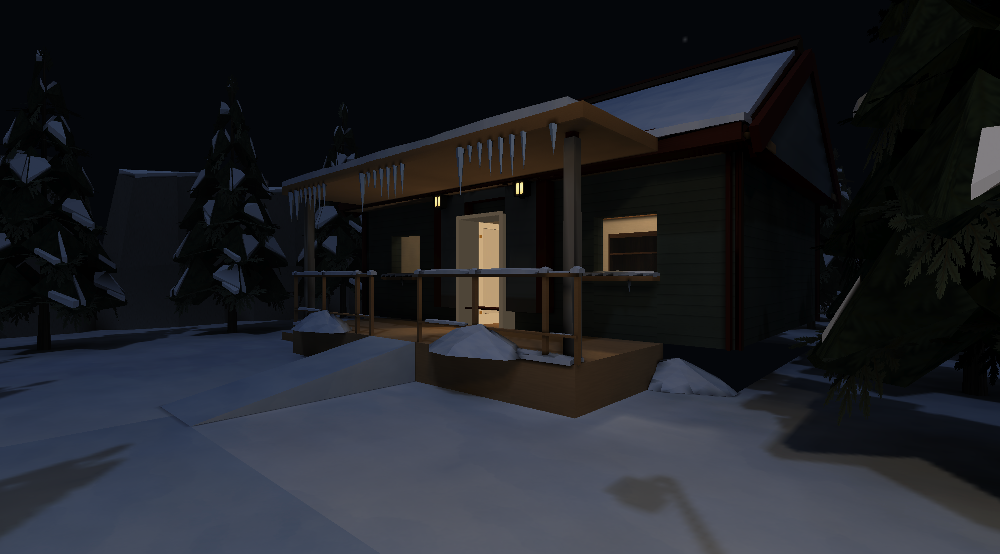
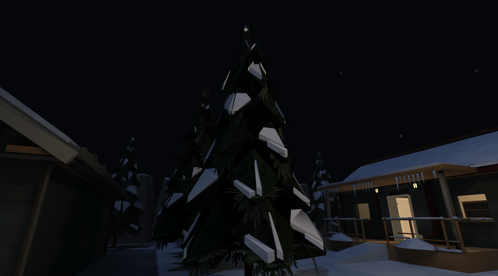

# Winter static snow asset pass — 2026-10-06

Historical acceptance: 2026-10-06 snow-kit pass. Counts, timings and validation below describe
that tested version; the canonical guides govern current contracts.

This pass adds the core snow kit and integrates it into the existing Winter
Place. Only `assets/levels/winter.json` and `winter.placesmap` change among
level files. Model Zoo and every other map remain untouched at the user's
explicit request. The supplied Winter concept sheet was inspected as the art
target; `outdoor:tree_03` remains the canonical evergreen.

## Assets and integration

The 28 committed GLBs cover two evergreen loads, six drifts/mounds, two capped
rocks, nine architecture/rail overlays, four canonical railing/post variants,
and five icicle modules. Their dimensions and mounting contracts are listed in
[the Winter kit README](../../assets/environment/winter/README.md). They use
real committed PNGs: a 1024² seamless terrain albedo and its 256² prop derivative.
Snow and packed snow use ordinary world-aligned materials, matte response and
cool restrained variation; neither has a normal map, emission or runtime image
creation.

The eight canonical variants preserve their original positions, indices, UVs,
vertex colours, embedded atlas and material/alpha contracts byte-for-byte. Snow
is a separate named mesh and material. Closed clumps sit on upward-facing opaque
branches, with lighter loads on sheltered trees and heavier loads around the
exposed perimeter. The level has 31 lighter and 44 heavier trees. Rocks retain
bare sides and some entirely bare placements. Full railing variants are library
assets; Winter keeps its structural guardrails and uses separate top/midrail
loads and post caps to preserve their exact dimensions and collision.

Winter now contains 327 prop placements, including 236 winter placements. Roof
caps, eaves, timber-backed doorway hoods and window ledges, the lodge awning,
porch edges and stair sides all use reusable additions. Flat-backed drifts meet
building bases and railings; landscape drifts gather around rocks and tree roots.
The lodge's sheltered rear eave and the cottage door lamps are clear of icicles.
Icicles hang from their common root plane, embedded 15 mm into the underside.
Caps sink 8–9 mm into their supports. Entrance centres, treads, ramps, pond
approaches, interiors and the forest spine remain clear.

The native close-up exposed an existing static-prop upload bug: a glTF material
with no texture selected the model's first atlas. The snow consequently sampled
bark/rock artwork. `src/render/wgpu/props.rs` now reserves one shared white
binding and resolves absent or invalid local image indices to it. Canonical
textured primitives still select their original images. Regression tests cover
mixed textured/untextured primitives, empty image lists, local index bounds and
overflow. This small binding fix is necessary for the separate snow material;
it does not change the lighting solver or shaders.

## Geometry, collision and cost

Asset validation records include
all model hashes, extents, triangle counts and snow topology. All snow/icicle
components are closed, outward-wound and free of degenerates, nonmanifold edges,
inconsistent edges and contradictory winding. Normals derive from the checked
face winding through the established loader. UVs are finite and within 0..1;
canonical UVs and alpha fringes are unchanged. The tree support checks vertically
probe the actual opaque branch triangles. The terrain PNG passes the seam metric.
Native close-ups check supports, facets, roof seams and icicle clearance.

The kit totals 4,994 triangles and 6,016 KiB of decoded RGBA across its embedded
images. The original evergreen has 770 triangles; the two snow loads are 1,238
and 1,442, explicitly reviewed and below the 1,500 static-art ceiling. Every other
new model is below 500 triangles; modular caps use 66, drifts 72, individual
icicles 8, and mixed/sparse clusters 56/24. The full catalogue holds 29,988 KiB
of decoded prop images against the existing 64 MiB pack budget.

Collision comparison checks
against the foundation commit `13a4ef6`: all 44 rooms, 12 walls, seven floor
regions, three guardrails, one stair flight, two ramps, three doors, seven solid
void walls and 157 solid prop colliders retain their original numerical geometry.
Added snow, hoods/sills and icicles are non-solid. Trees keep their narrow trunk
colliders; capped rocks explicitly keep the bare rock collider sizes.

The real compiler rebuilt Winter in 156.490 seconds into a 51,555,031-byte
package. Off has 109 architectural ranges/3,533 vertices; Medium/Full have
105/2,687. All profiles have 205 prop batches. Medium uses three lightmap pages
and Full five, within the existing eight-page budget. The 45 pre-existing tiny
architectural slivers retain the standard vertex-lit fallback; no atlas overflow
or placeholder prop fallback was reported. An incremental rebuild confirmed the
package is current and preserved its bytes.

## Validation commands

| Command | Result |
| --- | --- |
| `python3 tools/props/build.py --workers 12 --only <all 28 winter IDs>` | PASS; real asset export, all 28 GLBs |
| `python3 tools/props/build.py --check` | PASS; 162 catalogue models |
| `python3 tools/assets/validate.py` | PASS; 282 assets, zero warnings |
| `python3 tools/assets/audit.py --workers 12 --out target/winter-assets/audit.json` | PASS; zero errors |
| `python3 tools/textures/build.py --check` | PASS; 65 sheets; source-resolution/manual-art manifest advisories, including the intentional imagegen snow source |
| `python3 tools/textures/seam_repair.py --check assets/environment/winter/textures/floors/snow_01.png` | PASS |
| `python3 tools/levels/build_winter.py --check` | PASS; deterministic and current |
| `python3 -m unittest tests.test_winter tests.test_winter_assets tests.test_glb_accessors` | PASS; 20 tests |
| `cargo test --workspace --all-features render::wgpu::props::tests` | PASS; four binding/layout tests |
| `cargo fmt --all --check` | PASS |
| `cargo clippy --workspace --all-targets --all-features -- -D warnings -D clippy::all -D clippy::pedantic -D clippy::nursery -D clippy::cargo` | PASS |
| `cargo build --release` | PASS |
| `cargo test --workspace --all-features` | 1,995 pass, two Model Zoo coverage failures, 23 ignored; 319.38 s |
| `target/release/places-compile build assets/levels/winter.json --workers 12` | PASS; real bake and incremental verification |
| `target/release/places-compile verify assets/levels/winter.json --package assets/levels/winter.placesmap --require-current` | PASS |
| `target/release/places-compile validate assets/levels/winter.placesmap` | PASS; all three variants, 19 entries and 62 dependencies |
| `target/release/places --check-geometry --level assets/levels/winter.json --json target/winter-assets/geometry.json` | PASS; zero errors/warnings, foundation outdoor intent annotations unchanged |
| `python3 -m unittest tests.test_package` | 47 pass, one fails because the untouched Model Zoo lacks the new catalogue displays |

The repository-wide checks deliberately retain their catalogue-coverage tests.
The Python failure is
`ShippedLevelTests.test_the_model_zoo_is_current_with_its_generator`. The two
Rust coverage failures are
`render::tests::the_showcase_level_renders_every_core_prop_with_real_geometry`
and `zoo_audit::the_zoo_displays_every_catalogued_placeable`: both require Model
Zoo to display the 28 new winter entries. Updating that map is explicitly outside
this pass. No assertion was weakened or suppressed to conceal these failures.

The two Zoo coverage failures above were present before this pass. The later
[string-light integration](winter-string-lights.md) refreshed Zoo and passed the
full workspace gate. These earlier failures remain part of the dated result.

## Native presentation and draw cost

The final release was loaded through the real SDL3/wgpu Metal desktop renderer
25 times: 14 High runs (ten views and four routes), five Medium, five Low and
one High run with Low lighting forced. Every run exited zero, presented Winter
and confirmed the requested renderer quality. All four traversal campaigns
passed: lodge ramp/door/interior, side stairs, pond entry/jump/return and the
forest spine. Native identities and metrics
record the package, binary and capture hashes; all final captures use the same
package and release binary. The white material remains correctly bound in all
lighting profiles. Interiors remain dry and unchanged.

```sh
python3 tools/bench/capture_winter.py --root "$PWD" --quality high --views tree-lit-snow,lodge,pond,forest,interior,overview,tree-snow,entrance-snow,railing-snow,square,walk-lodge,walk-stairs,walk-pond,walk-forest
python3 tools/bench/capture_winter.py --root "$PWD" --quality medium --views tree-snow,tree-lit-snow,lodge,pond,railing-snow
python3 tools/bench/capture_winter.py --root "$PWD" --quality low --views tree-snow,tree-lit-snow,lodge,pond,railing-snow
python3 tools/bench/capture_winter.py --root "$PWD" --quality high --low-lighting --views tree-lit-snow
```

The same High lodge camera was compared with the preserved foundation capture.
Cost records retain the complete
benchmark summaries and both identities.

| Native High lodge metric | Foundation | Snow pass |
| --- | ---: | ---: |
| Expanded world vertices | 224,060 | 382,340 |
| Total drawable ranges | 282 | 455 |
| Visible draw calls | 95 | 164 |
| Vertex-buffer bytes | 14,339,840 | 24,469,760 |
| Texture binds | 51 | 109 |
| Material changes | 55 | 113 |

The separate snow geometry adds 158,280 expanded vertices, about 9.66 MiB of
vertex buffers, and 69 draws in this view. The catalogue/model and level budgets
remain satisfied. These short captures establish geometry and draw costs; their
frame timings are not a sustained performance benchmark.

Package SHA256:
`2f0cbb11116b84a9dd0d9a515d9a2d21396335155e9a58b9d7aa50ffb19c63f0`.
Release binary SHA256:
`6cb4289e45a79dab7bade8f09d2132a952ec1ed1aad02549e132fd81c2f6a8fa`.




Low evergreen and
Medium evergreen document the
same tree through the two other quality profiles.

## Reproduction

The [Winter kit README](../../assets/environment/winter/README.md) inventories
the native models, shared source artwork and generator commands.
`tools/bench/capture_winter.py` exercises the real renderer across qualities;
the final integrated acceptance is in the [Winter audit](winter-final-audit.md).
