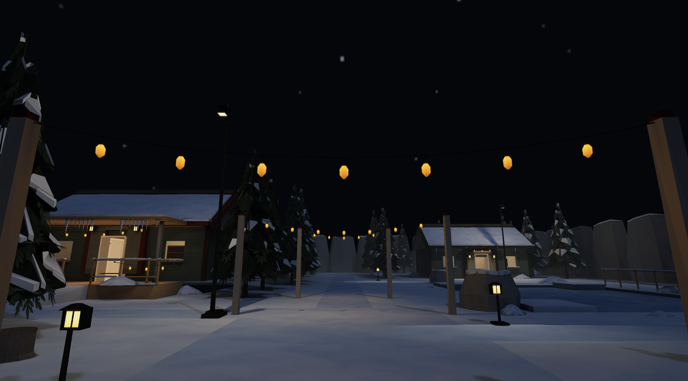
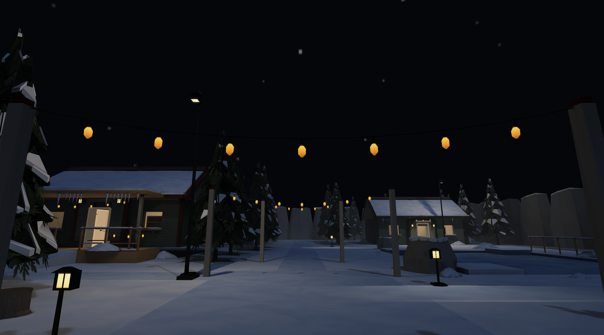
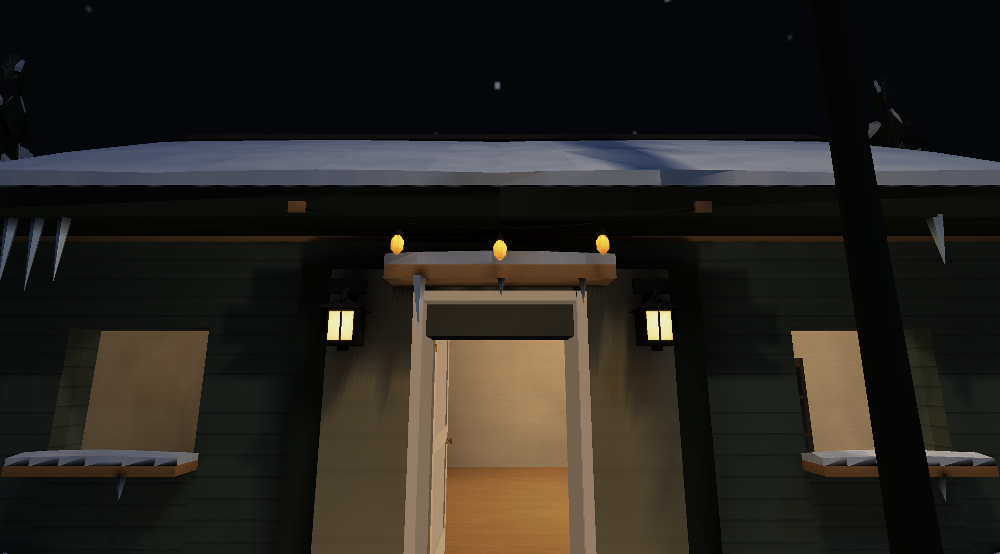
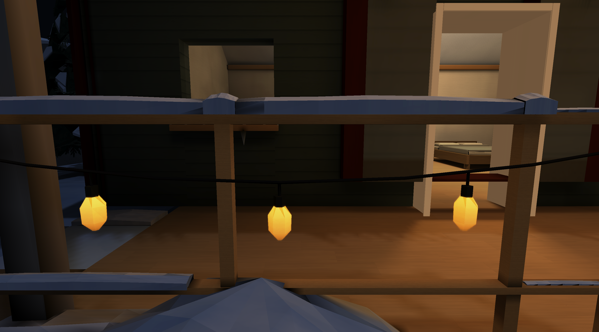
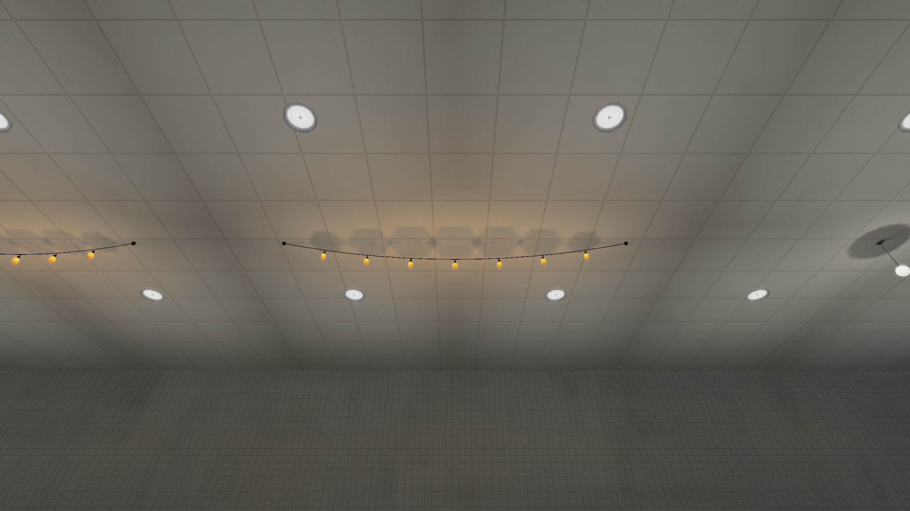

# Winter string lights

October 6, 2026. Reusable short, medium and long strings bring the concept
art's amber contrast to the Winter Place. Eight spans cover two cottage
entrances, the lodge porch and rails, the square, and one path crossing. The
forest, pond shore and rear facades retain their cold lighting.

## Assets and integration

| Module | Attachment span | Sag | Bulbs | Triangles |
| --- | --- | --- | --- | --- |
| Short | 2.8 m | 0.15 m | 3 | 344 |
| Medium | 4.0 m | 0.28 m | 5 | 552 |
| Long | 6.6 m | 0.40 m | 7 | 760 |

Each closed GLB has a dark 12 mm cable, attachment clips, drops and faceted
9 cm wide × 14 cm tall bulbs. Only the glass material emits, at amber
`[1, 0.56, 0.16]`, strength 1.0. The real sibling 128² opaque PNG reuses the
existing ball-light atlas losslessly; both GLB material slots load that atlas.
All three models together decode 192 KiB of embedded imagery. Repeated
native-size spans preserve bulb size and avoid unique meshes per placement.

`tools/props/string_lights.py` shares cable, bulb, endpoint and source positions
between the builder and map authors. The origin is centered X/Z at the lowest
bulb tip. Sources sit 2 cm below opaque glass to avoid self-shadowing. Each
bulb contributes a static amber point source, baked by the existing compiler
onto real architectural and prop receivers. Non-solid spans omit the coarse
box occluder while retaining opaque-triangle transport visibility.

Winter adds 38 sources: 32 at intensity 0.32/range 4.5 m, and six rail bulbs
at 0.10/3 m. No span exceeds seven sources or the existing eight-source prop
limit. Winter totals 53 static emitters, with no switchable layers or new
runtime per-bulb light updates. Six existing timber posts and four small
fascia brackets support the new strings. Brackets move entrance bulbs clear
of snowy door hoods; the rear square string clears the existing lamp base.

## Lighting audit

The control uses identical geometry and visible emissive bulbs, disabling
only the 38 physical string sources. Full-quality receiver chart records
match exactly. This isolates environmental illumination from bright glass.
The committed [comparison](winter-string-lights/lighting-comparison.json)
contains bilinear samples and regional prop-receiver measurements.

| Receiver | Added linear RGB from strings |
| --- | --- |
| Square snow | `[0.208, 0.125, 0.041]` |
| Square path | `[0.208, 0.126, 0.042]` |
| Path crossing | `[0.190, 0.117, 0.038]` |
| Lodge ground | `[0.153, 0.096, 0.030]` |
| Cottage ground | `[0.147, 0.088, 0.029]` |
| Distant forest | red delta `0.0000062` |
| Far pond shore | red delta `0.000158` |

Regional model receiver windows also gain amber illumination: porch snow
averages `[0.152, 0.091, 0.031]`, porch rail faces `[0.096, 0.058, 0.020]`,
and square seating `[0.017, 0.010, 0.003]`. Windows include all prop faces in
their measured bounds, rather than assigning charts to named models.

The permanent Rust regression loads the real authored short span and real
stump GLB. Medium and High bakes verify warm receiver illumination and an
opaque divider suppressing received light by more than half, while disabling
sources preserves the visible emissive material. Native entrance, porch,
rail, interior, square and path captures supplement this transport check;
it is not an exhaustive proof of every possible visibility ray.

Bulbs remain distinct faceted shapes with a restrained glow. Lower rail
sources avoid bright local hotspots. Outdoor floor receiver channels peak
at 1.234, with no sample above the diagnostic 1.4 threshold; native snow
retains its surface detail. At three tested floor chart borders, maximum
channel discontinuities are 0.00414, 0.000883 and 0.000953. The
[atlas audit](winter-string-lights/atlas-audit.json) reports finite geometry,
unit normals and disjoint padded reservations, with zero errors. Thin prop
charts remain diagnostic entries rather than atlas integrity failures.









## Bake and catalogue cost

Winter Medium uses three atlas pages; High uses five, the same High page
count as the pre-change package. High has 130,935 charts and 1,810,132
receiver texels. The eight strings add 4,208 model triangles. The package
grows from 52,244,409 to 53,540,758 bytes, about 2.5%.

The final all-quality Winter build took 177.9 s on this machine, including
142.2 s for High, with 12 workers and other validation running concurrently.
The identical-geometry control had 78.49 million direct rays versus 99.41
million with string sources. Both had 231.70 million bounce rays: total ray
work grows about 6.8%. Different concurrent workloads prevent a reliable
relative wall-time comparison. These are offline bake costs.

Refreshing Model Zoo was necessary for catalogue coverage: its shipped source
already lacked the previous 28 snow-kit models, and now also needed the three
strings. All 165 placeable models are displayed. Strings hang at native size
with their own 15 amber sources. Thin snow accessories use wall mounts.
The larger continuous hall uses compact flat ownership cells to retain the
existing High atlas budget, without adding interior walls. Narrow intent
annotations explain only the open cell borders and authored exit; the basin
remains wholly inside one cell. Zoo Medium uses five pages; High uses eight,
with 31,041 charts and 5,770,267 High receiver texels. The final all-quality
Zoo build took 203.8 s. Generator tests protect coverage, stable ids,
growth, non-overlapping full hall coverage, basin containment and serial/parallel
reproducibility.



## Verification

Full logs and large float receiver dumps remain under
`target/winter-string-lights/`. Compact [native capture identities](winter-string-lights/native-captures.json),
[asset audit](winter-string-lights/asset-audit.json), measurements and screenshots
are committed with this report.

| Check | Result |
| --- | --- |
| `cargo fmt --all --check` | PASS |
| `cargo clippy --workspace --all-targets --all-features -- -D warnings -D clippy::all -D clippy::pedantic -D clippy::nursery -D clippy::cargo` | PASS |
| `cargo test --workspace --all-features` | PASS; 2,007 library tests, six additional tests, 23 intentionally ignored |
| `python3 -m unittest tests.test_string_lights tests.test_winter tests.test_winter_assets tests.test_glb_accessors tests.test_zoo_generator tests.test_package` | PASS; 82 tests |
| `python3 tools/props/build.py --check` | PASS |
| `python3 tools/assets/validate.py` | PASS; zero warnings |
| `python3 tools/assets/audit.py --workers 2 --out target/winter-string-lights/asset-audit.json` | PASS; zero errors |
| `python3 tools/textures/build.py --check` | PASS; existing manual-art/source-resolution advisories |
| Both level generators `--check` | PASS |
| Native geometry checker, Winter and Zoo | PASS; zero errors/warnings after authored intent annotations |
| Compiler build, validate and verify for Winter and Zoo | PASS; all off/medium/full variants, both packages current |
| Native Winter captures | PASS; 13 High and six Low views, correct package and quality committed |
| Native Zoo High smoke capture | PASS; full atlas selected, amber ceiling illumination visible |

Reproduce the lighting measurements after dumping identical-geometry on/off
High builds using the existing compiler's lighting diagnostics:

```sh
python3 tools/bench/audit_winter_strings.py \
  --on target/winter-string-lights/final-lighting \
  --off target/winter-string-lights/control-lighting \
  --out target/winter-string-lights/lighting-comparison.json
python3 tools/bench/capture_winter.py --root . --quality high \
  --views string-square,string-cottage,string-porch,string-rail,string-path,forest,interior
```

The audit utility uses the same optional NumPy tooling as the existing dump
inspector; no game dependency is added. Low retains the existing vertex-lit
fallback policy, verified visually. Geometry checker intent annotations and
finite samples supplement, rather than replace, native visual inspection.

## Changed files

- `assets/catalog.json`
- `assets/environment/winter/props/models/string_lights.png`
- `assets/environment/winter/props/models/string_lights_{short,medium,long}.glb`
- `assets/environment/winter/README.md`
- `assets/levels/winter.json`, `assets/levels/winter.placesmap`
- `assets/levels/model_zoo.json`, `assets/levels/model_zoo.placesmap`
- `tools/props/string_lights.py`, `tools/props/parts/string_lights.py`,
  `tools/props/parts/__init__.py`
- `tools/levels/build_winter.py`, `tools/levels/build_model_zoo.py`
- `tools/bench/winter_views.json`, `tools/bench/audit_winter_strings.py`
- `tests/test_string_lights.py`, `tests/test_zoo_generator.py`
- `src/static_prop_lighting_tests.rs`
- `docs/ASSET_SPECIFICATION.md`, `docs/MAP_AUTHORING_GUIDE.md`
- This report and its `winter-string-lights/` evidence files.

The user's existing `assets/environment/Winter Place Prompt.txt` edits remain
outside this change.
