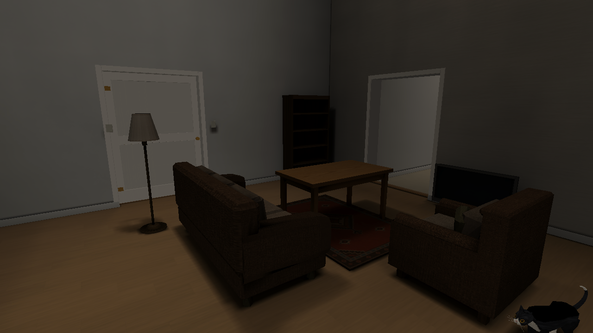
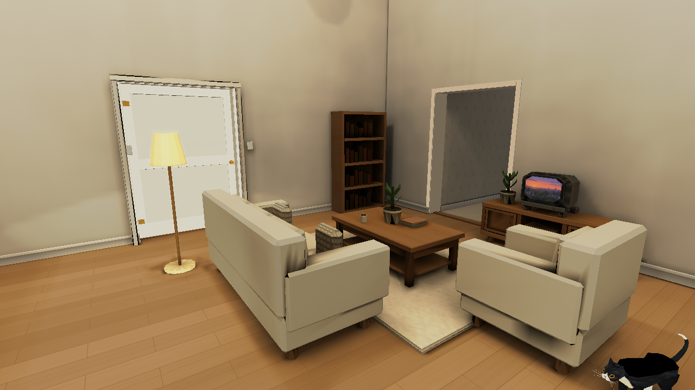
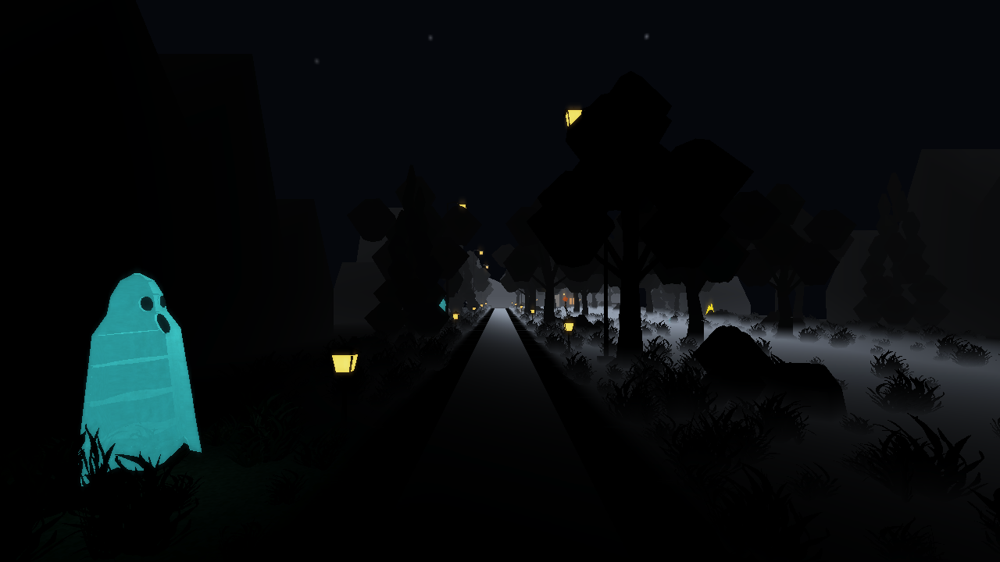
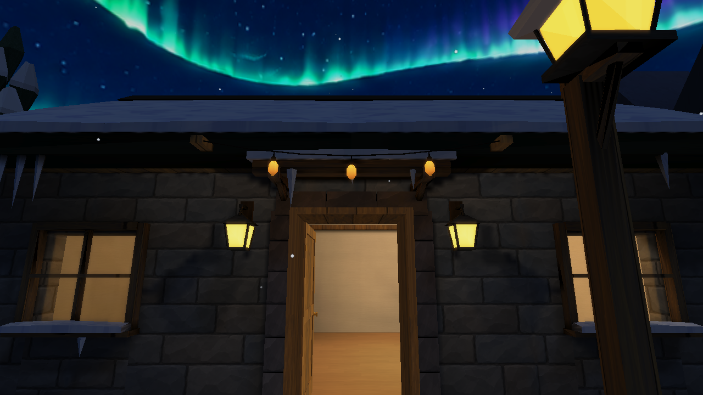

# Places visual development — October 7–9, 2026

The four scene reconstructions and seven Art-style milestones are completed historical work. Their reports preserve concrete authoring decisions, genuine native results, dated costs and remaining limitations. Concept artwork is a reference, not a renderer screenshot. Images below are byte-exact copies of the selected original captures.

## Production scene reconstruction

### [Pool](pool/README.md)

| Before | Final |
| --- | --- |
|  |  |

### [Home](home/README.md)

| Before | Final |
| --- | --- |
|  |  |

### [Outdoors](outdoors/README.md)

| Before | Final |
| --- | --- |
|  |  |

### [Winter](winter/README.md)

| Before | Final |
| --- | --- |
|  |  |

Pool/Home/Outdoors/Winter preserve the original logical asset roles, geometry/UV/alpha contracts and meaningful gameplay. Full outdoors High lighting remains very dark; severe Winter whiteout remains nearly opaque. Camera/startup timing tables describe those particular native runs and are not controlled FPS gains. Historical local stale drop-in discovery failures were retained honestly and later reconciled in Stage 7.

## Completed Art-style sequence

[Seven Art-style milestones](art-style-history.md) provides the compact progression: baseline/diagnostics; linear colour/HDR; continuous surfaces/transport; spatial live entities; highlight/atmosphere controls; content/cache currency; then supported-map integration. [Stage 7](../art-style/stage7/README.md) completed at publication [a1e7122](https://github.com/csd113/Places/commit/a1e7122bba5df549c2e82c16371bcc57db99e976) with successful [exact-head CI](https://github.com/csd113/Places/actions/runs/37906450891). Home restored-lighting/parity acceptance is qualified around its untraced animated cat, with static pixels and actual lighting payloads exact; physical Linux/Windows GPU and sustained memory plateau remain unclaimed.

The later [model-lighting root cause and correction](../model-lighting-root-cause-and-fix.md) covers production kitchen surfaces, Home corridor joins and the camera-dependent close Hallows skeleton normal. It is distinct from this historical concept and Stage 7 acceptance. [Verification](../VERIFICATION.md), [map authoring](../MAP_AUTHORING_GUIDE.md) and [asset specification](../ASSET_SPECIFICATION.md) are the maintained implementation contracts.

## Preceding integration provenance

The October 7 integration combined verified Office/Aurora/painting work with five current/decode normal packages. Winter's 17 physical payloads and all 31 Demo payloads remain exact through their respective identity/format refreshes. The dated [integration provenance](../reports/integration-provenance-20261007.md) retains the final source/CI sequence and scoped native acceptance; it does not turn the old implementation journal into a current architecture guide.
