# Places visual development journal

Each entry preserves the starting scene, approved reference, reasoning,
native rendered result and validation. Entries follow the serial queue; a
later pass adds a sibling folder without replacing earlier evidence.

## 2026-10-07 — Pool

[Detailed comparison, inventory and validation](pool/README.md) ·
[Approved concept](../../assets/environment/pool/Places_%20Quiet%20Indoor%20Pool%20Asset%20Sheet.png)

| Before | After |
| --- | --- |
|  |  |

The original working Pool used a nearly neutral basin, a square tray table,
horizontal chair slats, two-tier rails and flat openings. The concept's blue
ceramic, pale mineral deck, round resin furniture, single waist rails and
restrained changing-bay furniture became the construction guide. This pass
remakes those weak families, adds the missing benches, grates, service leaves
and submerged treads, and separates the dry coping from the blue recess.
Existing water and entity behavior remain intact.

Commit subject: `rebuild pool assets toward concept art`. The exact pushed
commit is reported with the task handoff; `git log -- docs/style-upgrade-20261007/pool`
locates this entry in repository history.

## 2026-10-07 — Home

[Detailed comparison, coverage and validation](home/README.md) ·
[Primary concept](../../assets/environment/home/Home%20Environment%20Asset%20Sheet.png)

| Before | After |
| --- | --- |
|  |  |

The original living group used dark shared seating, a dining-height coffee
table, office-style chairs and a low flat screen. Home now has cream woven
seating, a low shelf table, timber dining construction, Shaker kitchen stock,
matching domestic appliances and a dark CRT on a cupboard console. Twenty
new static families add the reference's missing domestic fittings, with warm
local surface variants and supported ceramic backsplash. The connected
vault/loft remains; the reference's external balcony is documented as a gap.

Commit subject: `rebuild home assets toward concept art`; the task handoff
records the exact pushed SHA and CI. Outdoors and Winter follow this entry.

## 2026-10-07 — Outdoors

[Detailed comparison, coverage and validation](outdoors/README.md) ·
[Approved concept](../../assets/environment/outdoor/Quiet%20Night%20Places%20Concept%20Sheet.png)

| Before | After |
| --- | --- |
|  |  |

The original night route had wispy tree cards, a nearly continuous grass fringe,
plain glowing fixtures and pillar-like rocks. Rebuilt branching/foliage, lantern
construction and broken natural forms now accompany fitted olive ground,
aggregate paths and pale facade stock. Eight new static families supply shrubs,
capped fences, masonry piers, a porch cover, striped barrier, distant geology and
a campfire without animation or character ownership.
The comparison shown is native Low; Full lightmaps retain the inherited dark-yard
limitation. Coarse fixture self-occlusion and porch coplanarity are fixed; the existing sky,
traversal, encounters and completed Pool/Home work remain intact.

Commit subject: `rebuild outdoors assets toward concept art`; the task handoff
records the exact pushed SHA and CI. Winter follows this entry.

## 2026-10-08 — Winter

[Detailed comparison, object coverage and validation](winter/README.md) ·
[Immutable concept](../../assets/environment/winter/Winter%20Expansion%20Environment%20Concept%20Sheet.png)

| Before | After |
| --- | --- |
|  |  |

The starting settlement used plain shared siding, primitive opening trim,
fine snow artwork and snow variants of the preceding bare landscape kit.
Winter now has mineral courses, deep timber frames, braced snowy entrance
hoods, stone approaches/piers, timber lanterns and fractured ice. Connected
evergreen coats and supported rock crowns preserve the completed Outdoors
bases exactly; asymmetric banks and broad faceted PNGs strengthen the snow.
All seven missing static families are built and placed in Winter and Zoo.
Sky/aurora/weather, door controls and original traversal geometry remain.
The full distant village/church and the illustration's softer tree/roof forms
remain documented gaps; actual severe views retain the intended whiteout.

Commit subject: `rebuild winter assets toward concept art`; the handoff records
its exact pushed SHA and CI. Parent integration and the Art-style queue follow.

## 2026-10-08 — Art-style Stage 1: the hero baseline

[Audit, native cameras and reproducible launch](../art-style/README.md) ·
[Dependency plan for Stages 2–7](../art-style/gap-plan.md) ·
[Costs and limitations](../art-style/performance.md)

| Native baseline | Independent native repeat |
| --- | --- |
|  |  |
|  |  |

**This establishes a benchmark; it is not a visual improvement milestone.**
A compact furnished room, connected utility hall and real glazed garden view
reuse the completed art on normal engine paths. Six fixed native High cameras
expose warm/broad lighting, geometry boundaries, material response and grounding.
Three separate repeats match byte for byte. The same chair's detailed static
shading and flat, ungrounded spawned response now provide a useful entity control.

The audit preserves working openings, warm light pools, real static shadows and
the four asset passes, while separating chart/fill policy, entity probes, color
headroom, material support, reflection sky and atmosphere problems. Dark exterior
readability remains; Low is supporting evidence, not acceptance. The exact stale
local-package ledger and the initially unavailable surface measurement are stated
openly; the diagnostic extension below adds a valid submitted-frame baseline. Verified implementation and push/CI links are recorded in
[the Stage 1 handoff](../art-style/handoff.md).

## 2026-10-08 — Art-style Stage 1: seeing the pipeline

[Selectable native diagnostics and provenance](../art-style/diagnostics.md) ·
[Expanded costs](../art-style/performance.md) ·
[Exact checks and limitations](../art-style/validation.md)

| Original normal baseline | Normal build after diagnostic infrastructure |
| --- | --- |
|  |  |

**These matched native PNGs are byte-identical; this is a diagnostic foundation,
not an achieved visual improvement.** Eleven opt-in views now expose actual PNG
albedo, normals, combined light, atlas values/addressing, roughness, geometric
depth and lighting routes without an authored edit or rebake for selection.
One instrumented hero solve exports true stages/charts/receiver/caster provenance
and produces the same package. The normal release omits the selector extension.

| Existing final | Native texture albedo | Native combined illumination |
| --- | --- | --- |
|  |  |  |

The sofa's diagonal tones live in stored lighting rather than its cream artwork;
the prepared entity field is present; the close resin-table region is severely
underlit. Independent High atlas/filtering controls separate causes that overall
Low changes together. Settled live Low/Medium/returned High and returned atlas/
filtering match direct launches exactly; loading transients remain qualified.
No new opening leak or full-white nonemissive model is demonstrated.

A fresh normal sample submits all measured scene frames and establishes CPU/event
loop and draw/resource costs. GPU execution time is still unmeasured. Strict
Clippy and focused tests pass; the three inherited stale-package discovery failures
remain exact Stage 7 ledger items. Verified baseline/diagnostic implementation
commits and CI links live in [the handoff receipt](../art-style/handoff.md).

[Diagnostic implementation 2050fb2](https://github.com/csd113/Places/commit/2050fb23f1c6be75b0ee1b248b1a2623b36e37f7)
is pushed; [its clean-source CI](https://github.com/csd113/Places/actions/runs/37728914254)
passed. The final source check preserves existing rectangular/line emitter
sampling and soft shadows, and distinguishes the table anchor's authored direct
coverage from unresolved indirect/sky support. This remains baseline evidence,
not a lighting improvement.

## 2026-10-08 — Art-style Stage 2: colour that survives the pipeline

[Matched native gallery and material distinctions](../art-style/stage2/README.md) ·
[Authoring/bake/shading/display contracts](../art-style/stage2/contracts.md) ·
[Measured costs and validation](../art-style/stage2/handoff.md)

| Original Stage 1 / Stage 2 before | Stage 2 after, matched native High |
| --- | --- |
|  |  |
|  |  |

Pale walls, upholstery, oak and the tiled passage are more legible under the same
lights and exposure. The warm lamp pool and dark night window remain. Source art,
models, cameras and map topology are untouched: sRGB textures now decode once,
bake/material sums retain linear HDR, and presentation owns display conversion.
Colour mips preserve energy/coverage; normals and scalar/alpha materials follow
one convention across static and entity mesh routes. Carpet stays matte, and
plastic, ceramic, paint and cool metal retain restrained existing distinctions.

The six original before images match Stage 1 byte for byte, and independently
rebuilt Stage 2 galleries match each other. Sofa receiver seams and the ungrounded
spawned chair remain visible for their owning lighting stages. Fine plastic panel
noise, single-sample silhouettes and lower-preset upsampling are explicit limits,
not hidden by asset or exposure corrections. The HDR package and frame targets
cost more memory; shader/GPU execution time is not inferred from CPU submission.

Original and intermediate native galleries are immutable. Local runnable milestone
bundles preserve matching binaries, packages, source, camera/settings, assets and
SDL outside target; Stage 1 replay reproduces its original room. This entry joins
the existing chronological story for the eventual seven-stage comparison, without
creating a video or replacing the initial pixels. Verified implementation, remote
commit and CI links are recorded in [the Stage 2 handoff](../art-style/stage2/handoff.md).

[Stage 2 implementation b34e1dd](https://github.com/csd113/Places/commit/b34e1dd6d8dcdf43280a35c9644bcb567905e492)
is pushed and its exact remote identity is verified. Both local milestone bundles
hash-verify and replay their matched room pixels; [snapshot receipts](../art-style/stage2/stage2-snapshot.json)
pin binaries, assets and settings. CI and final ownership release are recorded
in [the publication handoff](../art-style/stage2/handoff.md).

## 2026-10-08 — Art-style Stage 3: light across construction seams

[Matched native gallery](../art-style/stage3/README.md) ·
[Separated lighting and caster evidence](../art-style/stage3/diagnostics.md) ·
[Transport contracts](../art-style/stage3/contracts.md) ·
[Costs and publication](../art-style/stage3/handoff.md)

| Stage 2 before, same native camera | Stage 3, same native camera |
| --- | --- |
|  |  |
|  |  |
|  |  |

The sofa's diagonal chart steps disappear while its cushions, bevels, contact
shadows and warm lamp pool remain. World-space receiver support and filtering
cross compatible coplanar cuts; source taps retain their real incoming cosine.
Gable black wedges proved to be missing geometry in the albedo view. Shared
roof ownership closes them and preserves real exposed wall tops.

The compiler now supplies actual architectural PNG reflectance and numeric alpha
to the offline solve. Glass attenuates straight light, grille and leaf coverage
block only covered pixels, and the lowered basin keeps its blue depth attenuation.
Cream walls contribute warmer diffuse energy; correcting the earlier white
reflectance estimate lowers aggregate indirect brightness. This is a continuity
and distribution improvement, not a brightness lift or a new light setup.

Six original before views match sealed Stage 2 pixels. All original Stage 1,
intermediate and control captures remain immutable, with source/settings hashes
and genuine native provenance. Finite-budget bevel gather differences, the
plant's real tabletop penetration, dynamic-chair grounding and screen AA remain
explicitly assigned limits. Normal bake/storage and submitted CPU costs are
measured separately from unmeasured GPU time. Runnable snapshots and verified
implementation/CI links are recorded in the Stage 3 publication handoff.

[Stage3 implementation b9377244249fa21fa12975ae8d93297e41111ebd](https://github.com/csd113/Places/commit/b9377244249fa21fa12975ae8d93297e41111ebd) is pushed and remote-verified.
[Main/control runnable snapshot receipts](../art-style/stage3/handoff.md#publication-and-retained-runnable-artifacts)
retain41/49 verified files outside target and repeat the final room/annex pixels.
Original Stage1/2 bundles still hash-verify. The final completion receipt supplies
the exact journal seal SHA, clean-source CI result and explicit ownership/custody
release; Stage4 waits for that gate.

## 2026-10-08 — Art-style Stage 4: light that follows objects

[Matched native gallery](../art-style/stage4/README.md) ·
[Spatial/direct contracts](../art-style/stage4/contracts.md) ·
[Measured CPU/GPU costs](../art-style/stage4/performance.md) ·
[Validation and publication](../art-style/stage4/handoff.md)

| Stage 3 before, same camera | Stage 4 final |
| --- | --- |
|  |  |
|  |  |
|  |  |

The movable chair gains spatial direct response and a restrained floor footprint
while the accepted static room stays intact. Real actor materials remain visible
under broad, dim and exterior light; authored black coat stays black. Selected
practical sources are removed from the combined probe coefficient before being
evaluated once at the actual entity fragment. Current rigid geometry and PNG alpha
occlude light without leaving a moving actor's fixed bind pose behind.

The additive door control caught a real black closed-leaf regression. Its bounds
lighting corners sat inside adjacent stops. A generic support inset clears those
stops without changing the mesh or collision; real frame crossing still blocks rays.
Opening and closing restores both the leaf and stationary chair payloads exactly.
Bidirectional aperture motion, rotation, uniform-scale controls and same-mesh
static/World/runtime comparisons retain raw native evidence in the stage gallery.

All six live preset pairs run twice in three environments, plus a final actor
repeat: 48 transitions without restarting. Independent lighting/filter/atlas
controls retain High texture storage and restore stationary pixels exactly. The
original Low→High failure was not reproduced here; the audited premature resident
state mutation is corrected. Ready-only endpoints do not claim every loading frame.

Native GPU execution is now measured with owned-PID Metal traces. The original
view costs about 0.306 ms more active GPU work. Conservative moving-caster cache
invalidation costs 7.56 ms whole-engine update for 32 receivers versus 0.70 ms
stationary; this limit is visible in the performance report. Floor bounds proxies,
clamped pose support and static indirect that remains baked when doors move are
disclosed approximations. No artwork, concept, exposure or limit is changed.

Original Stage 1/2/3 captures and runnable bundles remain immutable and hash-verified.
The [Stage 4 handoff](../art-style/stage4/handoff.md) records implementation/CI links,
new compatible runnable snapshots and explicit custody release after publication.

[Stage 4 implementation 2615b9b](https://github.com/csd113/Places/commit/2615b9bc787a116bca1d9bc9d9deb855ed87724d)
is pushed and remote-verified. Five [runnable snapshot receipts](../art-style/stage4/handoff.md#verified-implementation-and-runnable-bundles)
retain compatible binaries, packages/settings, SDL and all real dependencies.
The original six-view bundle replays final PNGs byte for byte; actor differences
are confined to normal animation. Exact final seal CI and custody transfer are
recorded in the completion receipt after the gate; Stage 5 is not started here.

### 2026-10-08 — Stage 4 final-audit correction

Before ownership release, the [compiler/runtime contract audit](../art-style/stage4/zero-source-repair.md)
found that newly solved indirect-only and switch-only fields incorrectly selected
the legacy center path. Solver 15 retains a validated v3 zero direct sidecar and
therefore spatial sampling and reserved switched sources. Genuine v2 compatibility
is preserved. Authored switch classification, air labels, serialization, actual
package decoding, and on/off/on accounting now have focused regressions.

The accepted hero shader and all five render payloads remain unchanged; the
original Stage 4 native gallery and measured GPU evidence retain their provenance.
New solver identities and compatible runnable bundles are appended, preserving
every earlier milestone. This correction establishes the missing contract; it
claims no additional visible gain or new GPU measurement. Final repair publication
and exact-SHA CI/custody receipts are recorded in the Stage 4 handoff.

[Solver-15 repair 7d80433](https://github.com/csd113/Places/commit/7d80433ccb77d828a8c519ffa8da935fcbcac4c4)
preserves the zero-source contract. Five [final v2 runnable bundles](../art-style/stage4/handoff.md#solver-15-final-publication)
retain compatible binaries, SDL, packages, settings and all real dependencies.
Six original views and the closed door replay byte for byte; tiny control-view
differences remain inside animated cat bounds. All 14 milestone bundles and all
seven original concepts hash-verify. The final completion receipt records the
exact seal/push/CI identity and explicit custody release after that gate.

## 2026-10-08 — Art-style Stage 5: warm highlights, readable water

[Matched native gallery](../art-style/stage5/README.md) ·
[Presentation/environment contracts](../art-style/stage5/contracts.md) ·
[Measured costs](../art-style/stage5/performance.md) ·
[Validation and runnable bundles](../art-style/stage5/handoff.md)

| Stage 4 before, matched native camera | Stage 5 after |
| --- | --- |
| 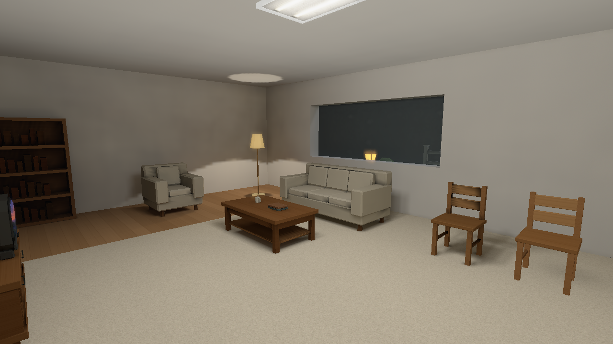 | 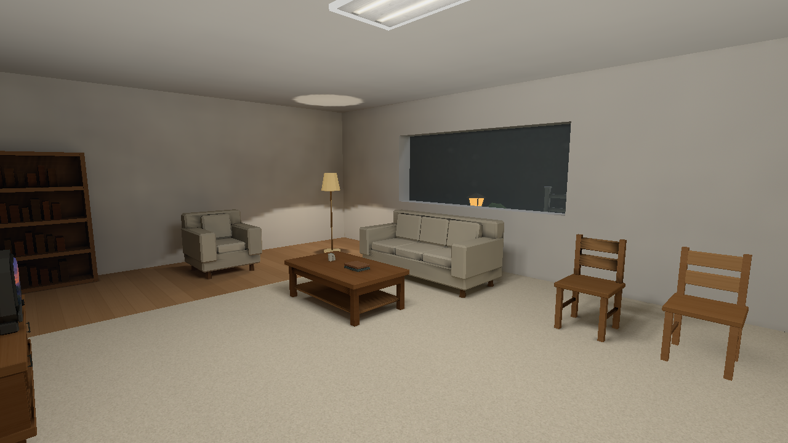 |
| 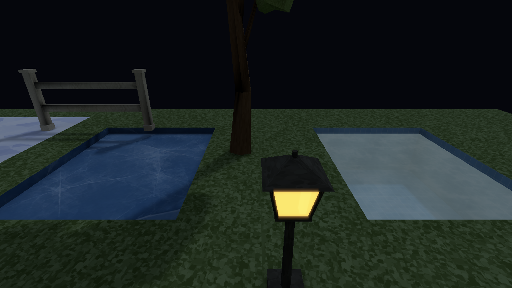 |  |
| 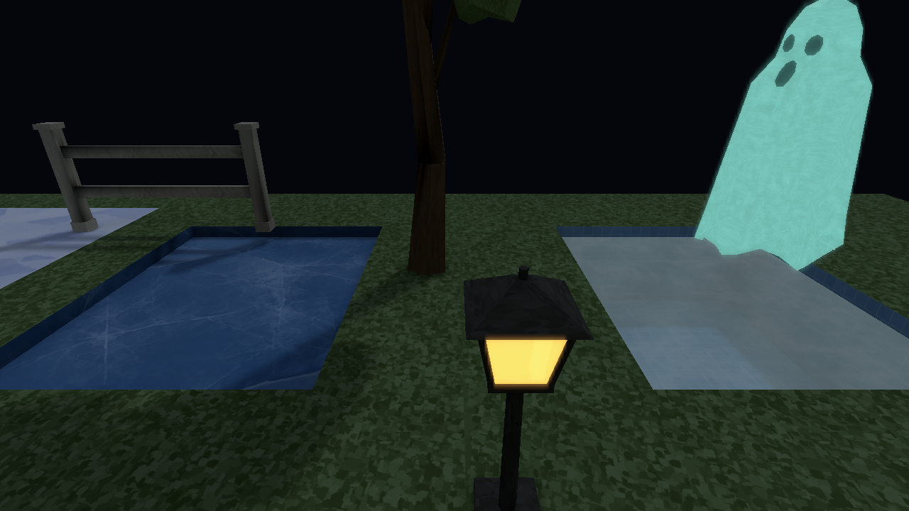 | 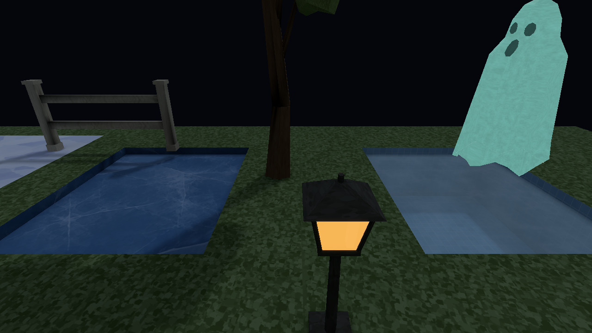 |

The room retains its soft lighting, furniture colour and contact shading. The
lantern keeps warm orange highlights instead of whitening; water becomes cooler
with readable basin tiles, while ice retains its cracked sheet and snow stays
diffuse and opaque. Correct coverage reduces ghost glow. Bloom-on/off changes
0.81% of the lantern-view pixels and leaves the water-only camera byte-identical.
These are modest presentation/surface gains on the accepted lighting foundation;
sharp texture detail and small silhouettes still differ from the concept softness.

Authored fixed exposure, sky radiance colour and global/regional distance/height
atmosphere make a cool night arrangement with warm practicals. Existing aurora,
calm snowfall and sheltered severe snow are checked in the same hero. Those
intentional environment views are labelled separately from matched improvements.
Mapped diagnostics bypass presentation effects with explicit sRGB encoding;
normal final matches the ordinary player. Both six-pair quality cycles restore
their High endpoints pixel for pixel without restarting.

The cost report rejects zero-draw window timings. Actual native capture GPU work
costs 0.897 ms before /0.963 ms after per encoded scene, including copy/readback;
bloom-off costs 0.831 ms. Ordinary presented-frame CPU cost remains unmeasured
while surface acquisition is unavailable. No speedup or universal budget is claimed.
Post attachments and atlas page storage remain unchanged; the additive control
gains one water chart and a second bounded reflection payload.

Original Stage 1 captures, all fourteen prior runnable bundles and all seven
concept PNGs remain unchanged. New compatible bundles replay the fixed views
exactly, with only small normal snow-animation differences in weather views.
Incomplete Stage 5 preparation bundles are preserved and explicitly rejected;
corrected controls use full dependencies and real runtime ghost assets. Automatic
spawn-template dependency traversal is a Stage 6 pipeline item. Nonhero adoption,
existing stale discovery packages and broader compatibility remain Stage 7.

The handoff records implementation publication and snapshot provenance. Final
seal/push/exact-SHA CI and explicit repository/caffeinate custody release are
recorded after the gate in the durable completion receipt. Stage 6 is not started
by Stage 5, and the unfinished queue retains `target/`.

[Stage 5 implementation 5a44e9d](https://github.com/csd113/Places/commit/5a44e9d3c461bd427830c5815738ba841342fc6a)
binds all 216 frozen build inputs and eight accepted compatible bundles through
[source publication](../art-style/stage5/source-publication.json). Original,
surface, night and both corrected ghost controls replay byte for byte; weather
differences remain confined to normal snowfall. The final seal/remote/exact-SHA CI
and repository/caffeinate transfer are appended in the completion receipt after
the publication gate.

## 2026-10-08 — Art-style Stage 6: a furnished hero, dependable edits

[Matched native gallery](../art-style/stage6/README.md) ·
[Measured content and workflow costs](../art-style/stage6/performance.md) ·
[Contracts](../art-style/stage6/contracts.md) ·
[Validation and runnable milestone](../art-style/stage6/handoff.md)

| Fresh Stage 5 control before | Stage 6 after, matched native High |
| --- | --- |
|  |  |
| 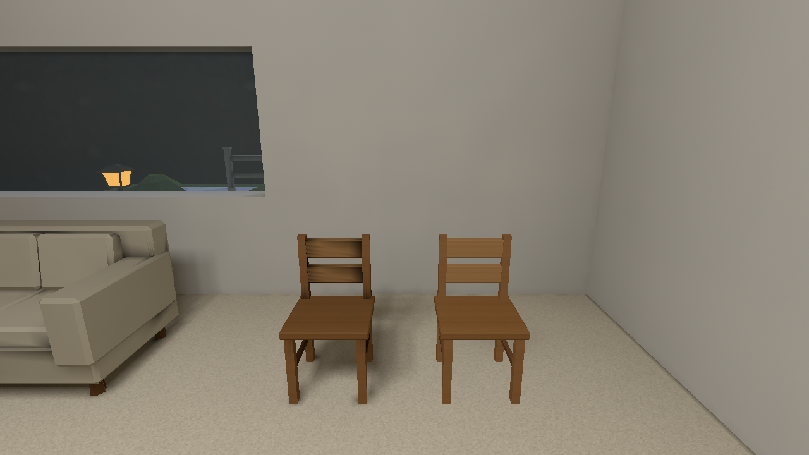 | 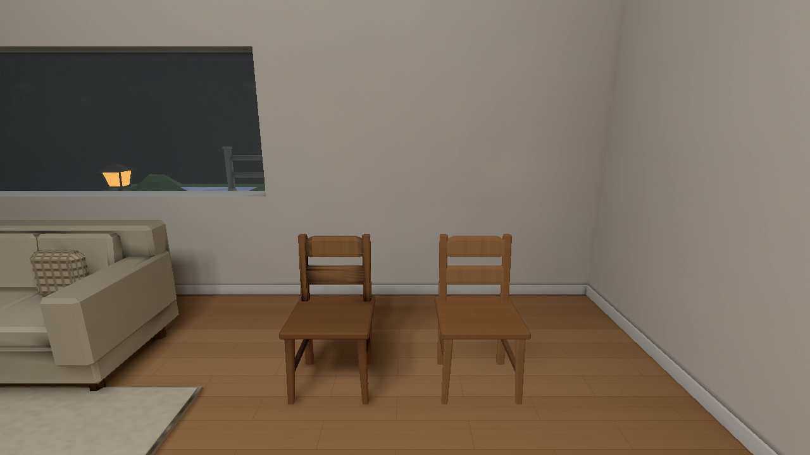 |

Oak connects the room beneath a fitted rug. Bevelled chair edges, a cushion,
plants, framed art and non-solid trim give the room scale and grounding while
retaining the accepted lighting, ghost and water/ice/snow controls. Nine fixed
views use the same cameras and settings. Concepts and original reusable assets
remain unchanged; movement and compiled navigation keep the passage usable.
The measured room rises from 38 draws/5,234 submitted triangles to 43/6,944;
two atlas pages remain unchanged. Casing feet and the plant/lamp projection overlap
remain visible reuse/composition compromises.

Ordinary builds now collect all runtime spawn-template models automatically,
pin catalogue/tool identity and explain cache decisions. Twenty-two individual
and combined hero edits agree exactly with independent forced builds; native
texture/light comparisons also agree. Unchanged/metadata/presentation work costs
0.330/0.749/0.759 s; physical edits safely rebuild in roughly ten seconds. Clearly
labelled Medium development builds take 2.574 s versus 9.982 s for all-quality
validation. Lower quality is not substituted for the final native gallery.

Three isolated moving-caster pairs reduce the receiver kernel median 34.6%
while preserving conservative updates. GPU traces have different capture/surface
submission contexts and establish no causal gameplay speedup. Warning budgets
retain headroom without changing hard safety limits. The original baseline,
22 prior accepted bundles and all seven concepts remain hash-verified.

Publication and exact-SHA CI/custody receipts are appended after their identities
exist. Nonhero adoption and the three inherited local discovery failures remain
Stage 7; this stage preserves `target/` and does not start that stage.

[Stage 6 implementation daa9642](https://github.com/csd113/Places/commit/daa9642fbe2e9cae91d95f667bcf50e1fefe585b)
is pushed and remote-verified. [Source publication](../art-style/stage6/source-publication.json)
binds 219 frozen build inputs. A [52-file runnable milestone](../art-style/stage6/stage6-snapshot.json)
preserves compiler/player/SDL, compatible catalogue and automatically collected
runtime assets without manual ghost exceptions. Isolated room and surface/ghost
replays match accepted native PNGs exactly. Final seal/push/exact-SHA CI and custody
release are recorded after that gate in the durable completion receipt.

## 2026-10-09 — Art-style Stage 7: the full map inventory works together

[Seven-stage history and original-baseline comparison](art-style-history.md) ·
[Integration report and runnable bundles](../art-style/stage7/handoff.md) ·
[Exact implementation binding](../art-style/stage7/source-publication.json) ·
[Measured costs and limits](../art-style/stage7/performance.md)

| Stage 6 replay before | Final integration after, matched native High |
| --- | --- |
| 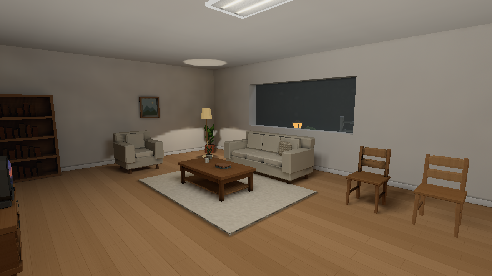 |  |
|  |  |

The hero retains the warm oak, fitted rug, softly grounded furniture and cool
night practicals. Five of its nine fixed views are byte-identical to Stage 6;
four have tiny wood-material response differences. This milestone extends
compatibility and validation across preserved content. It adds no new map-by-map
concept-refinement pass. The history gallery shows all successive milestones
and six cumulative ORIGINAL Stage 1 baseline-to-final comparisons; the original
baseline, all seven concepts and earlier asset-pass entries remain unchanged.

The ordinary gate inventories 50 source paths and compiles, validates and loads
all 48 supported package cases. Two explicit offline controls and named negative
geometry fixtures retain their assertions. Home, Office, Pool, Outdoors, Winter
and Hallows exercise every directed quality pair twice, plus independent
filtering, lighting and reflection changes with visible models. Genuine supported
examples have [complete provenance](../art-style/stage7/supported-native/provenance.json).

| Existing content under final systems | Purposeful regression example |
| --- | --- |
| 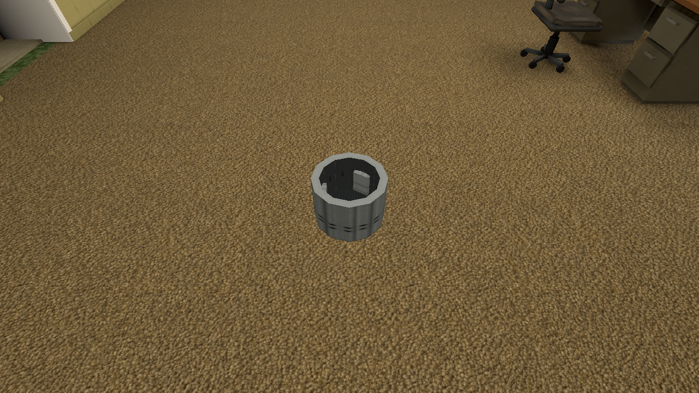 | 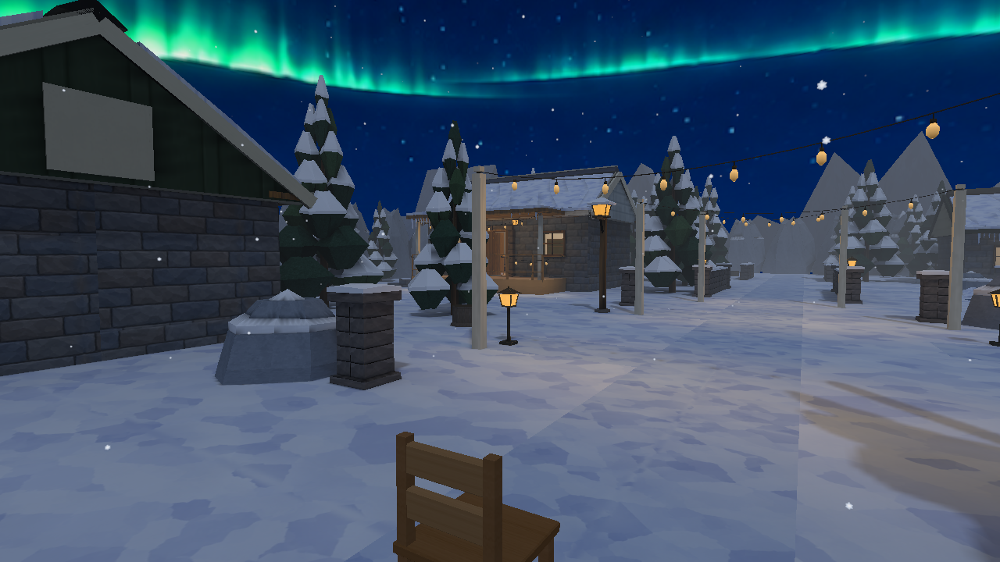 |
| 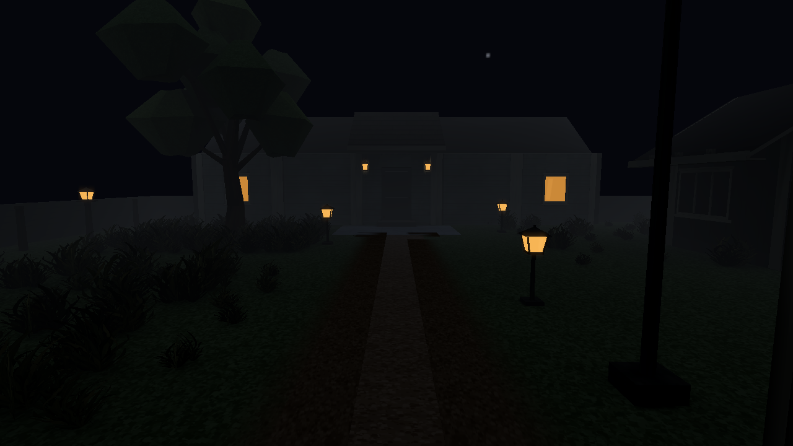 | 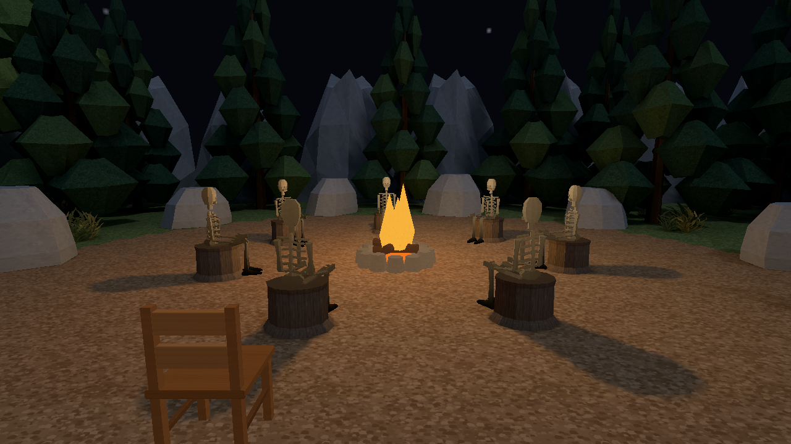 |

Scalar model materials, Zoo adoption and all shipped archives use the established
contracts. Generic roof endpoints and clipped ghost support fix real geometry
issues; bounded probe placement restores actual Demo room support. Hallows' ten
Full pages and Demo's exact typed atlas allowance preserve existing illumination.
Lossless PLMP6 sharing puts dense content below the unchanged 1 GiB aggregate
limit. Two authored Outdoor/Snowfall duplicate-face defects are fixed while
collision/navigation remain unchanged. The 28-item ledger records each resolution
and retained limitation.

The actual normal desktop gate passes 2,169 all-feature library tests, every
integration target, 286 Python tests, strict debug/release Clippy and real Metal
controls. Latest default workspace tests pass 2,163 library tests; six new
geometry-authoring tests and asset validation pass. Linux ARM64 tests and Windows
GNU linking are recorded without physical cross-platform GPU claims.

Failed campaigns remain visible. The affected 68-step native run records 56
passes, two Home whole-image failures and ten conditional steps unnecessary.
All 52 original obligations have 48 direct passes and four explicitly qualified
Home results. Its cat animates: all ten comparisons are exact outside an
independently source-derived idle footprint, and all twelve captured cat/drum
lighting payloads agree. Actual animation pose/time/VBO equality and causal
classification of every actor-region pixel remain unproved; the original whole
image assertions are not relabelled as passed.

The same-context hero pair retains 43 draws and 6,944 submitted triangles. CPU
render means rise 0.354→0.371 ms; Metal surface-scene medians rise 0.957→1.023 ms.
Capture/readback blocks about 81 ms per frame, so these are descriptive capture
costs, with one-pair uncertainty and no gameplay FPS claim. GPU allocation
observations are unchanged and exported error tables are empty. Loading
transients and a sustained memory plateau remain unmeasured.

[Implementation 4ef8c88](https://github.com/csd113/Places/commit/4ef8c8857b759b5b5f19357f437e7a9367456e59)
binds 606 committed inputs and nine explicitly local preserved inputs. The
[52-file hero bundle](../art-style/stage7/stage7-snapshot.json) and
[617-file integration bundle](../art-style/stage7/stage7-integration-snapshot.json)
retain compatible players/compiler/SDL, assets, settings, cameras and all 48
packages outside `target/`. [Isolated verification](../art-style/stage7/snapshot-verification.json)
replays room/surfaces byte for byte and loads Winter from the integration bundle.
Run `python3 debug-maps/art-style-hero/milestones/stage7-integration/run-map.py --list`
then provide an exact case key to that helper.

The final seal, exact remote SHA/CI and explicit custody release are recorded
after publication in `debug-maps/art-style-hero/evidence/stage7-completion.json`.
The user extended the queue with a nontechnical document and a separate task
for kitchen-model lighting, Demo/Home joins and close Hallows skeletons. Those
specific issues remain uninvestigated here. Needed `target/` artifacts and the
same temporary caffeinate PID 88945 transfer to the parent; cleanup and stopping
that inhibitor belong to the end of the extended queue.
