# Places visual development journal

Each entry preserves the starting scene, approved reference, reasoning,
native rendered result and validation. Entries follow the serial queue; a
later pass adds a sibling folder without replacing earlier evidence.

## 2026-10-07 — Pool

[Detailed comparison, inventory and validation](pool/README.md) ·
[Approved concept](../../assets/environment/pool/Places_%20Quiet%20Indoor%20Pool%20Asset%20Sheet.png)

| Before | After |
| --- | --- |
| 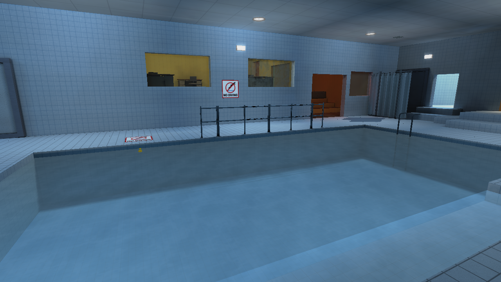 | 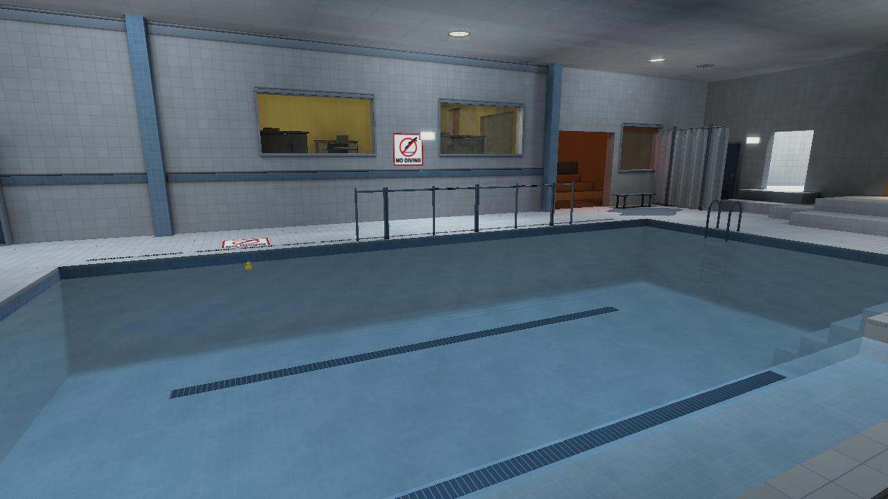 |

The original working Pool used a nearly neutral basin, a square tray table,
horizontal chair slats, two-tier rails and flat openings. The concept's blue
ceramic, pale mineral deck, round resin furniture, single waist rails and
restrained changing-bay furniture became the construction guide. This pass
remakes those weak families, adds the missing benches, grates, service leaves
and submerged treads, and separates the dry coping from the blue recess.
Existing water and entity behavior remain intact.

Commit subject: `rebuild pool assets toward concept art`. The exact pushed
commit is reported with the task handoff; `git log -- docs/style-upgrade-20261007/pool`
locates this entry in repository history.

## 2026-10-07 — Home

[Detailed comparison, coverage and validation](home/README.md) ·
[Primary concept](../../assets/environment/home/Home%20Environment%20Asset%20Sheet.png)

| Before | After |
| --- | --- |
|  |  |

The original living group used dark shared seating, a dining-height coffee
table, office-style chairs and a low flat screen. Home now has cream woven
seating, a low shelf table, timber dining construction, Shaker kitchen stock,
matching domestic appliances and a dark CRT on a cupboard console. Twenty
new static families add the reference's missing domestic fittings, with warm
local surface variants and supported ceramic backsplash. The connected
vault/loft remains; the reference's external balcony is documented as a gap.

Commit subject: `rebuild home assets toward concept art`; the task handoff
records the exact pushed SHA and CI. Outdoors and Winter follow this entry.

## 2026-10-07 — Outdoors

[Detailed comparison, coverage and validation](outdoors/README.md) ·
[Approved concept](../../assets/environment/outdoor/Quiet%20Night%20Places%20Concept%20Sheet.png)

| Before | After |
| --- | --- |
| 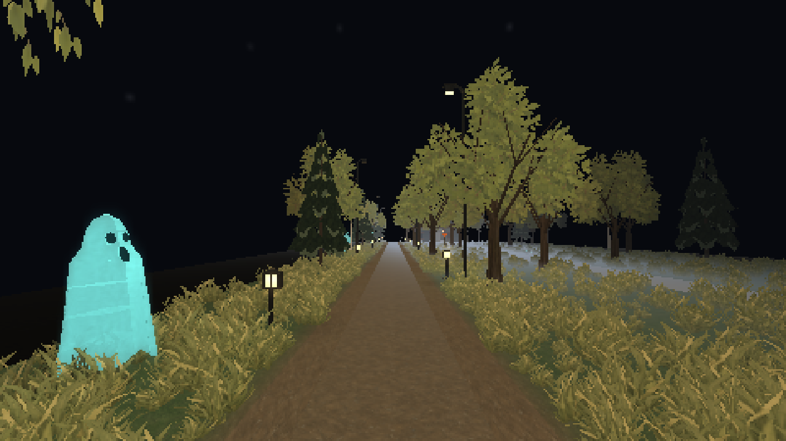 | 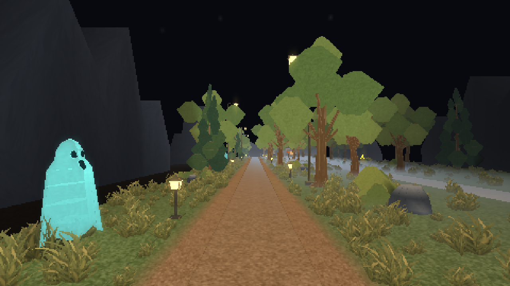 |

The original night route had wispy tree cards, a nearly continuous grass fringe,
plain glowing fixtures and pillar-like rocks. Rebuilt branching/foliage, lantern
construction and broken natural forms now accompany fitted olive ground,
aggregate paths and pale facade stock. Eight new static families supply shrubs,
capped fences, masonry piers, a porch cover, striped barrier, distant geology and
a campfire without animation or character ownership.
The comparison shown is native Low; Full lightmaps retain the inherited dark-yard
limitation. Coarse fixture self-occlusion and porch coplanarity are fixed; the existing sky,
traversal, encounters and completed Pool/Home work remain intact.

Commit subject: `rebuild outdoors assets toward concept art`; the task handoff
records the exact pushed SHA and CI. Winter follows this entry.

## 2026-10-08 — Winter

[Detailed comparison, object coverage and validation](winter/README.md) ·
[Immutable concept](../../assets/environment/winter/Winter%20Expansion%20Environment%20Concept%20Sheet.png)

| Before | After |
| --- | --- |
| 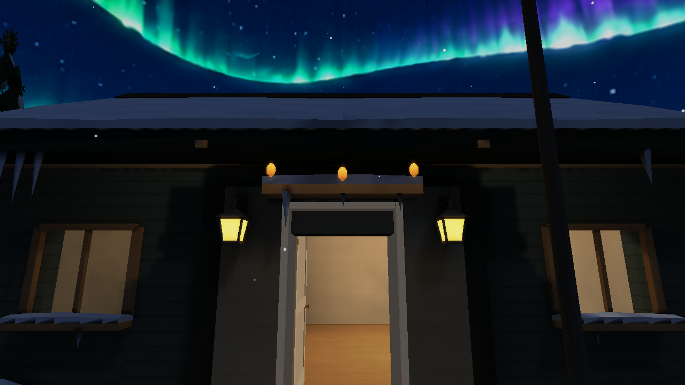 |  |

The starting settlement used plain shared siding, primitive opening trim,
fine snow artwork and snow variants of the preceding bare landscape kit.
Winter now has mineral courses, deep timber frames, braced snowy entrance
hoods, stone approaches/piers, timber lanterns and fractured ice. Connected
evergreen coats and supported rock crowns preserve the completed Outdoors
bases exactly; asymmetric banks and broad faceted PNGs strengthen the snow.
All seven missing static families are built and placed in Winter and Zoo.
Sky/aurora/weather, door controls and original traversal geometry remain.
The full distant village/church and the illustration's softer tree/roof forms
remain documented gaps; actual severe views retain the intended whiteout.

Commit subject: `rebuild winter assets toward concept art`; the handoff records
its exact pushed SHA and CI. Parent integration and the Art-style queue follow.

## 2026-10-08 — Art-style Stage 1: the hero baseline

[Audit, native cameras and reproducible launch](../art-style/README.md) ·
[Dependency plan for Stages 2–7](../art-style/gap-plan.md) ·
[Costs and limitations](../art-style/performance.md)

| Native baseline | Independent native repeat |
| --- | --- |
|  | 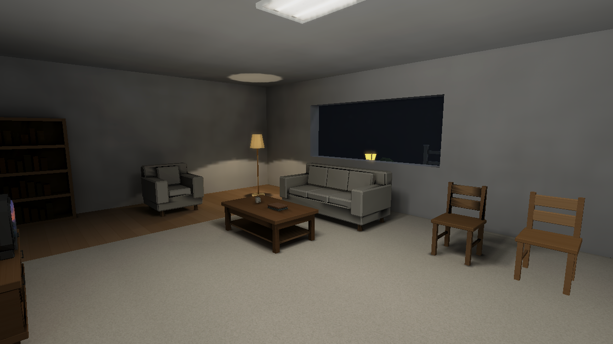 |
|  |  |

**This establishes a benchmark; it is not a visual improvement milestone.**
A compact furnished room, connected utility hall and real glazed garden view
reuse the completed art on normal engine paths. Six fixed native High cameras
expose warm/broad lighting, geometry boundaries, material response and grounding.
Three separate repeats match byte for byte. The same chair's detailed static
shading and flat, ungrounded spawned response now provide a useful entity control.

The audit preserves working openings, warm light pools, real static shadows and
the four asset passes, while separating chart/fill policy, entity probes, color
headroom, material support, reflection sky and atmosphere problems. Dark exterior
readability remains; Low is supporting evidence, not acceptance. The exact stale
local-package ledger and the initially unavailable surface measurement are stated
openly; the diagnostic extension below adds a valid submitted-frame baseline. Verified implementation and push/CI links are recorded in
[the Stage 1 handoff](../art-style/handoff.md).

## 2026-10-08 — Art-style Stage 1: seeing the pipeline

[Selectable native diagnostics and provenance](../art-style/diagnostics.md) ·
[Expanded costs](../art-style/performance.md) ·
[Exact checks and limitations](../art-style/validation.md)

| Original normal baseline | Normal build after diagnostic infrastructure |
| --- | --- |
| 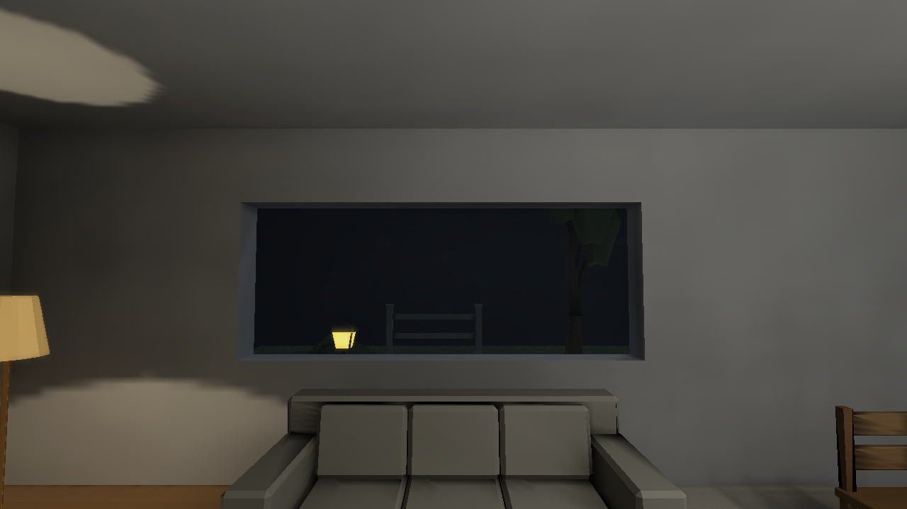 |  |

**These matched native PNGs are byte-identical; this is a diagnostic foundation,
not an achieved visual improvement.** Eleven opt-in views now expose actual PNG
albedo, normals, combined light, atlas values/addressing, roughness, geometric
depth and lighting routes without an authored edit or rebake for selection.
One instrumented hero solve exports true stages/charts/receiver/caster provenance
and produces the same package. The normal release omits the selector extension.

| Existing final | Native texture albedo | Native combined illumination |
| --- | --- | --- |
| 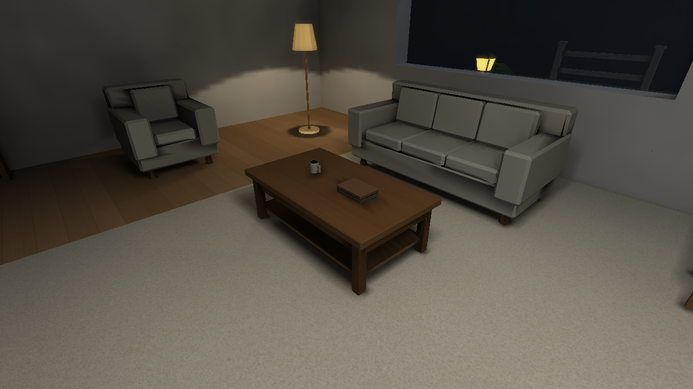 | 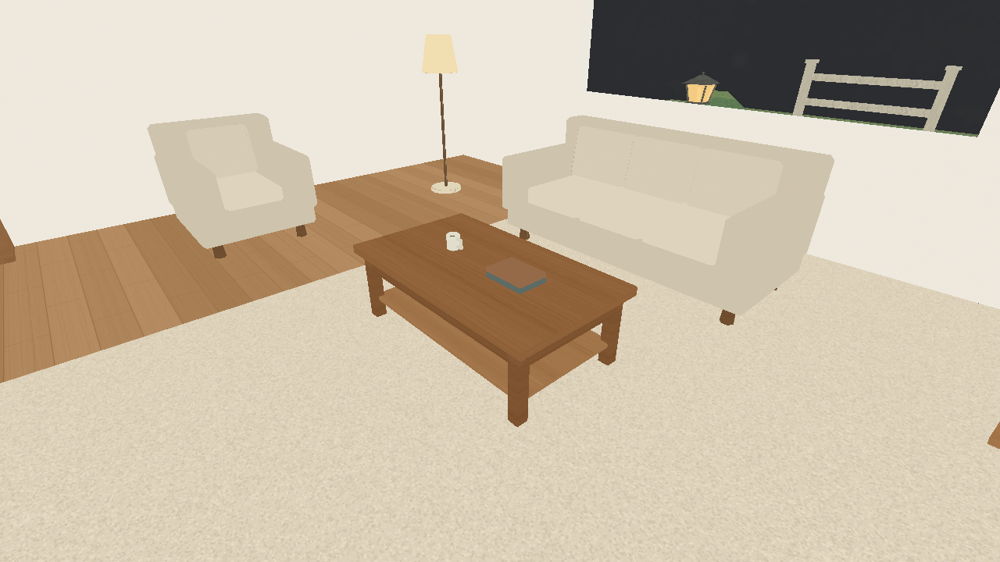 | 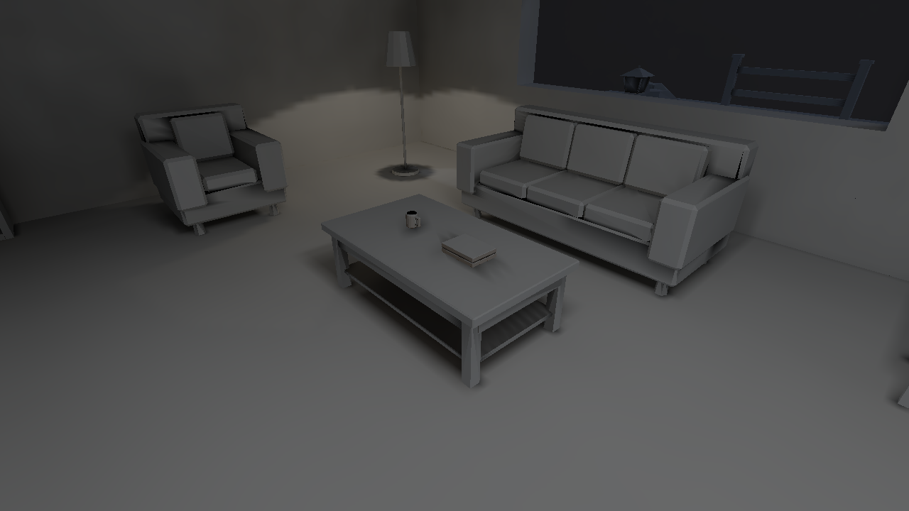 |

The sofa's diagonal tones live in stored lighting rather than its cream artwork;
the prepared entity field is present; the close resin-table region is severely
underlit. Independent High atlas/filtering controls separate causes that overall
Low changes together. Settled live Low/Medium/returned High and returned atlas/
filtering match direct launches exactly; loading transients remain qualified.
No new opening leak or full-white nonemissive model is demonstrated.

A fresh normal sample submits all measured scene frames and establishes CPU/event
loop and draw/resource costs. GPU execution time is still unmeasured. Strict
Clippy and focused tests pass; the three inherited stale-package discovery failures
remain exact Stage 7 ledger items. Verified baseline/diagnostic implementation
commits and CI links live in [the handoff receipt](../art-style/handoff.md).

[Diagnostic implementation 2050fb2](https://github.com/csd113/Places/commit/2050fb23f1c6be75b0ee1b248b1a2623b36e37f7)
is pushed; [its clean-source CI](https://github.com/csd113/Places/actions/runs/37728914254)
passed. The final source check preserves existing rectangular/line emitter
sampling and soft shadows, and distinguishes the table anchor's authored direct
coverage from unresolved indirect/sky support. This remains baseline evidence,
not a lighting improvement.

## 2026-10-08 — Art-style Stage 2: colour that survives the pipeline

[Matched native gallery and material distinctions](../art-style/stage2/README.md) ·
[Authoring/bake/shading/display contracts](../art-style/stage2/contracts.md) ·
[Measured costs and validation](../art-style/stage2/handoff.md)

| Original Stage 1 / Stage 2 before | Stage 2 after, matched native High |
| --- | --- |
|  |  |
| 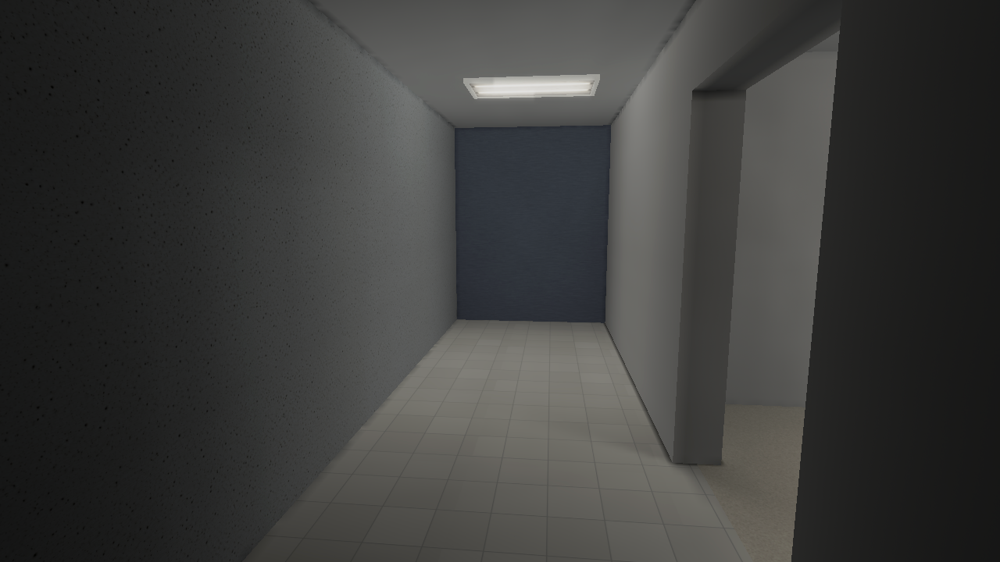 |  |

Pale walls, upholstery, oak and the tiled passage are more legible under the same
lights and exposure. The warm lamp pool and dark night window remain. Source art,
models, cameras and map topology are untouched: sRGB textures now decode once,
bake/material sums retain linear HDR, and presentation owns display conversion.
Colour mips preserve energy/coverage; normals and scalar/alpha materials follow
one convention across static and entity mesh routes. Carpet stays matte, and
plastic, ceramic, paint and cool metal retain restrained existing distinctions.

The six original before images match Stage 1 byte for byte, and independently
rebuilt Stage 2 galleries match each other. Sofa receiver seams and the ungrounded
spawned chair remain visible for their owning lighting stages. Fine plastic panel
noise, single-sample silhouettes and lower-preset upsampling are explicit limits,
not hidden by asset or exposure corrections. The HDR package and frame targets
cost more memory; shader/GPU execution time is not inferred from CPU submission.

Original and intermediate native galleries are immutable. Local runnable milestone
bundles preserve matching binaries, packages, source, camera/settings, assets and
SDL outside target; Stage 1 replay reproduces its original room. This entry joins
the existing chronological story for the eventual seven-stage comparison, without
creating a video or replacing the initial pixels. Verified implementation, remote
commit and CI links are recorded in [the Stage 2 handoff](../art-style/stage2/handoff.md).

[Stage 2 implementation b34e1dd](https://github.com/csd113/Places/commit/b34e1dd6d8dcdf43280a35c9644bcb567905e492)
is pushed and its exact remote identity is verified. Both local milestone bundles
hash-verify and replay their matched room pixels; [snapshot receipts](../art-style/stage2/stage2-snapshot.json)
pin binaries, assets and settings. CI and final ownership release are recorded
in [the publication handoff](../art-style/stage2/handoff.md).

## 2026-10-08 — Art-style Stage 3: light across construction seams

[Matched native gallery](../art-style/stage3/README.md) ·
[Separated lighting and caster evidence](../art-style/stage3/diagnostics.md) ·
[Transport contracts](../art-style/stage3/contracts.md) ·
[Costs and publication](../art-style/stage3/handoff.md)

| Stage 2 before, same native camera | Stage 3, same native camera |
| --- | --- |
| 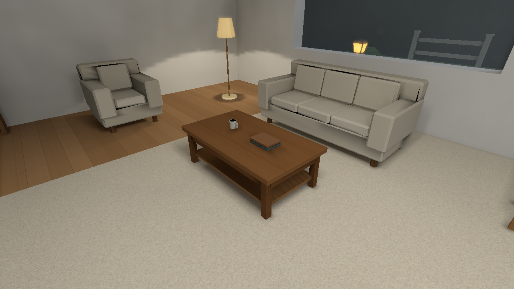 | 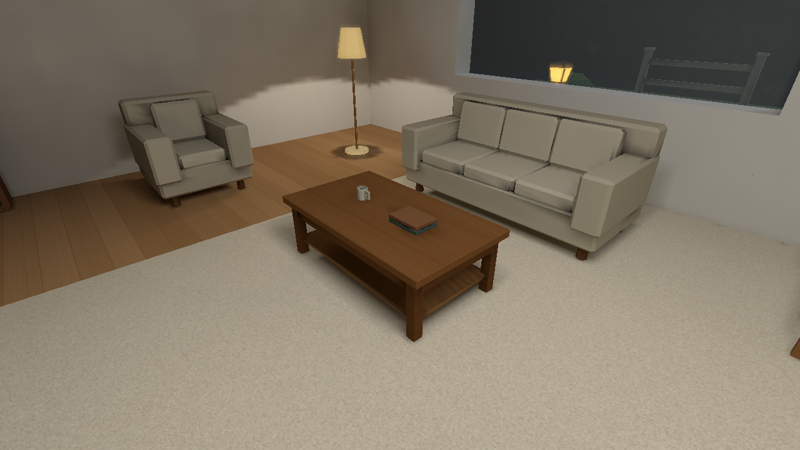 |
|  |  |
| 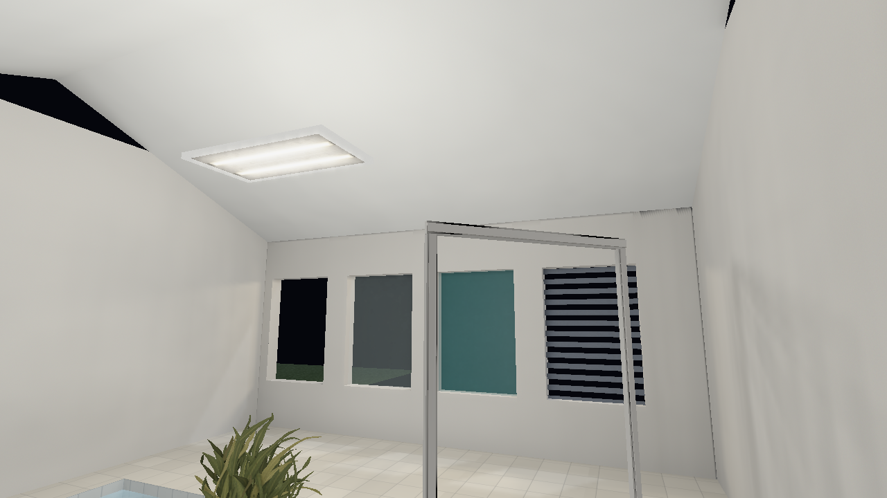 | 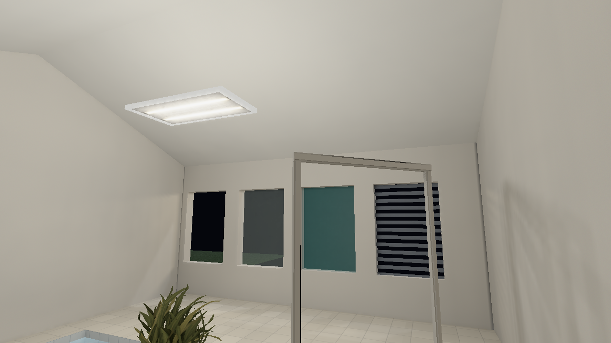 |

The sofa's diagonal chart steps disappear while its cushions, bevels, contact
shadows and warm lamp pool remain. World-space receiver support and filtering
cross compatible coplanar cuts; source taps retain their real incoming cosine.
Gable black wedges proved to be missing geometry in the albedo view. Shared
roof ownership closes them and preserves real exposed wall tops.

The compiler now supplies actual architectural PNG reflectance and numeric alpha
to the offline solve. Glass attenuates straight light, grille and leaf coverage
block only covered pixels, and the lowered basin keeps its blue depth attenuation.
Cream walls contribute warmer diffuse energy; correcting the earlier white
reflectance estimate lowers aggregate indirect brightness. This is a continuity
and distribution improvement, not a brightness lift or a new light setup.

Six original before views match sealed Stage 2 pixels. All original Stage 1,
intermediate and control captures remain immutable, with source/settings hashes
and genuine native provenance. Finite-budget bevel gather differences, the
plant's real tabletop penetration, dynamic-chair grounding and screen AA remain
explicitly assigned limits. Normal bake/storage and submitted CPU costs are
measured separately from unmeasured GPU time. Runnable snapshots and verified
implementation/CI links are recorded in the Stage 3 publication handoff.

[Stage3 implementation b9377244249fa21fa12975ae8d93297e41111ebd](https://github.com/csd113/Places/commit/b9377244249fa21fa12975ae8d93297e41111ebd) is pushed and remote-verified.
[Main/control runnable snapshot receipts](../art-style/stage3/handoff.md#publication-and-retained-runnable-artifacts)
retain41/49 verified files outside target and repeat the final room/annex pixels.
Original Stage1/2 bundles still hash-verify. The final completion receipt supplies
the exact journal seal SHA, clean-source CI result and explicit ownership/custody
release; Stage4 waits for that gate.

## 2026-10-08 — Art-style Stage 4: light that follows objects

[Matched native gallery](../art-style/stage4/README.md) ·
[Spatial/direct contracts](../art-style/stage4/contracts.md) ·
[Measured CPU/GPU costs](../art-style/stage4/performance.md) ·
[Validation and publication](../art-style/stage4/handoff.md)

| Stage 3 before, same camera | Stage 4 final |
| --- | --- |
|  |  |
| 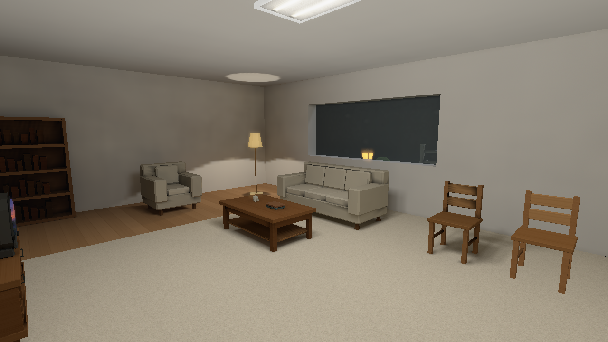 |  |
| 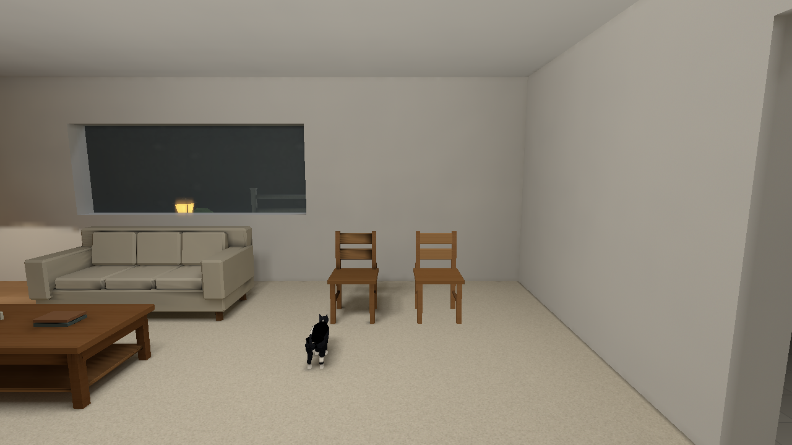 |  |

The movable chair gains spatial direct response and a restrained floor footprint
while the accepted static room stays intact. Real actor materials remain visible
under broad, dim and exterior light; authored black coat stays black. Selected
practical sources are removed from the combined probe coefficient before being
evaluated once at the actual entity fragment. Current rigid geometry and PNG alpha
occlude light without leaving a moving actor's fixed bind pose behind.

The additive door control caught a real black closed-leaf regression. Its bounds
lighting corners sat inside adjacent stops. A generic support inset clears those
stops without changing the mesh or collision; real frame crossing still blocks rays.
Opening and closing restores both the leaf and stationary chair payloads exactly.
Bidirectional aperture motion, rotation, uniform-scale controls and same-mesh
static/World/runtime comparisons retain raw native evidence in the stage gallery.

All six live preset pairs run twice in three environments, plus a final actor
repeat: 48 transitions without restarting. Independent lighting/filter/atlas
controls retain High texture storage and restore stationary pixels exactly. The
original Low→High failure was not reproduced here; the audited premature resident
state mutation is corrected. Ready-only endpoints do not claim every loading frame.

Native GPU execution is now measured with owned-PID Metal traces. The original
view costs about 0.306 ms more active GPU work. Conservative moving-caster cache
invalidation costs 7.56 ms whole-engine update for 32 receivers versus 0.70 ms
stationary; this limit is visible in the performance report. Floor bounds proxies,
clamped pose support and static indirect that remains baked when doors move are
disclosed approximations. No artwork, concept, exposure or limit is changed.

Original Stage 1/2/3 captures and runnable bundles remain immutable and hash-verified.
The [Stage 4 handoff](../art-style/stage4/handoff.md) records implementation/CI links,
new compatible runnable snapshots and explicit custody release after publication.

[Stage 4 implementation 2615b9b](https://github.com/csd113/Places/commit/2615b9bc787a116bca1d9bc9d9deb855ed87724d)
is pushed and remote-verified. Five [runnable snapshot receipts](../art-style/stage4/handoff.md#verified-implementation-and-runnable-bundles)
retain compatible binaries, packages/settings, SDL and all real dependencies.
The original six-view bundle replays final PNGs byte for byte; actor differences
are confined to normal animation. Exact final seal CI and custody transfer are
recorded in the completion receipt after the gate; Stage 5 is not started here.
