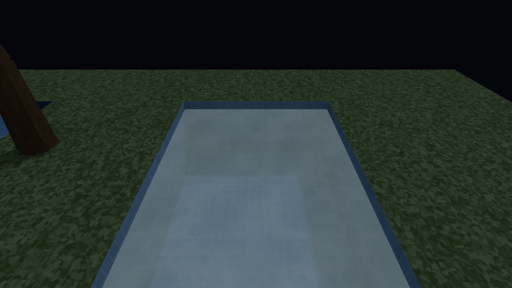
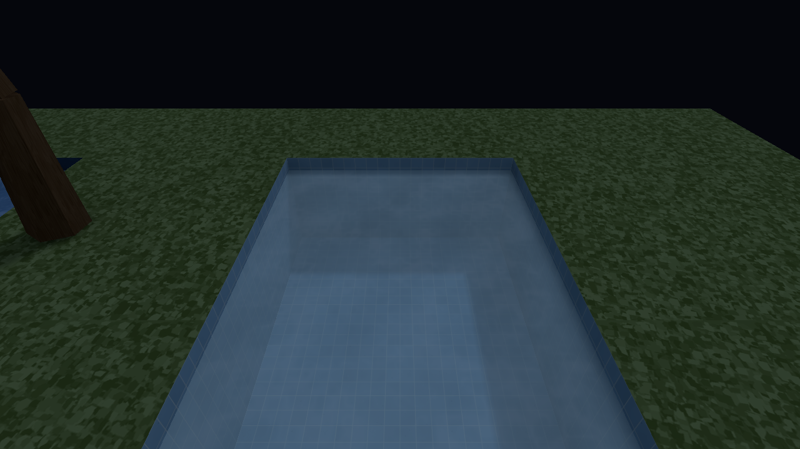
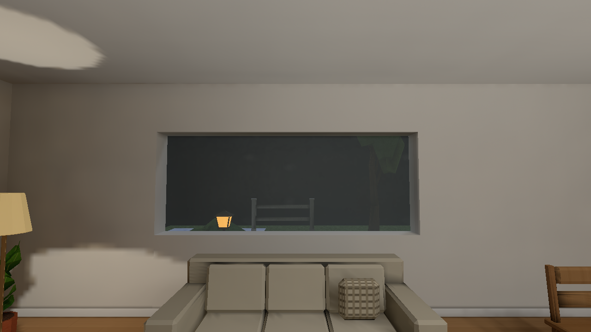
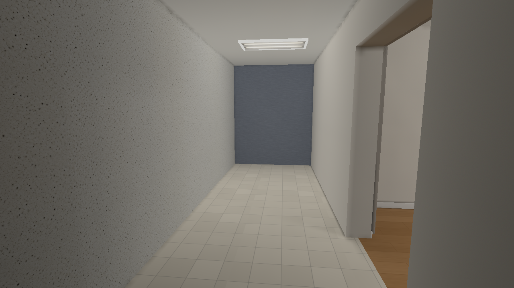
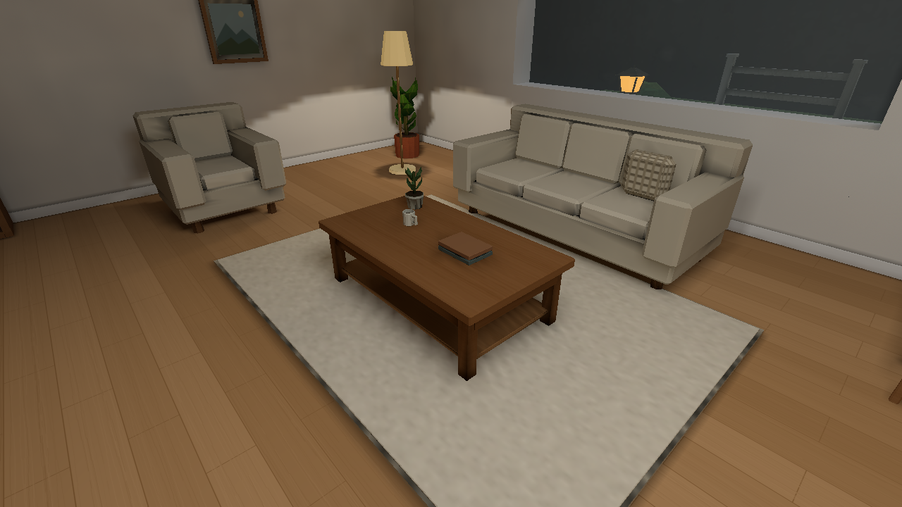
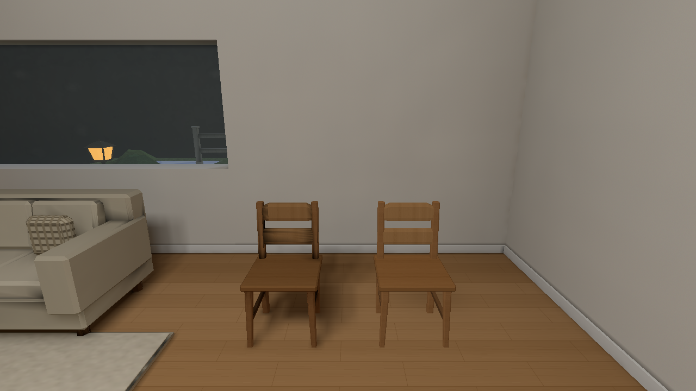
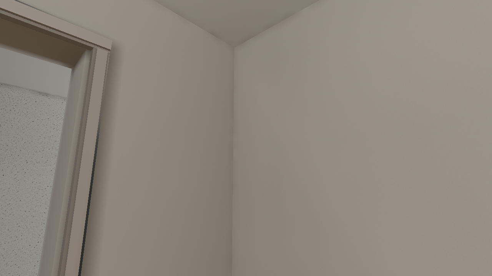
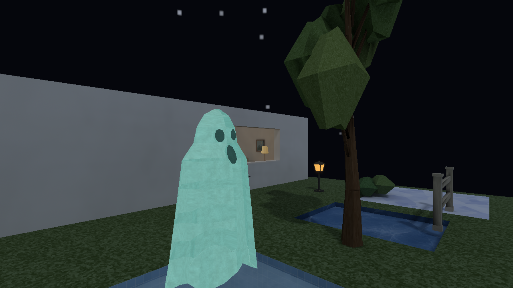
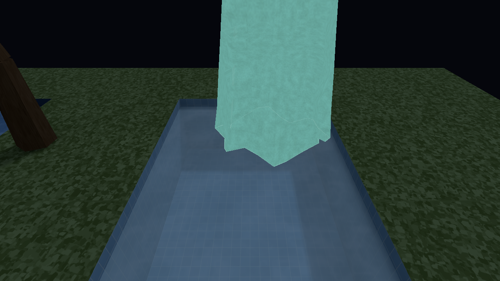
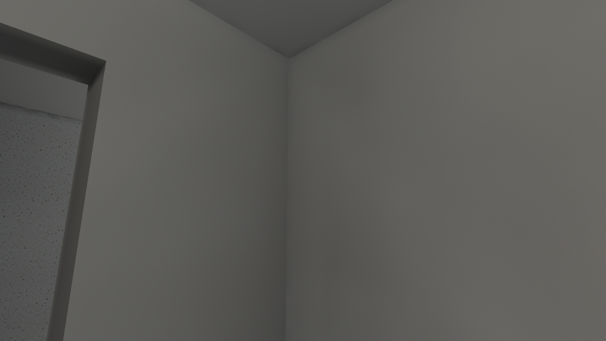

# Seven Art-style milestones

[Chronological visual journal](README.md) · [Original audit](../art-style/README.md)
· [Final integration](../art-style/stage7/README.md)

This gallery assembles the existing native captures. The Pool, Home, Outdoors
and Winter asset passes remain earlier entries in the same journal. No earlier
image, concept, camera receipt or runnable milestone is replaced. Stages 1–6
were captured on 2026-10-08 UTC. Stage 7’s accepted hero after captures are
from 2026-10-09 UTC; wider integration acceptance remains in progress. Images are native
macOS Metal framebuffer PNGs, without retouching.

The matched hero views use FOV 60°, a 640×360 logical window /1280×720 drawable,
High texture/filter quality, Full lightmaps/reflections and bloom. Source and
capture manifests preserve authored environment, exact transforms, readiness,
binary/package/catalogue hashes and precommit source context. A later published
implementation link identifies the corresponding frozen changes; it does not
rewrite a capture's original revision field.

## 1 — establish the original baseline

| Original baseline | Independent native repeat |
| --- | --- |
|  |  |

This is an audit and reproducibility milestone, with no claimed visual gain.
The subsequent diagnostic foundation preserves the original pixels. The room
exposes the sofa's diagonal chart seam, flat spawned chair and dark night view.
[Capture identity](../art-style/baseline/high/manifest.json) retains the
prequeue revision `22a78fc43822900cd866869f93c55d7796e2c812`.
[Diagnostic implementation 2050fb2](https://github.com/csd113/Places/commit/2050fb23f1c6be75b0ee1b248b1a2623b36e37f7)
and [handoff](../art-style/handoff.md) explain its normal-output preservation.
[Stage 1 runnable receipt](../art-style/stage2/stage1-snapshot.json) preserves
the original room in `debug-maps/art-style-hero/milestones/stage1`.

## 2 — retain colour and HDR through the pipeline

| Stage 1 / Stage 2 before | Stage 2 after |
| --- | --- |
|  |  |

Pale furniture, walls and wood become more legible under unchanged lights.
Colour images decode once; bake and scene sums retain linear HDR. The sofa seam
and entity grounding remain for their owning stages.
[Before](../art-style/stage2/before/high/manifest.json) /
[after](../art-style/stage2/after/sealed-high/manifest.json) retain exact identities.
[Implementation b34e1dd](https://github.com/csd113/Places/commit/b34e1dd6d8dcdf43280a35c9644bcb567905e492)
· [gallery and limits](../art-style/stage2/README.md)
· [runnable Stage 2 receipt](../art-style/stage2/stage2-snapshot.json).

## 3 — join real lighting across construction cuts

| Stage 2 before | Stage 3 after |
| --- | --- |
|  |  |
|  |  |

The diagonal sofa seam disappears while cushions, grounding and warm light remain.
PNG reflectance and numeric alpha enter transport; the additive gable control's
missing geometry is repaired generically. This does not establish new entity GI.
[Before](../art-style/stage3/before/high/manifest.json) /
[after](../art-style/stage3/after/published-high/manifest.json).
[Implementation b937724](https://github.com/csd113/Places/commit/b9377244249fa21fa12975ae8d93297e41111ebd)
· [gallery and limits](../art-style/stage3/README.md)
· [runnable Stage 3 receipt](../art-style/stage3/stage3-snapshot.json).

## 4 — connect movable objects to their surroundings

| Stage 3 before | Stage 4 after |
| --- | --- |
|  |  |
|  |  |

The spawned chair gains spatial practical-light response and a softer floor
relationship. Actual door/crossing controls and live quality loops establish
bounded behavior. Static atlases during motion and skinned bounds proxies remain
approximations. The final solver-15 zero-source repair retains spatial residual
fields without changing these accepted pixels.
[Before](../art-style/stage4/before/high/manifest.json) /
[after](../art-style/stage4/after/support-final/high/manifest.json).
[Implementation 2615b9b](https://github.com/csd113/Places/commit/2615b9bc787a116bca1d9bc9d9deb855ed87724d)
· [solver repair 7d80433](https://github.com/csd113/Places/commit/7d80433ccb77d828a8c519ffa8da935fcbcac4c4)
· [gallery and limits](../art-style/stage4/README.md)
· [final runnable receipt](../art-style/stage4/stage4-v2-snapshot.json).

## 5 — control highlights, transparent emission and water

| Stage 4 before | Stage 5 after |
| --- | --- |
|  |  |
|  |  |

Warm highlight colour survives; translucent emission has restrained coverage.
Water shares prepared incident lighting with its surroundings. Night/aurora/storm
arrangements are separate authored comparisons, not matched before/after gains.
The failed incomplete-asset controls and ghost snapshots remain rejected and
preserved; this gallery uses the explicitly corrected evidence.
[Original before](../art-style/stage5/before/original/manifest.json) /
[after](../art-style/stage5/after/original/manifest.json).
[Implementation 5a44e9d](https://github.com/csd113/Places/commit/5a44e9d3c461bd427830c5815738ba841342fc6a)
· [gallery, corrections and limits](../art-style/stage5/README.md)
· [original runnable receipt](../art-style/stage5/stage5-original-snapshot.json)
· [corrected ghost receipt](../art-style/stage5/stage5-transparency-v2-snapshot.json).

## 6 — furnish the hero and make rebuilds trustworthy

| Stage 5 control / Stage 6 before | Stage 6 after |
| --- | --- |
|  |  |
|  |  |

Oak, fitted rug, cushion, plants, art and passage casing add domestic density.
An additive bevelled chair preserves the original model. Dependency closure now
includes runtime spawn choices; exact hashes and tool provenance make rebuilds
reliable. The isolated moving receiver kernel improves 34.6%; this is not a
whole-engine GPU or FPS claim. Casing feet, silhouette detail and conservative
global receiver refresh remain limitations.
[Before](../art-style/stage6/before/refinement-control/manifest.json) /
[after](../art-style/stage6/after/refined/manifest.json).
[Implementation daa9642](https://github.com/csd113/Places/commit/daa9642fbe2e9cae91d95f667bcf50e1fefe585b)
· [gallery and limits](../art-style/stage6/README.md)
· [runnable receipt](../art-style/stage6/stage6-snapshot.json)
· [isolated replay verification](../art-style/stage6/snapshot-verification.json).

## 7 — final compatibility integration

The [accepted final hero receipt](../art-style/stage7/validation/hero-final-acceptance-v1.json)
records nine genuine native after captures on 2026-10-09 UTC. This compatibility
integration retains the earlier art and lighting work. Five views — hall, corner,
surfaces, night and water — are byte-identical to the Stage 6 result. Room, window,
contact and entities have small, bounded wood-material response differences;
the largest whole-image RGB mean absolute difference is 0.008652 on a 0–255 scale.
The source adopts existing material-family scalars; this milestone does not add
a new art-refinement pass.

| Stage 6 replay / Stage 7 before | Stage 7 final hero |
| --- | --- |
|  |  |
|  |  |
|  |  |
|  |  |
|  |  |
|  |  |
|  |  |
|  |  |
|  |  |

[Before identity](../art-style/stage7/before/high/manifest.json) /
[after identity](../art-style/stage7/after/high/manifest.json) retain the exact
nine transforms, High settings, 1280×720 drawable, ready time and raw PNG hashes.
The [before preservation receipt](../art-style/stage7/before-preservation.json)
binds the replay to Stage 6. The [current source freeze](../art-style/stage7/source-input-identities-v14.json)
binds the integration inputs. The after capture keeps its actual precommit
revision `26486b8538424f013c243ae6edea8720ac07d7f2` and dirty-diff identity;
publication will be recorded separately. Requested VSync is off, while the
actual Metal renderer receipt reports Fifo. These images establish appearance,
without a gameplay-FPS claim.

The [first supported-map native pass](../art-style/stage7/validation/native-execution-v1.md)
retains genuine six-theme and Zoo frames as well as its failed geometry,
endpoint and empty-scene controls. Its overall result remains a failure.
The separately allocated 68-step affected recheck is pending; accepted hero
pixels do not certify that wider gate. [Integration costs and limits](../art-style/stage7/performance.md)
retain their measurement scopes.

- Final implementation revision: **pending**.
- Final publication / exact-head CI: **pending**.
- Stage 7 runnable snapshot and isolated replay: **pending**.
- Affected native recheck: **pending**.

The successor reports about kitchen cupboards/sink/refrigerator, Home corridor
wall/ceiling joins in `places_demo`, and Hallows skeletons becoming full-bright
at close range remain separate and unresolved.

## Original baseline → final hero

These six pairs use the untouched original baseline and its exact original
camera/settings, followed by the accepted Stage 7 final hero. They show the
cumulative colour, transport, entity response, presentation and furnishing work
from the earlier milestones. They are not six new Stage 7 refinement gains.
The later surfaces, night and water controls did not exist in the original
six-view baseline and are shown only in the matched Stage 7 table above.

| Original baseline | Final integrated hero |
| --- | --- |
|  |  |
|  |  |
|  |  |
|  |  |
|  |  |
|  |  |

[Original source/capture identity](../art-style/baseline/high/manifest.json) /
[final source/capture identity](../art-style/stage7/after/high/manifest.json)
preserve their respective revisions and hashes. Artwork and authored source
changed across the earlier stages; matching cameras and settings do not imply
identical content. The [seven-stage evidence index](../art-style/stage7/seven-stage-evidence-index.json)
provides the accepted per-stage reports, measured gains and costs, exact
publication boundaries, runnable receipts and unresolved limits.

## Runnable history

The [independent Stage 7 entry audit](../art-style/stage7/validation/prior-preservation-entry.json)
checks all 23 accepted bundles /1,010 files against their immutable receipts,
the seven concept PNGs and eleven original baseline/repeat images. Every accepted
bundle is outside `target/`; historical incomplete candidates remain retained
without an acceptance claim. Each linked receipt supplies an exact asset root,
launch and replay command. The source commit alone is never the runnable record.
