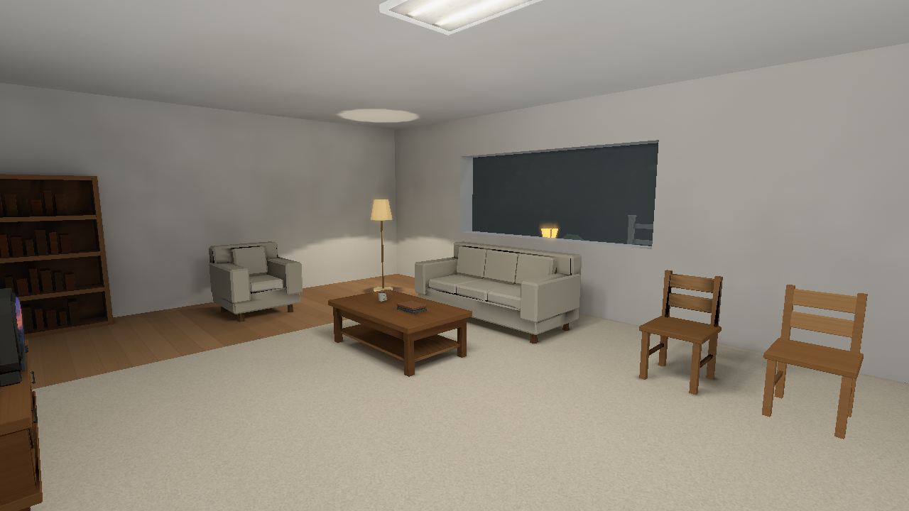
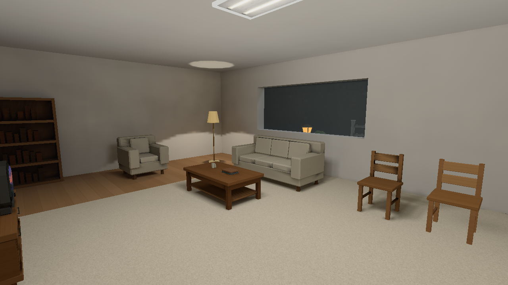
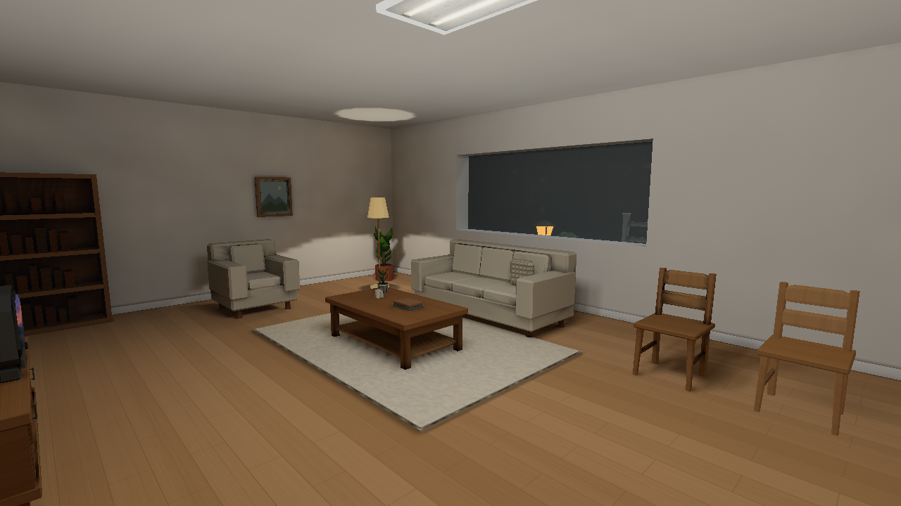

# Seven completed Art-style milestones

October 8–9, 2026. This history shows what each milestone established and preserves its practical limits. The images are genuine original native captures copied without changing their bytes. The [scene index](README.md) covers the preceding Pool/Home/Outdoors/Winter reconstruction; [current verification](../VERIFICATION.md) and the separate [model-lighting correction](../model-lighting-root-cause-and-fix.md) describe the later working implementation.

## 1 — Establish the baseline

[Stage 1](../art-style/README.md) creates a fixed room/hall/garden benchmark and native/offline diagnostics. It identifies receiver-grid seams, static/live response differences and legitimate authored darkness. It claims no lighting improvement.

## 2 — Retain colour and HDR

[Stage 2](../art-style/stage2/README.md) decodes colour once, preserves energy above 1, uses alpha-aware linear mips and consistent scalar/alpha/normal handling. The lights, exposure and artwork are held; remaining sofa seams and live contact are separate causes.

| Before | Final |
| --- | --- |
|  |  |

## 3 — Join transport across construction cuts

[Stage 3](../art-style/stage3/README.md) uses physical surface support and actual finite-segment blockers/transmission. Direct/indirect/filter/fill and chart/caster evidence separate errors from legitimate plant/rail/contact darkness. Straight neutral transmission does not implement refraction.

| Before | Final |
| --- | --- |
|  |  |

## 4 — Connect moving objects to light

[Stage 4](../art-style/stage4/README.md) separates selected direct from residual probe light, uses inset spatial anchors and actual rigid caster triangles, and retains zero-source v 3 fields. Real door visibility changes and restores. Skinned bound proxies and static atlases during motion remain approximations; ready endpoints do not measure every loading frame.

| Before | Final |
| --- | --- |
|  |  |

## 5 — Control highlights and atmosphere

[Stage 5](../art-style/stage5/README.md) preserves hue in bright output, uses covered emission for selective bloom and supports authored night/fog/sky/water controls. Night/weather arrangements are intentional variants, not matched-source brightness gains. Intersecting transparency, silhouette AA and tiny alpha mips remain bounded limitations.

| Before | Final |
| --- | --- |
|  |  |

## 6 — Furnish content and preserve currency

[Stage 6](../art-style/stage6/README.md) adds reusable domestic detail/refined chair and automatically captures runtime spawn-template dependencies. Same-size content mutations invalidate package-open identity; safe metadata changes reuse prepared work. Twenty-two edit controls agree with forced output. Historical isolated caster-kernel improvement is not whole-engine FPS.

| Before | Final |
| --- | --- |
|  |  |

## 7 — Integrate the supported inventory

[Stage 7](../art-style/stage7/README.md) completes 48 supported Off/Medium/Full package and native-load cases within 50 inventoried source paths. It repairs genuine probe coverage, roof/ghost/overlap findings and retains atlas availability and package safety. Exact PLMP v6 storage reduces dense aggregate size without removing any ordered corner or authored object.

Publication [a1e7122](https://github.com/csd113/Places/commit/a1e7122bba5df549c2e82c16371bcc57db99e976) passed [CI 37906450891](https://github.com/csd113/Places/actions/runs/37906450891). Forty-eight failed/blocked native obligations pass directly; four Home obligations use qualified animated-image acceptance. Static pixels outside the conditional idle projection and actual entity/spatial payloads agree, while untraced pose/time/VBO equality is unclaimed. Linux/Windows physical GPU execution, exact total memory/plateau and gameplay FPS remain outside the proof.

| Before | Final |
| --- | --- |
|  |  |

## Original baseline to final historical hero

The hero's materials, furnishing density and contact improve over the original audit while source identity and actual lighting limits remain assessable. Representative integration screenshots did not prove that every production receiver or close camera case was correct; the later model-lighting investigation addresses those separately.

| Before | Final |
| --- | --- |
|  |  |

[Historical cost methods](../art-style/stage7/performance.md) distinguish captures/readback from ordinary gameplay, and earlier stage cost reports retain their own measured scopes. The curated native images and technical reports carry the conclusions and their qualifications.
