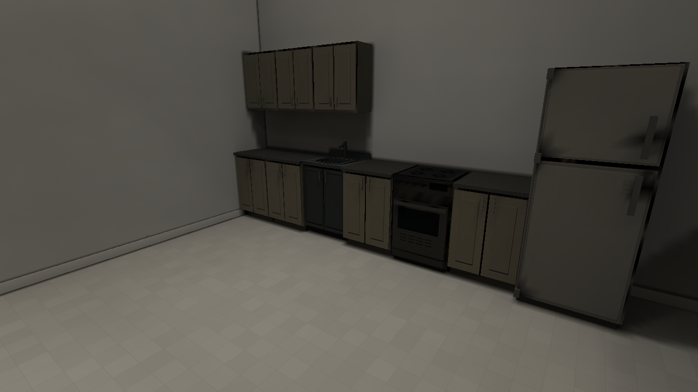
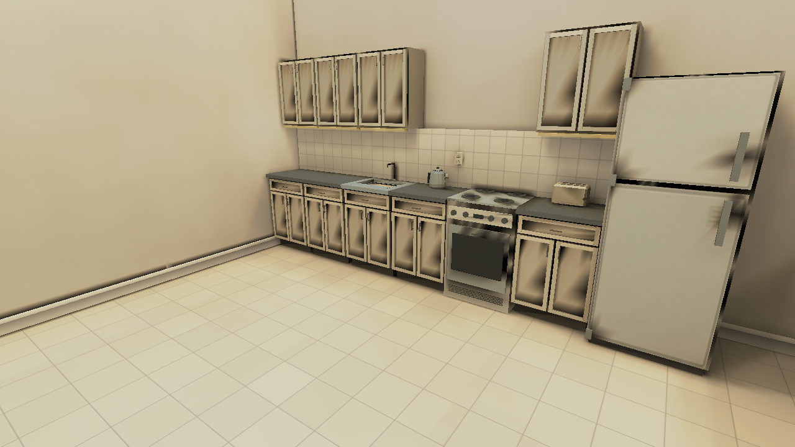

# Home — concept reconstruction, 2026-10-07

Starting commit: [`476dfb4`](https://github.com/csd113/Places/commit/476dfb4e603da2dbaaf78a1016243ca20f4e1858),
on the existing `Winter-expansion` branch, immediately after Pool. This is
the second serial entry in the [visual development journal](../README.md).
Reconstruction commit: [`0ca1c92`](https://github.com/csd113/Places/commit/0ca1c926d233f11dbad645e62148cfd1980f85ec);
the numerical validation follow-up is described below.
Both immutable Home sheets were inspected as actual pixels before authoring:
[Home Environment Asset Sheet](../../../assets/environment/home/Home%20Environment%20Asset%20Sheet.png)
and [Warm Low-Poly Home Asset Sheet](../../../assets/environment/home/Places_%20Warm%20Low-Poly%20Home%20Asset%20Sheet.png).

## Reference and the original scene

The primary sheet establishes cream wallpaper/paint, warm narrow oak boards,
darker walnut, pale textured carpet, domestic ceramic and substantial white
or timber trim. Kitchen cupboards have actual Shaker construction, bar pulls,
a laminate edge and a recessed kick. Cream upholstery, timber tables/chairs,
a dark convex CRT, plants and faceted warm globe/linen lamps form a calm,
familiar room. The warmer sheet supplies additional construction and dressing:
drawer fronts, the low cupboard/cubby television console, a coffee table with
lower shelf, a checked cushion, books, mug and sunset screen picture. The
second sheet's kitchen includes a kettle and toaster.

The original playable Home retained a much larger vaulted footprint and an
interior loft. Its furniture was dark, the living coffee table was dining
height, the television was a flat screen placed very low, and its dining
chairs used office-chair construction. Its kitchen was an unlit row without
the reference's ceramic splash, counter appliances or warm strips. Floor
planks, wallpaper motifs and carpet structure were almost invisible in play.
The reference's warm surfaces and functional construction guide this remake;
no new route or fundamental map layout is introduced.

## Coverage and decisions

| Reference object / existing family | Classification | Delivered coverage |
| --- | --- | --- |
| Off-white and patterned wallpaper | Substantial retexture | Warm paper stock; readable restrained sage sprigs at 25 cm. Existing Home wall/loop layout retained. |
| Paint / oak / ceiling / plaster | Remake for Home | Four local warm PNG/material variants. Shared originals remain byte-identical for the sauna, outdoor destination and other fixtures. |
| Walnut / cream carpet / kitchen floor tile | Remake | Staggered 15 cm boards, visible loop pile, 30 cm ceramic with fine grout/mineral flecks. Original repeat periods retained. |
| White/wood skirting, handrail timber, thresholds | Appropriate palette; depth refinement | Shared PNGs retained. Raised white shoulders add real skirting profile to the Home; existing timber rails, threshold depth and material transitions retained. |
| Room envelope, vaulted ceiling, loft, knee walls and stair structure | Existing functional architecture retained | No room/opening/floor elevation changes; material variants and extra stock deepen the domestic finish. Eight risers and rail collision/support unchanged. |
| Runtime interior leaves / frames | Appropriate real panel/depth system | Leaves, swing and interaction retained; new profiled Home casing on the living face of the hall opening. Shared door paint and frame artwork unchanged. |
| `home:cabinet_base`, `home:cabinet_wall` | Rebuild | Closed carcasses, real recessed centres and rails, drawer, standoff pulls, 40 mm counter edge, kick recess, matching added upper. New cream fitted master/native atlases. |
| `core:sink`, `core:stove` in Home | Significant rebuild using new local assets | `home:sink`: matching Shaker carcass, open folded-metal bowl, drain and raised tap. `home:stove`: cream enamel, four burner rings, inset oven lens, knobs, handle and ventilation. Core appliances remain unchanged. |
| Shared refrigerator | Retain | Existing simple enamel refrigerator is economical and appropriate; no speculative appliance redesign. |
| `core:couch`, `core:armchair` in Home | Rebuild using new local assets | Cream woven `home:sofa` / `home:armchair`, separate cushions, squared arms and timber feet. Shared core furniture unchanged. |
| Living `core:table` | Rebuild | Low 0.46 m `home:coffee_table`, thick slab, jointed aprons, four legs and real lower shelf; aligned with sofa. |
| Dining `core:table`, `core:chair` | Rebuild | `home:dining_table` and `home:dining_chair`, timber stock/aprons/stretchers and broad back slats. Existing dining footprint/place settings retained. |
| Flat screen at living-room wall | Replace / add missing console | Rebuilt dark `home:crt_tv` on new `home:tv_console`; cupboard doors, feet, receiver and book cubby. Convex screen and controls retained/refined. |
| Bare bookcases | Rebuild using local asset | Populated `home:bookshelf`, thick side/shelf stock, thin back and individually readable book spines. |
| Patterned shared rug | Replace using local asset | Plain bound `home:rug` with cream loop pile, larger beneath the living group; shared rug unchanged. |
| Floor lamps / pendant | Significant model/lighting refinement | `home:floor_lamp` has linen shade, stem, disc foot and owned warm light. Existing ball becomes a closed 380 mm opal globe with dark cord/rose; another globe dresses the living group. Eight former fill positions use the same globe at half scale, retaining illumination with economical CPU placeholders. Shared flush-fixture PNG unchanged. |
| Switches, plate, bowl, cutlery and table plant | Appropriate existing models | Seven Home families retained, including the exact switch nodes/clip and bindings. Actual tableware stays on the 0.75 m dining plane; plants added to tables/console. |
| Mug / stacked books / checked cushions | Missing | New `home:mug`, `home:book_stack`, `home:cushion`, built and placed on the coffee group. Mug has a real handle aperture and coffee surface. |
| Counter kettle / toaster | Missing | New `home:kettle` / `home:toaster`, built and placed on the working counter. |
| Ceramic backsplash / warm under-cabinet strips | Missing | New periodic `home:backsplash_01`, real tile build-up, four `home:cabinet_strip` housings/diffusers with map-owned line lights. |
| Domestic outlets / small framed landscapes | Missing | New `home:outlet` / `home:landscape_frame`, built and placed beside the worktops and living group; real plate/frame/mount depth. |
| Existing hanging painting | Retain | Original photograph, frame, label and interaction untouched. New landscapes supplement it rather than replace it. |
| Bed in current loft | Not depicted in either reference | Existing low-poly bed retained, with no invented bedroom redesign. |
| Outdoor balcony, inset sliding glazing and distant city view | Genuine remaining omission | Current end room is an interior loft. Reproducing the external balcony would change its connected architecture; no painted fake window or speculative new route was added. City art is used only on the CRT. |
| Wall sconces / additional domestic clutter | Partial / deliberately limited | Existing warm fixtures and two real floor lamps provide the mood. No separate sconce family, loose cables, invented decorations or additional appliances were added. |

Twenty new Home static model families are built and placed in the playable
demo. Four existing Home families are rebuilt; seven are retained after
inspection. The Home fixture uses the domestic replacements, and all new
families appear in the Zoo's previously unused south apron. Every pre-existing
non-Home Zoo prop, route, wall, room and light remains unchanged.

## Authoring and texture contracts

`tools/textures/author_home.py` deliberately authors the production PNGs
offline. Normal texture builds load the committed finishes through
`home_art.py`; no painter runs at game startup or level load. The 24 rebuilt
or new model atlases keep 1024² masters and fitted 256² Lanczos derivatives.
GLBs embed only the derivative; High/Medium keep it and Low uses 128².
Surface sources remain 1024², opaque and periodic. Oak retains 20 cm boards
over 1.6 m; walnut 15 cm over 1.2 m; floor tiles become 30 cm and backsplash
tiles 15 cm over 1.2 m. No mandatory aspect, alpha, UV or orientation contract
was discarded. [Asset specification §8.9](../../ASSET_SPECIFICATION.md#89-home-concept-furniture-and-static-domestic-fittings)
records the new fitted layouts and local finishes.

`tools/props/parts/home_remade.py` owns the closed domestic construction.
`home.py` now loads the globe PNG and registers the retained switch/CRT
builders; unused old cabinet and television builders were removed.
`tools/levels/refine_home.py` applies idempotent tagged Home dressing.
The catalog change contains only Home additions/refinements.

Lantern Hollow also uses the Home base cabinet. Native discovery exposed a
stale dependency that would hide its bundled level after this rebuild; its
compiled package is refreshed solely for that direct Home blocker. Its
source, Hallows assets and entities remain unchanged, and the old package is
preserved in the before archive. Movement Test's source is likewise unchanged.

The CRT picture was produced with the installed imagegen skill's built-in
tool, then saved as the real [city PNG](../../../assets/environment/home/props/art/city_dusk_01.png).
Its prompt asked for a flat, faceted, quiet residential city at dusk: peach
horizon, muted violet sky, charcoal apartment silhouettes, warm windows and
treetops; readable at 128 pixels, with no frame, text, logo or photorealism.
The immutable concept images and every gameplay screenshot were unaltered.

## Matched native comparison

These are actual SDL/wgpu Metal captures, without compositing, recolouring or
synthetic after views. Each pair has identical camera and renderer settings;
click for the native 1280×720 image.

| View | Before | After | Result |
| --- | --- | --- | --- |
| Living group |  |  | Cream seating, low shelf table, domestic console/CRT and restrained dressing. |
| Kitchen |  |  | Real Shaker build, matching sink/cooker, warm ceramic and counter fittings. |

The comparison uses `PLACES_SPAWN=x,z,yaw`, absolute yaw/pitch and the same renderer identity. Floor/support resolution sets eye height consistently. High quality,
full lightmaps/reflections, High filtering, bloom on, 60° FOV, 640×360 logical
window / 1280×720 drawable, vsync off; 15 warmup frames, capture/exit at frame
60, 45 CSV samples. The same Apple M 2 Pro Metal renderer is used for both.

The first complete native candidate exposed a black thin-box backsplash and
extra casing, plus a coffee table/rug axis mismatch. The splash became an
ordinary supported tile wall chart and the casing became a profiled GLB;
unsupported thin-box dressing was removed. The table/rug now follow the sofa
and the CRT received restrained textured emission. A further close native
view exposed overlap with the original door frame; the new casing was moved
proud of that stock and rebaked. Model review also fixed
oversized handles, a rotated book UV, coplanar floor-contact casing faces and
coincident construction edges. The new 600 mm sink moved 25 mm onto the
counter line, preserving its standable deck. Four extra skirting shoulders
that continued beyond Home were removed. Lighting diagnostics then found
that the enlarged ceiling fill and pendant saturated the lamp samples.
An attempt to retain only two flush fixtures passed the CPU/lighting checks
but native review showed excessively dark cream furniture; that candidate was rejected. The original eight fill positions now use
half-scale committed Home globes with owned warm lights. Each needs only
24 CPU placeholder vertices instead of 105 flush-fixture vertices, restoring
the domestic fill within the unchanged limit: 99,974 vertices below 100,000.
The prop emitters use 12 m reach for the tall vault: they measure full 3D
distance, whereas the old ceiling family used horizontal reach. The kitchen
pendant keeps its identity/transform and warm point light, tuned to .55
intensity with its existing 5 m reach to avoid CPU channel clipping. Two repeated
outlets and a repeated small frame were omitted without removing any new
object family. The source-ownership checks sample 25 cm above the dining plane, clear of its
new planter and coarse tabletop occlusion. The full authored scene separately
retains the original below/above contrast and gains more than .02 red near the
orb when only the pendant is enabled. High also retains a measured source
contribution. The sink regression names the new Home sink. No threshold was weakened and no renderer-wide workaround was introduced.

The final placement audit corrected yawed local collision stock dimensions
for the sofa, coffee table, console, shelves and CRT, then moved outlet/frame
mounts to within 1 mm of their actual wall faces. Final screenshots use that
rebaked source.

### Pendant contribution with the full authored scene

These additional native High/full views keep all other Home lights active.
The private off package differs only at `kitchen_pendant.lights[0].enabled`;
geometry, emissive faces, camera and settings remain identical. The table
receives a small warm lift: mean RGB increases by 1.52/1.70/1.88 values out of
255 in the recorded table rectangle. This is a subtle contribution within
bright room fill. The comparison holds geometry, emissive faces, camera and settings fixed. The full-scene CPU regression
and supplemental source-isolation checks preserve the protected .02 contrast
thresholds; no renderer or limit was changed to obtain a pass.

The clean all-features CI later exposed a numerical false positive in its
independent wall-intersection reference. At the knee-wall/north-wall junction,
a ray ending just outside the north face rounded into a hit in f32; a
10-micrometre outward move restored exact agreement. The reference now solves
its unshrunk slab intersection in f64. A regression retains the exterior
endpoint as clear and a ray entering the same wall as blocked. Production
lighting, authored assets and the .02 acceptance threshold remain unchanged.
The failed CI result remains a historical failure; this correction changes only the independent reference.

## Remaining visual limits and cost

The room is still larger and taller than the reference's domestic interior;
the connected vault and loft cannot reproduce the exact camera composition
or outdoor balcony. Cream upholstery and the existing plant forms follow the
primary sheet; the warmer sheet's olive sofa and denser foliage are variants
not reproduced simultaneously. Prepared lighting produces some stronger
low-poly shadow gradients than the concept's beauty lighting. Fine fabrics,
timber grain and drawer recesses are deliberately restrained at native prop
resolution. The CRT image is a static picture, with no new television entity.

Model, geometry and scope inspection underlies the measured asset and residency results below.
The short fixed-camera samples are a proportional cost check, not a controlled
FPS benchmark. The living view adds 21,304 total / 7,697 visible vertices,
nine draw calls, 1.30 MiB VBO and 3.70 MiB model-texture residency; measured
world-texture residency is unchanged. CPU fallback uses 99,974 vertices with
26 vertices of headroom under its preserved 100,000 limit. Neither a
performance improvement nor exact concept parity is claimed.

## Historical validation and compatibility

The October 7 catalog contains 332 assets, 189 placeables and five themes with zero warnings. Thirty-one Home model families total 9,200 triangles; the largest has 704 and no invalid topology. Twenty-four 1024² masters have exact 256² derivatives and ten periodic surfaces pass seam checks. Twelve matched High views and the pendant on/off control have zero missing textures/models. The normal release build takes 95.99 s and three-profile Demo preparation takes 236.16 s without compiler warnings.

Formatting and strict Clippy pass. The first workspace run reports 2,016 library passes, 23 ignored and five failures. Focused fixes cover the new sink selector, 600 mm sink/counter alignment, lamp clipping, unchanged CPU geometry limit and bundled-level discovery after refreshing the newly dependent Hollow cabinet. Those five checks plus five Home Showcase checks pass. A full local workspace rerun was not performed at this asset checkpoint; the focused result must not be described as a complete pass.

The first [Home CI run](https://github.com/csd113/Places/actions/runs/37693916111) failed formatting. The [corrected run](https://github.com/csd113/Places/actions/runs/37694798789) passes formatting, debug/release builds and strict Clippy, with 2,020 library passes, 23 ignored and the independent wall-reference failure described above. Its subsequent focused repair passes; this report does not claim an unobserved final Home CI. [Stage 7](../../art-style/stage7/README.md) records the later complete inventory/test gate and qualified animated Home acceptance.

Two non-Home placement warnings remain inherited at this checkpoint: Office trim at `[1.215,0.09,0.162]` and the Outdoors porch at `[13.5,0.24,-90.95]`. The dated after kitchen image still shows diagonal smearing on cupboard and refrigerator panels, alongside darker/coarser narrow recesses than the concept sheet. The later [production model-lighting correction](../../model-lighting-root-cause-and-fix.md) investigates that distinct rendering issue; this asset reconstruction does not claim to have solved it.
