# Outdoors — concept reconstruction, 2026-10-07

Starting commit: [`7ecacdf`](https://github.com/csd113/Places/commit/7ecacdfbe9f9c11df2c00932248a73634e78904e), on the existing `Winter-expansion` branch after the completed Pool and Home passes. This is entry three in the [serial visual development journal](../README.md). [Reconstruction commit history](https://github.com/csd113/Places/commits/Winter-expansion/docs/style-upgrade-20261007/outdoors) locates the standalone `rebuild outdoors assets toward concept art` commit; the task handoff records its exact pushed SHA and CI run.

The authoritative [Quiet Night Places Concept Sheet](../../../assets/environment/outdoor/Quiet%20Night%20Places%20Concept%20Sheet.png) was inspected as actual pixels before editing. Its SHA-256 remains `479ecb9a971b2f585c0e2208274ca00fa4cebda5aca5d696e90173fad291cbd8`.

## Reference and baseline

The sheet pairs an olive lawn with warm compacted gravel, clearly separated aggregate chips and feathered edges. Concrete forms pale square slabs and curb stock. The pale house has clapboard, cream square posts, real baluster rails, a pitched porch cover, charcoal shingles and warm windows. Lanterns have four tapered panes, projecting pyramidal hoods and finials on garden, fence, wall and swan-neck mounts. Stone piers support the fence fixtures. Broad and tall deciduous trees have substantial branching and grouped uneven leafy masses; the pine has a ragged narrow outline. Shrubs, grass, boulders, broken rock faces, campfire/stump seats and a striped road gate appear in the object vignettes. Forest and faceted geology layer behind the street beneath deep blue stars. No pond, bridge or bench is visibly established by this sheet.

The original demo is a long established night route between two facades, with a parallel concrete walkway and encounters. It is substantially darker than the illustration: sky ambient is zero and lighting comes from real bounded fixtures. Its deciduous leaves were thin card meshes, rocks were pillar-like, lamps were simple glowing shapes, siding was muddy and the grass fringe nearly continuous. We retain this working traversal and its encounters. Rebuilt landscape silhouettes, fitted materials and deliberate foreground/midground/destination groups bring its static asset language closer to the reference.

## Concept-object coverage

| Visible object / family | Decision and playable coverage |
| --- | --- |
| Olive lawn / broad grass pattern | Refined `grass_ground_01`: broad low-contrast islands and restrained clumps, 2 m repeat. Existing ground plane and containment remain. |
| Brown gravel path / pale concrete slabs | Refined real PNGs: 2–6 cm chips over the 1.6 m dirt repeat; concrete joints establish 1 m squares over 2 m. Existing path, crossing and walkway remain. |
| Feathered dirt verge / bend / end | Refined three alpha PNGs; original dimensions, orientation and roles retained. |
| Broad deciduous / narrow deciduous / pine | Rebuilt all three: tapered closed limbs, deliberate asymmetry, grouped opaque faceted foliage. Narrow tree envelope reduced to 2 m while its trunk collision remains unchanged. Existing tree-scale rhythm retained. |
| Bushes / low ground cover | Missing shrub stock built: `bush_round`, `bush_low`. Forty-two placements in fourteen curated three-shrub groups, using different scales and rotations beside traversal. |
| Grass tufts | Appropriate MASK blade stock retained; scattered density reduced from 2,850 to 1,285. Denser boundary/foreground areas alternate with clear gravel and quieter lawn. |
| Faceted boulder / broken rock faces | Three models rebuilt with unequal shoulders and tapered crowns. Fourteen boulders dress shrub islands. Existing downstream rock-face placements retain their footprints. |
| Layered distant geology / landscape boundary | Missing `boundary_ridge` built and placed five times beyond existing invisible containment. Closed faceted silhouettes, no added collision or fake sky image. |
| Garden / fence / wall / tall swan-neck lantern | All four rebuilt: cast feet/collars, corner stock, tapered panes, pyramidal hoods and finials. Published bounds and emitter anchors retained. Coarse self-occlusion disabled on route fixtures; Full lightmaps still exhibit the inherited dark-yard limitation. |
| Masonry lamp pier | Missing `masonry_pier` built and placed four times with fence lanterns; five stone courses, real joints, projecting foot/cap. Four lamps own the documented warm point lights. |
| Pale capped two-rail fence | Missing `fence_two_rail` built and placed eleven times in three intentional runs; actual timber rails, capped newels and feet. Existing alternative fence post/road gate remain compatible. |
| Pale clapboard house, charcoal roof, warm four-pane windows | Sound panel construction retained; three original facade panels and all nine Family 02 pieces refined. Fitted cream/grey siding, warm glazing, charcoal-blue shingles and pale stock; opaque framing and separate emissive panes. Other house families retained. |
| Covered porch / square columns / baluster rails / concrete steps | Missing `porch_canopy` built and placed at the destination; existing columns/rail/step construction retained and two rail modules added. Rail bases sit on the real local floor; deck top sunk 25 mm beneath it to remove coplanar dressing. |
| Campfire / stump seats | Recognizable cut-ring stump stock retained; a new `campfire_static` version builds the existing rock-ring/log/flame geometry with no animation clips or character ownership. Three stump seats and one real static fire form a quiet off-route pocket with local warm illumination; no new actions or entities. Original animated campfire remains unchanged. |
| Striped road barrier | Missing concept-style `road_barrier` built and placed in a side pocket. Stripes are restricted to the actual rail face, with pale legs, stable feet and hinge straps. Its proportions fit this small garden pocket; the reference's central sign plate remains an explicit detail gap. |
| Road / dashed markings / sidewalk / curb | Existing low-poly Showcase construction and PNGs retained; already placed in the playable Lantern Hollow scene. The established demo remains a garden path rather than a newly invented road network. |
| Signs / utility hardware | The road gate visibly carries a small `ROAD CLOSED` plate. That plate/text is omitted from the side-pocket barrier in this pass: it does not mark a closed traversable road, and the demo retains its established route. This is a remaining object detail, not a claim that the reference lacks signs. No additional utility fixture is clearly established. |
| Pond edge / bridge / benches | Not visible in the authoritative sheet; no speculative family introduced. |
| Complete neighbourhood / blue diffuse night | Remaining composition/lighting gap: the existing demo has two facades rather than the reference street. The zero-ambient sky and engine transport are unchanged. No global atmosphere rewrite or new neighbourhood layout. |
| Entities shown in captures | Excluded from this reconstruction; existing ghosts, characters, routes, triggers and behavior preserved. |

The [complete model inventory](model-inventory.json) records every one of the 89 Outdoors GLBs, its classification, before/after triangles, topology, actual demo placement count and downstream users: **8 new, 10 rebuilt, 12 refined, 59 retained**. The [complete texture inventory](texture-inventory.json) classifies all 89 non-reference Outdoors PNGs, including masters, runtime derivatives and retained sources. New families also appear on the Zoo's unused apron; prior non-Outdoors exhibits and architecture are unchanged.

## Asset and technical decisions

Artwork is authored explicitly offline by `tools/textures/author_outdoors.py`. Normal texture and model builds load committed PNGs; game startup and level loading never paint textures. New/refined prop atlases retain 1024² masters and 256² Lanczos derivatives. Ground masters are 1024² with 512² periodic runtime sheets. The path feather master/native pairs preserve 2:1 edges, square ends/corners and blended alpha. Family 02 keeps its exact seven fitted regions and both 128²/256² derivatives. [Asset specification §8.10](../../ASSET_SPECIFICATION.md#810-outdoors-concept-reconstruction) and [map guide §34](../../MAP_AUTHORING_GUIDE.md#34-the-outdoor-kit) describe the contracts.

Opaque foliage eliminates layered leaf-card overdraw on the three rebuilt trees. The broad tree uses 768 triangles, slender tree 720 and evergreen 708; all remain below the existing 800-triangle review threshold. Closed branch roots and the concave ridge were repaired through actual topology checks, without changing limits or suppressing assertions. New shrubs use 144 triangles each; fence 96, pier 144, canopy 76, barrier 84, ridge 68. Tree colliders stay trunk-sized. Decorative ridges and shrubs avoid coarse bake occlusion; natural rocks retain meaningful collision where placed.

Native iteration exposed two real construction problems. Registering the opaque Family 02 stock slot before its faces confines window emission to glass. The closed lantern head surrounds its light anchor, so route lamps now opt out of coarse self-occlusion without changing collision, the existing light intensities/ranges, sky or engine. Four new pier lights and the campfire use local owned lights. The gravel painter now wraps aggregate chips across tile edges; every final ground sheet passes raw and smoothed seam checks. The porch deck no longer shares a plane with the walkable region, and added rails use the floor-relative placement contract.

The boulder now uses grounded homothetic rings with deliberate planar shoulders rather than warped lower quads. Its grazing faces exposed a test-reference mismatch: direct native uploads and packages both use RGBA16F, while the Outdoors rock round-trip test sampled the original FP32 solve. That test now independently rounds coefficients to binary16 before sampling, retains its original illumination tolerance and exact geometry/chart assertions, and additionally checks every texel and encoded upload plane exactly. No production renderer, lighting solver or serializer changes. The original animated campfire remains unchanged; the new static version avoids adding a seventeenth character to the existing sixteen-owner scene.

## Native matched views

The before copy was made from the clean starting revision before content changes. The final after copy uses the final source/assets and compiled packages. Captures are actual native wgpu Metal frames, unmodified PNGs, at matched positions and angles. `tools/bench/capture_outdoors.py` records renderer, quality, camera, settings, package/binary identity and image hashes in the [capture provenance](provenance.json). High uses full lightmaps/reflections, bloom, 60° FOV, vsync off, a 640×360 logical window and 1280×720 drawable capture; warm-up is 15 frames and capture is frame 60. Existing moving entities can differ slightly with startup timing.

| View | Before | After |
| --- | --- | --- |
| Path | 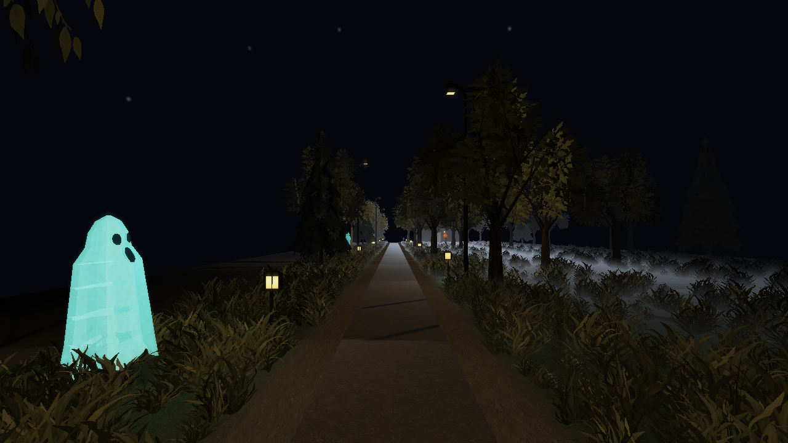 |  |
| Grove / silhouette | 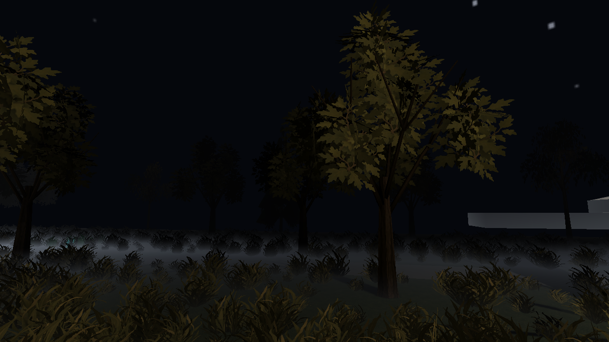 | 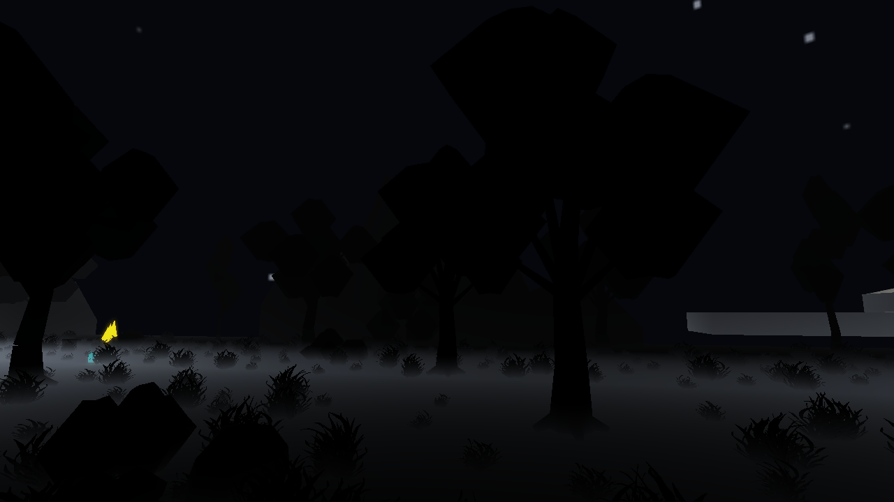 |
| Ground / texture scale | 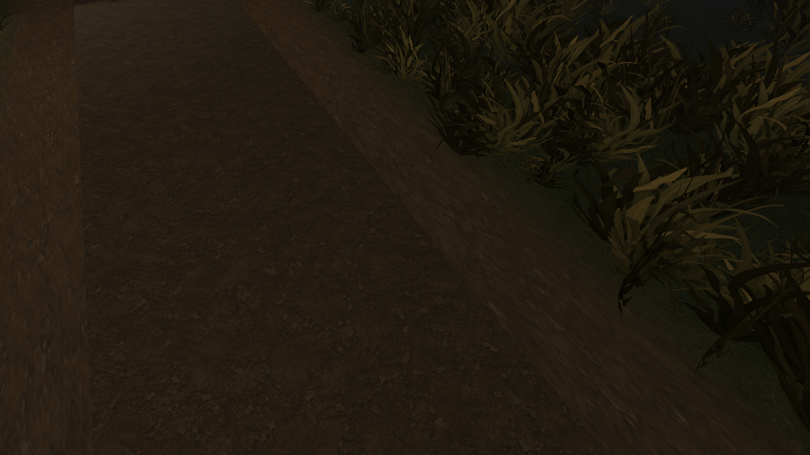 |  |
| Destination | 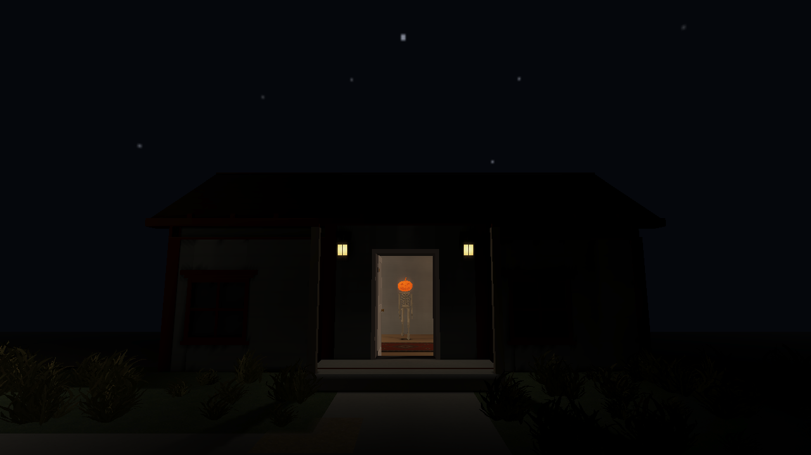 | 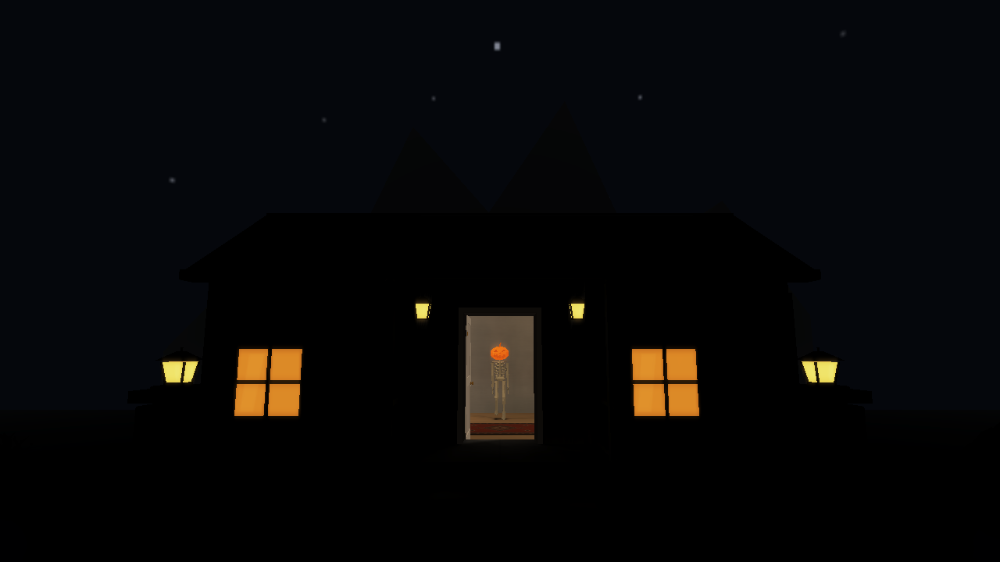 |
| Porch / fixture construction | 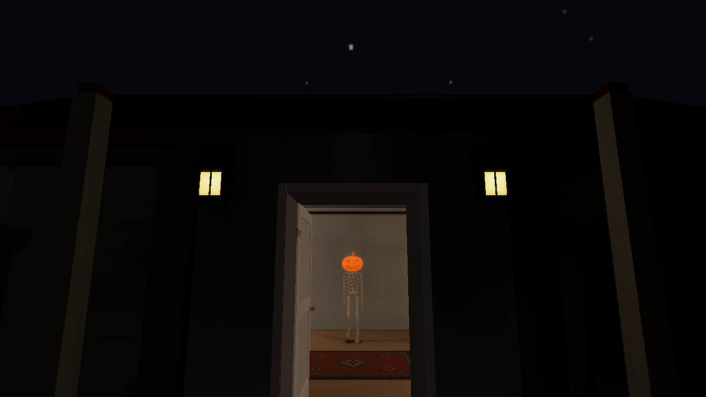 | 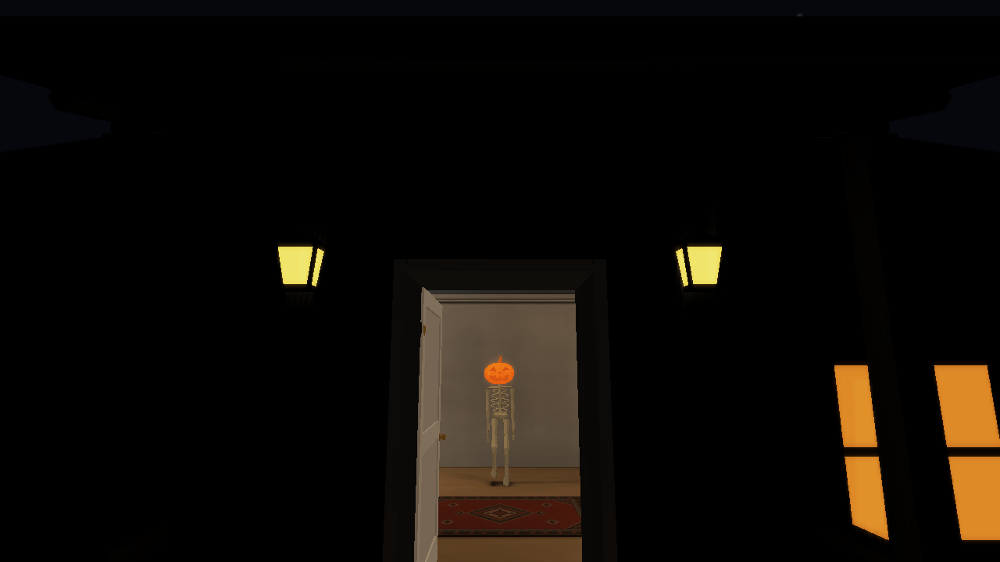 |
| Off-route layers | 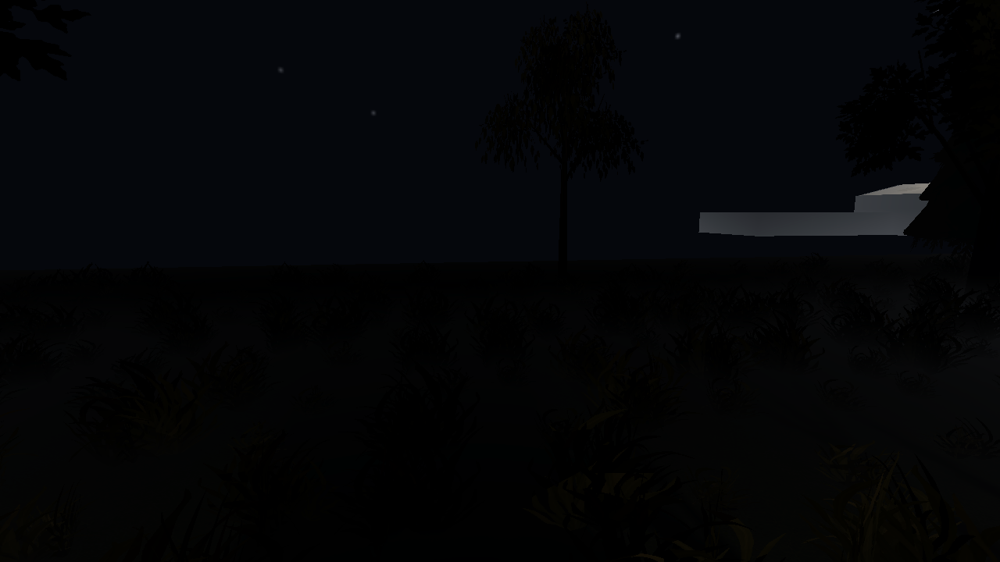 | 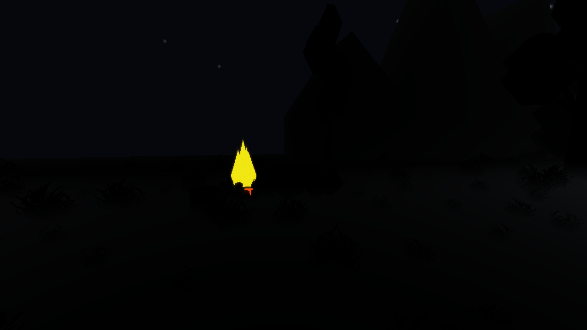 |

Matched Low native views, with lightmaps and reflections Off, make the delivered construction/palette readable; the inherited Full-lightmap route stays nearly black in both revisions. This is a material remaining rendering limitation, not evidence of a solved High atmosphere. Low is the ordinary shipped quality setting, not an edited image, custom fill-light scene or exposure change.

**2026-10-08 clarification:** the sentence above records the asset pass's
historical description; fresh installations actually default to High
(`QualityLevel::DEFAULT` in `src/quality.rs`). These preserved Low pixels are
diagnostic construction comparisons. They do not demonstrate High lighting
acceptance. [Stage 7](../../art-style/stage7/README.md) checks the final High
packages and independent quality transitions with their actual settings receipts;
the original captures and labels remain unchanged.

| Low view | Before | After |
| --- | --- | --- |
| Path / material palette |  |  |
| Grove / branches | 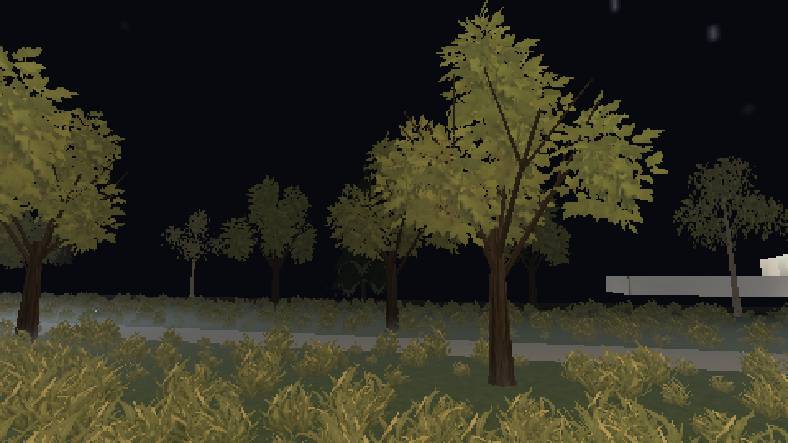 | 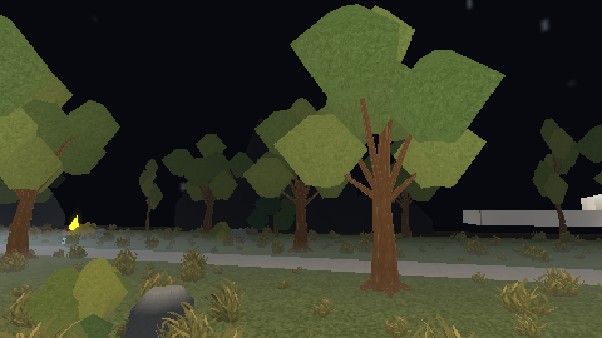 |
| Ground / derivative survival | 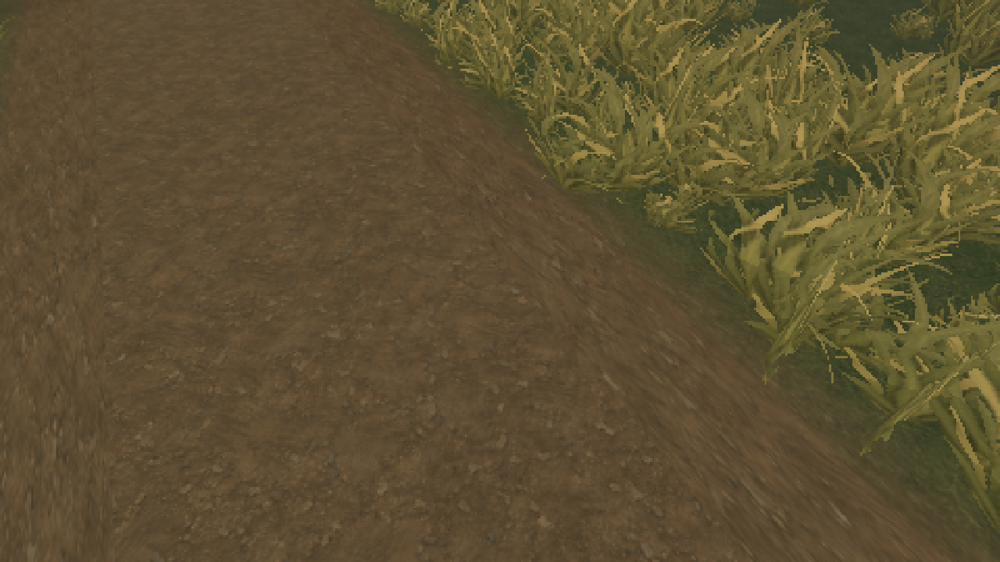 | 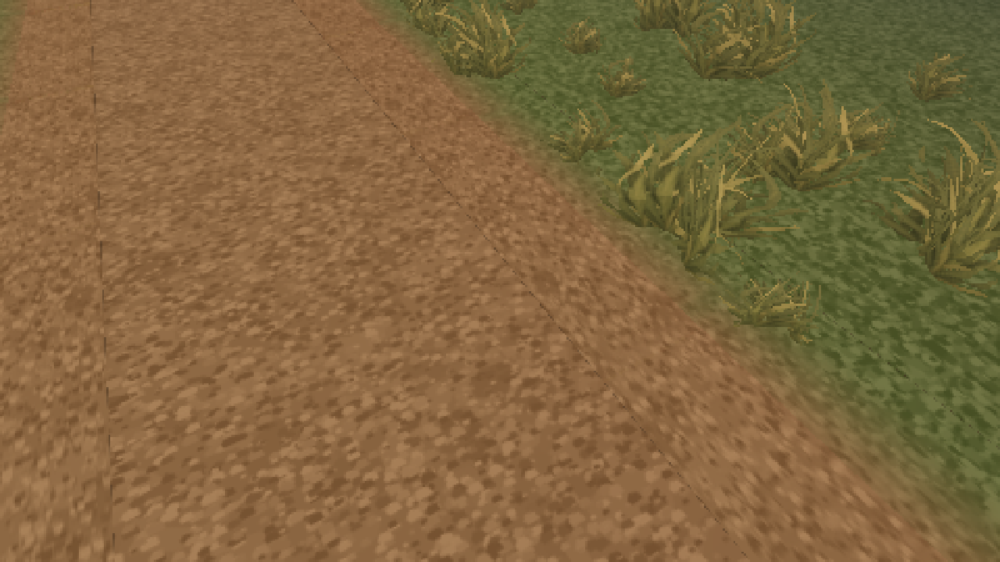 |
| Destination / constructed stock | 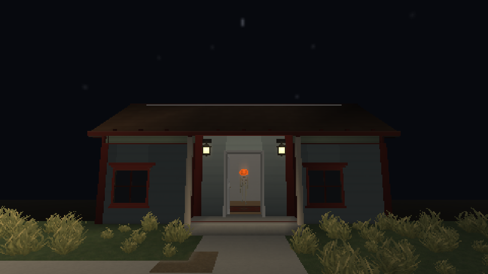 | 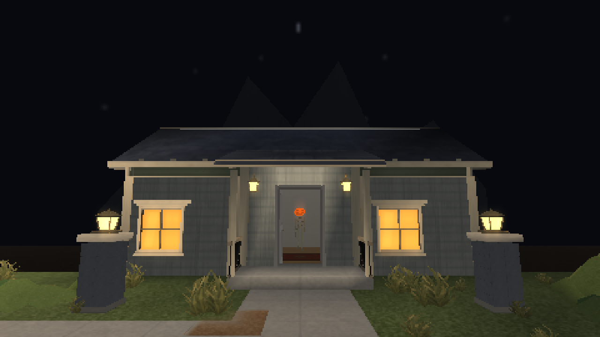 |

The arrival, lamp, walkway and source views are preserved alongside these six High pairs, and all ten cameras have matched Low pairs. The candidate copy and its first native iteration remain in the local archive; no after image is manufactured or altered.

## Performance, compatibility and validation

Final measurements and exact checks are recorded in [validation](validation.md). All local review assets and binaries are preserved outside `target` under [debug-maps/outdoors-style-20261007](../../../debug-maps/outdoors-style-20261007/README.md). The before/candidate/final payloads, settings, logs, CSV timings and older evidence remain available locally; repository journal PNGs and JSON evidence are tracked normally.

Pool, Home, Office, Winter and entity source artwork are byte-identical to the starting pass. Only Outdoors catalog entries are changed/added; the demo changes stay in the owned static night props. Its walls, floor regions, rooms, floor patches and decals remain exactly equal, including array order. Winter, Hollow and Movement source JSONs are unchanged. Their affected compiled dependencies are refreshed honestly rather than disguising stale packages. Zoo registration changes are limited to the new Outdoors apron models and the narrower tree envelope. A Rust showcase assertion caught the route generator moving its decal group after the later Pool/Home groups. The generator now replaces its slice at the original insertion position, preserving other generators' content/order; the assertion remains unchanged and a focused regression covers later appended decals.

Winter's shipped snow GLBs still contain the preceding bare evergreen/rock generation. `tree_03_snow_base.png` preserves the exact old evergreen PNG so the asset audit retains genuine embedded/source identity. Snow builders and canonical-support expectations need reconciliation with the new bare kit in the authorized Winter pass; they were not regenerated, weakened or suppressed here. Original full bases, packages and source assets remain in the before copy and starting commit. The handoff transfers this explicit dependency along with the active sleep assertion; this pass does not start Winter reconstruction.
